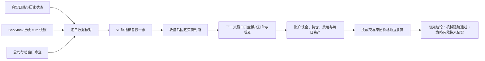

# 51 指标固定策略：真实数据贯通试验

日期：2026-09-25。隔离工作树基线：`origin/main@69b7d9fc234bbde876594ad7a7bc9c72dab81b53`。本试验是工程贯通诊断，不授予策略有效、Paper 或实盘资格。

## 当前结论

固定规则已用两只 A 股的真实 BaoStock 日线走过数据、51 项指标、每日判断、下一交易日开盘模拟成交、账户结算和逐日独立复算。此前唯一缺口是 `TURNOVER_RATE_V1` 需要逐日历史流通股本；本试验为固定策略显式注册 `TURNOVER_RATE_BAOSTOCK_TURN_V1`，直接使用 BaoStock 日线 `turn`（百分比），没有反推或假造流通股本。原有全局 V1 指标实现和默认注册表不变。

本次两只证券各有 200 根日线、51/51 项指标可计算，固定规则各形成 140 个完整判断。在公司行动筛查后选定的 2024-02-01 至 2024-05-31 窗口内，76 个交易日形成 152 个信号、74 笔订单、68 笔成交。每个收盘日的现金、持股和资产由成交记录与原始收盘价独立重算，最大账实差异为 0；同一输入连续运行得到相同的报告哈希。完整结果和逐项指纹见 [PROBE.json](../reports/all_indicator_fixed_strategy_pilot_20260925/PROBE.json)。



## 固定规则与业务口径

策略身份为 `ALL_51_EQUAL_VOTE_BAOSTOCK_TURN_V1`。48 个内置指标及 3 个自定义指标全部参与；包括 MACD、KDJ、RSI、均线和布林带等。每项固定取其注册表首个输出：当日输出高于上一完成交易日投一张买入票，否则投一张卖出票。只有 51 项均就绪才判断；买入票至少 26 张为买入，低于 26 张为卖出。规则没有按收益选择方向、阈值或权重。判断在当日 15:30 提交，订单最早于下一交易日开盘模拟成交。

本试验固定本金 100 万元、最多两个仓位、单仓目标上限 50%、A 股最小交易单位 100 股；佣金双边 0.025% 且最低 5 元、卖出印花税 0.05%、模拟滑点为价格的 0.1%，日线开盘价作为成交参考，每日成交量参与率上限 10%。不启用额外指数择时或 60 日强制退出，以免混入另一个策略规则。原始未复权价格同时用于指标和成交；这只在所选无公司行动账户窗口内构成机械核算，不说明跨除权期的长期策略回测已经解决。

## 输入来源和验收

| 输入 | 实际核对 | 仍需区分的事 |
|---|---|---|
| 现有 `DAILY.parquet` | 两只证券在 2023-10-09 至 2024-07-31 各 200 根，`adjustflag=3`；受控日期读取最高日期 2024-07-31 | 样本不是全市场数据认证 |
| [BaoStock `turn` 快照](../reports/all_indicator_fixed_strategy_pilot_20260925/BAOSTOCK_TURN.manifest.json) | `query_history_k_data_plus`、日线、未复权；400 个交易日记录、无缺值/重复/停牌行；逐日 `volume` 与价格快照一致；快照 SHA-256 `218e50a3c11b19fd8bbc1d07c55f37c92a983a5172bf84c52feceb744f8640f2` | 供应商历史 `turn` 的当时发布时间未独立验证；成交量一致不等于换手率数值被独立认证 |
| 现有 `STATES.parquet` | 账户窗口两只证券各 76 日；每日为上市、非退市、样本成员、`ELIGIBLE`、非 ST、`TRADING` | 已在本试验外部检查，但未接入引擎的 PIT 历史资格闸 |
| [公司行动筛查](../reports/all_indicator_fixed_strategy_pilot_20260925/BAOSTOCK_ACTION_SCREEN_V2.json) | BaoStock 2022–2024 报告年度的分红/送股记录中，账户窗口除权日或股份上市日为 0 | 单一来源；未与通达信 gbbq 独立交叉确认，未宣称所有公司行动类型全覆盖 |

`GuardedResearchReader` 对日线、换手率和历史状态均做日期下推读取；没有读取 2025-08-01 起的封存测试区间。数据快照、脚本、51 项公式指纹、信号、订单、成交、逐日账户复算和物理读取审计均在本工作树可追溯。

GitHub CI 在 PR 和 `main` 推送时运行指标验收的合成回归；真实 `DAILY.parquet`、`STATES.parquet` 位于本地 E 盘，不在 CI 环境，因此 CI 通过不等于真实数据链路在 GitHub 重跑。真实数据结果以本地快照哈希和本报告的复验命令为准。

## 验证结果与研究判断

| 层级 | 本次状态 |
|---|---|
| 工程实现 | 固定策略专用的 BaoStock 换手率版本、数据快照、规则、引擎接线和对账报告已实现；没有改写通用 `TURNOVER_RATE_V1` |
| 自动化测试 | 5 项目标测试通过：每项指标在阈值附近可改变判断、缺项拒绝、供应商 `turn` 原值使用、合成完整链路及成交量/公司行动/账户篡改负例阻断，并验证越界文件拒绝 |
| 真实数据验证 | 51/51 可计算；两只证券共 306 次“截至当日重算”与全量计算的抽样前缀结果一致；76 日账户逐日独立对账通过，68 笔交易的下单时序、开盘参考价、数量与费用受检 |
| 策略有效 | **未证实**。没有独立样本外、统计显著性、基准比较、全市场泛化或前瞻观察 |

模拟账户末日资产为 1,037,978.8776 元，窗口收益约 +3.80%；期间最大回撤约 10.96%，累计费用 17,816.5724 元，成交额 35,589,546.21 元。六笔订单被拒绝（3 笔成交前仓位缩为零、2 笔现金不足、1 笔超过最大仓位数），另有 30 次买入意图因 sizing 为零未生成订单。这些数字是该窄窗口、该交易假设下的**诊断观察值**，不是收益承诺或择时优势证据。68 笔成交对应 76 个交易日，换手频繁；把波动率、趋势、量价等不同含义的指标统一解释为“上升即买入”，还有重复信息计票问题。因此不应把此固定规则直接晋级 Paper。

## 复验

初次获取的快照已冻结。日常复验读取快照，不重新请求实时供应商：

```powershell
$env:PYTHONDONTWRITEBYTECODE = '1'
$env:PYTHONPATH = 'src;.'
python scripts/probe_all_indicator_strategy_v1.py --daily-parquet 'E:/llmwiki/autonomous-strategy-research-v1/execution-data-v1/baostock-account-v1/DAILY.parquet' --turn-parquet 'reports/all_indicator_fixed_strategy_pilot_20260925/BAOSTOCK_TURN.parquet' --turn-manifest-json 'reports/all_indicator_fixed_strategy_pilot_20260925/BAOSTOCK_TURN.manifest.json' --states-parquet 'E:/llmwiki/autonomous-strategy-research-v1/execution-data-v1/baostock-account-v1/STATES.parquet' --actions-json 'reports/all_indicator_fixed_strategy_pilot_20260925/BAOSTOCK_ACTION_SCREEN_V2.json' --report 'reports/all_indicator_fixed_strategy_pilot_20260925/PROBE.json'
python -m pytest -q -p no:cacheprovider tests/indicators_v2/test_all_indicator_pilot_v1.py
```

报告应为 `blockers=[]`、`account_status=RECONCILED_DIAGNOSTIC`。如任一输入缺失或不一致，链路停止，不用 50 项指标或当下流通股本替代。后续若要扩大到跨分红区间、全市场或 Paper，应先补公司行动与历史资格的正式引擎接线，再单独做样本外统计验证；这次通过仅证明这段机械链路可追溯、可复算。

该固定试验的命令行读取仅接受此工作树及上述 E 盘数据目录内的文件；`--report` 只能指向本报告路径。测试通过显式传入临时夹根目录使用合成数据，不放宽正式命令行边界。
