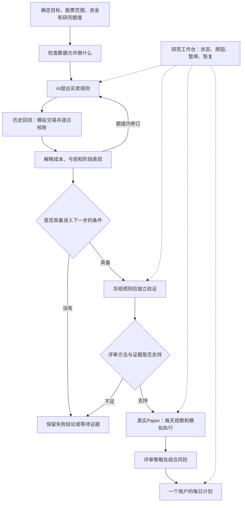

# 自主研究系统：日常使用说明

新增[持续全范围研究](CONTINUOUS_UNIVERSE_RESEARCH_GUIDE.md)通过固定部署、Owner 总范围审批和 V4 公共单步推进。总额度用完进入等待，不以默认轮数宣布完成；默认模型硬预算及未来独立资料的真实验收缺口在新指南中明确保留。

新的[全池长期研究入口](LONG_HORIZON_UNIVERSE_RESEARCH_GUIDE.md)使用 `FULL_UNIVERSE_SUBMISSION_V3`：固定长期区间、同账户分段计算，分别报告账户收益与信号表现；需要排序选股时可使用 V4 评分规则。旧版本与新版本的授权、资源边界和验收证据分别保留。

全范围账户现在可明确选择[先检查全池、回测全部资料合格股票、公布排除清单](QUALIFIED_UNIVERSE_RESEARCH.md)。公共请求使用 `FULL_UNIVERSE_SUBMISSION_V2` 加 `account_scope=DATA_QUALIFIED`，工作台也有同名选择；原严格全池和信号研究保留。范围由资料资格确定，策略随后按信号选股。

系统的工作是提出策略、核对交易账户、解释失败，并把符合条件的策略送入下一阶段。它可以正确地得出“这一轮没有可用策略”，不会为了完成任务而降低通过标准。

## 当前公共入口与交付边界

固定规则可以通过公共CLI查询能力、预览、冻结、核对批准并启动账户，不依赖AI在线。旧V3路径的限定发布包可用 `publication` 查询；它覆盖原声明范围，不代表新增全范围与创业板完成。源码或凭证变化时保持未验收。当前能力与新版本各板块验收状态见[自动生成的能力说明](RESEARCH_CAPABILITIES.md)。

新的[全范围入口](FULL_UNIVERSE_RESEARCH.md)扫描登记的深圳主板、上海主板和创业板全部目标股票，再按策略信号选股，所有板块共用同一个资金账户。选全范围目录时无需手填少数股票；数据缺口继续保留在完整覆盖清单。已有缓存数量不能证明历史清单完整或账户数据齐全。

真实连续AI研究默认仍被费用硬上限证据阻断：`BoundedCodexInvokerV1` 尚不能证明供应商token/费用限制，创建自动研究会返回 `DIAGNOSIS_MODEL_HARD_BUDGET_UNVERIFIED`。已有一次真实模型JSON接线证据只证明模型能够提出合法规则，不能据此说默认已经可以无人值守研究。

部署人员先准备数据目录登记和不可变授权引用JSON。以下占位值须替换为实际工作区、配置和请求文件；按前一步返回值填写 `preview_identity` 与 `task_id`：

```powershell
python scripts/run_trusted_research_v1.py capabilities --workspace-root <工作区> --deployment <部署配置.json>
python scripts/run_trusted_research_v1.py preview --workspace-root <工作区> --deployment <部署配置.json> --request <策略请求.json>
# 全范围请求先做数据诊断；旧版指定股票请求跳过这一条
python scripts/run_trusted_research_v1.py diagnose --workspace-root <工作区> --deployment <部署配置.json> --request <策略请求.json> --preview-identity <预览身份>
# 全范围也可以独立检查全部股票的原始条件；不运行账户、不产生收益
python scripts/run_trusted_research_v1.py scan --workspace-root <工作区> --deployment <部署配置.json> --request <策略请求.json> --preview-identity <预览身份>
python scripts/run_trusted_research_v1.py freeze --workspace-root <工作区> --deployment <部署配置.json> --request <策略请求.json> --preview-identity <预览身份>
python scripts/run_trusted_research_v1.py approval --workspace-root <工作区> --deployment <部署配置.json> --task-id <任务身份>
python scripts/run_trusted_research_v1.py approve --workspace-root <工作区> --deployment <部署配置.json> --task-id <任务身份> --preview-identity <预览身份>
python scripts/run_trusted_research_v1.py start --workspace-root <工作区> --deployment <部署配置.json> --task-id <任务身份>
python scripts/run_trusted_research_v1.py status --workspace-root <工作区> --deployment <部署配置.json> --task-id <任务身份>
# 仅当新版本原账户任务中断、已有记录可恢复时，手动沿用同一任务
python scripts/run_trusted_research_v1.py resume --workspace-root <工作区> --deployment <部署配置.json> --task-id <任务身份>
```

预览只检查规则与登记元信息，不读取行情、不签发权限。全范围的数据诊断检查全部目标，显示缺口，不计算策略信号、不创建账户额度；重复查询复用原记录。全范围冻结复用受限信号检查中已保存的输入，核对回执、元信息及规则身份；主进程不重新加载全市场行情，也不会自行批准账户。批准再次核对已有账户授权中的资金、股票池、日期、成本、计划及有效期，真正运行账户时仍复核输入。调整这些条件后必须重新预览，不能沿用旧身份。

信号 `scan` 从登记全部股票开始，先检查资格，再为资料齐全的股票计算原始条件。报告中的“已检查股票数”与“已计算条件股票数”不同；所有条件缺证据时是“未知”，不是“零买入信号”。这一步不模拟账户、止损成交或收益，不授予盈利策略资格。旧全范围入口的准备和计算共同受900秒、2048MiB与单数值线程约束。重复同一意图只读复用，中断或输入/源码改变保留原记录供核对，不另开免费扫描。

长期请求 `FULL_UNIVERSE_SUBMISSION_V3` 使用分段执行：900秒是每段上限，同一计算用途累计受4或8小时及授权到期时间约束，不因此缩短事先冻结的交易区间。使用方式、恢复和实际验收范围见[全池长期研究指南](LONG_HORIZON_UNIVERSE_RESEARCH_GUIDE.md)。

恢复 `resume` 只针对新版本原账户任务；系统会先核对工作进程已经退出、原输入和逐日记录、授权有效期及剩余时间。已结算或证据不足时拒绝，没有自动恢复、新资金或新增研究额度。页面只在查询到这个任务属于新版本且尚未结算时显示手动恢复按钮。

如使用工作台，现有启动器可增加 `--submission-config <部署配置.json>`；需要页面执行动作时由维护者明确启用 `--allow-trusted-research`，默认仍只读。该开关不代替数据或账户授权。长期宿主与接手方式见[运行说明](RESEARCH_LIFECYCLE_OPERATIONS.md)。

## 整个系统如何工作



历史研究、独立验证、Paper 观察分别记账。已经被研究用过的历史数据不能通过更换目录重新变成独立证据；合成测试通过也不能增加真实合格策略数量。

## 现在可以表达哪些策略

AI 可以从原有 51 个技术指标中选择需要的指标，组合独立的买入、卖出与价格过滤条件，设置最短和最长持有交易日、卖出后的冷却期及目标仓位。每个策略都有固定版本和解释；执行时使用真实持仓状态计算持有期，而不是假设每天空仓。

买卖冲突时优先退出；未知数据不会自动变成买入信号。技术指标使用对应的因果价格视图，模拟成交与账户核算使用实际价格。指标多不代表策略更有效，也不要求新策略同时使用所有指标。原先全 51 指标基线继续保留。

旧指定股票入口支持多只沪深主板股票。新全范围入口把创业板纳入同一份共享现金，三个板块使用相同技术指标与组合规则；不同板块的交易制度分别核对。刚上市或字段不足的股票明确显示预热、状态或数据缺口，不用假的行情补齐。过去小池的逐日核账和发布证据不代表全范围已验证；正式评审仍按原方法支持范围，不随股票范围扩大自动取得资格。

成本止损、固定止盈和移动止损设置在 `rule.exits`，会真实影响退出。它们在收盘确认后于随后合法开盘尝试成交，不能保证止损线价格。`market_filter` 当前是同一股票的价格、成交条件，尚不代表大盘指数过滤。波动率指标已在公共目录；新版 V4 规则可通过 `selection.score` 按波动率等数值评分决定同日买入顺序，旧 V3 规则仍按原有代码顺序处理。ATR 止损仍未接通。

## 在工作台看什么

使用现有启动器，传入部署人员准备的业务绑定配置：

```powershell
python scripts/run_ui.py 8765 --research-root <研究数据根目录> --lifecycle-config <配置文件>
```

打开 `/research/lifecycle`。顶部把四件事分开：

| 页面内容 | 实际含义 |
|---|---|
| 工程能力 | 入口和流程是否存在 |
| 测试验证 | 对应交付报告是否有通过证据 |
| 真实观察 | 某账户实际积累了多少有效观察，不能合计成另一账户的证据 |
| 策略有效性 | 原资格服务是否真的允许进入正式观察 |

页面刷新只读取状态。默认只读，后台未启用会明确显示。业务对象按原服务显示研究、验证、观察、组合及每日计划；原始凭证可展开核对。

需要执行时，使用同一业务服务的 CLI 或受现有本机执行策略允许的页面动作。真实运行不能通过前端传入一个 `qualified=true` 获得资格。研究数据根、业务对象绑定和有限任务配置由部署入口验证；不接受用户提供的任意代码或命令。

## 常见状态怎么处理

| 状态 | 含义及下一动作 |
|---|---|
| 本轮没有通过初筛的策略 | 这一轮结束；保留失败者和预算，后续研究需要已有授权范围内的剩余额度 |
| 等待数据 | 缺少指定交易日或阶段的合格原件；及时补齐未来采集条件，不把迟到数据改成准时到达 |
| 等待资格 | 方法不支持、没有独立证据或成员资格不足；查看原评审原因，不重跑回测刷通过 |
| 预算耗尽 | 停止自动研究，不新建目录重置次数 |
| 已暂停 | 同一任务暂停；恢复沿用同一记录和已消费额度 |
| 工程失败 | 数据、账户或执行异常；修复工程问题，不把异常记成策略亏损 |
| 阶段完成 | 指定动作完成；不等于策略有效，也不等于全部市场观察结束 |

## 每日观察与交易计划

正常观察需要及时收到开盘、收盘、证券状态，以及可核对的公司行动覆盖凭证。现金分红需要公告收到时间、登记日、除息日、到账日和税务条款。只有当天是否除权的标志，不足以证明公司行动信息完整。

系统支持有限任务的启动、查看、暂停和恢复。每次推进使用同一业务记录，重复触发不能重复调用模型、交易或记账；错过的采集时段会留下缺口。任务到期或预算耗尽后停止。本次没有启用永久后台定时任务。

组合使用固定的成员、权重和风险上限，共享账户处理同股交易冲突与资金争用。成员合格不代表组合合格；组合也需要自己的观察评审。没有合格成员时，应得到有原因的无交易状态。每日计划用于模拟和辅助核对，本轮没有接入券商实盘下单。

## 进一步核对

- [七项验收与真实证据](AUTONOMOUS_SYSTEM_ACCEPTANCE.md)
- [任务运行与恢复](RESEARCH_LIFECYCLE_OPERATIONS.md)
- [统一入口与配置](LIFECYCLE_SERVICE_V2.md)
- [新规则的研究循环](BOUNDED_RULE_RESEARCH_V2.md)
- [数据资格](RESEARCH_DATA_QUALIFICATION.md)、[独立验证协议](VALIDATION_EVIDENCE_PROTOCOL_V2.md)
- [公司行动](CORPORATE_ACTION_LIFECYCLE.md)、[组合准入](PORTFOLIO_QUALIFICATION.md)

## 动态字段与预热下限

V3按规则实际引用申报因子字段：未引用换手率 `turn` 时，原件缺少该列保持 `UNKNOWN`，不会补零。引用换手率指标时，缺列会在数据冻结阶段拒绝，不能进入账户执行。旧指定股票账户仍采用原每日矩形覆盖；新全范围版本使用独立日历和有证据的稀疏行情，把未上市、停牌与缺行分开，原持仓继续管理。旧V2及未声明字段依赖的旧数据调用仍要求换手率。

旧历史账户和Paper的原执行准备仍要求至少60个预热交易日。新全范围指标准备按规则实际需要的有效历史bar检查预热；持有期与T+1使用完整交易日历。新的预热规则不会改写旧合同，也不会为IPO补造过去行情。
