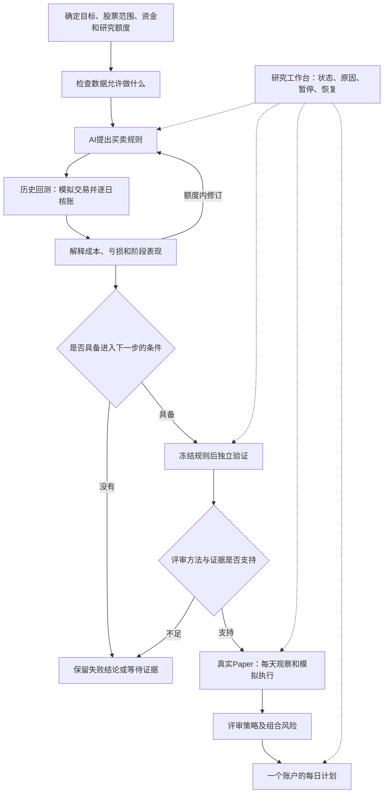

# 自主研究系统：日常使用说明

系统的工作是提出策略、核对交易账户、解释失败，并把符合条件的策略送入下一阶段。它可以正确地得出“这一轮没有可用策略”，不会为了完成任务而降低通过标准。

## 整个系统如何工作



历史研究、独立验证、Paper 观察分别记账。已经被研究用过的历史数据不能通过更换目录重新变成独立证据；合成测试通过也不能增加真实合格策略数量。

## 现在可以表达哪些策略

AI 可以从原有 51 个技术指标中选择需要的指标，组合独立的买入、卖出与价格过滤条件，设置最短和最长持有交易日、卖出后的冷却期及目标仓位。每个策略都有固定版本和解释；执行时使用真实持仓状态计算持有期，而不是假设每天空仓。

买卖冲突时优先退出；未知数据不会自动变成买入信号。技术指标使用对应的因果价格视图，模拟成交与账户核算使用实际价格。指标多不代表策略更有效，也不要求新策略同时使用所有指标。原先全 51 指标基线继续保留。

研究账户允许配置多只沪深主板股票，使用一份共享现金和确定的资金分配规则。本次三只股票、504 个交易日的真实历史账户已通过逐日独立核账和重复验证；这不代表全 A 股范围已验证。正式评审目前仍保留原两股票和资金范围。

## 在工作台看什么

使用现有启动器，传入部署人员准备的业务绑定配置：

```powershell
python scripts/run_ui.py 8765 --research-root <研究数据根目录> --lifecycle-config <配置文件>
```

打开 `/research/lifecycle`。顶部把四件事分开：

| 页面内容 | 实际含义 |
|---|---|
| 工程能力 | 入口和流程是否存在 |
| 测试验证 | 对应交付报告是否有通过证据 |
| 真实观察 | 某账户实际积累了多少有效观察，不能合计成另一账户的证据 |
| 策略有效性 | 原资格服务是否真的允许进入正式观察 |

页面刷新只读取状态。默认只读，后台未启用会明确显示。业务对象按原服务显示研究、验证、观察、组合及每日计划；原始凭证可展开核对。

需要执行时，使用同一业务服务的 CLI 或受现有本机执行策略允许的页面动作。真实运行不能通过前端传入一个 `qualified=true` 获得资格。研究数据根、业务对象绑定和有限任务配置由部署入口验证；不接受用户提供的任意代码或命令。

## 常见状态怎么处理

| 状态 | 含义及下一动作 |
|---|---|
| 本轮没有通过初筛的策略 | 这一轮结束；保留失败者和预算，后续研究需要已有授权范围内的剩余额度 |
| 等待数据 | 缺少指定交易日或阶段的合格原件；及时补齐未来采集条件，不把迟到数据改成准时到达 |
| 等待资格 | 方法不支持、没有独立证据或成员资格不足；查看原评审原因，不重跑回测刷通过 |
| 预算耗尽 | 停止自动研究，不新建目录重置次数 |
| 已暂停 | 同一任务暂停；恢复沿用同一记录和已消费额度 |
| 工程失败 | 数据、账户或执行异常；修复工程问题，不把异常记成策略亏损 |
| 阶段完成 | 指定动作完成；不等于策略有效，也不等于全部市场观察结束 |

## 每日观察与交易计划

正常观察需要及时收到开盘、收盘、证券状态，以及可核对的公司行动覆盖凭证。现金分红需要公告收到时间、登记日、除息日、到账日和税务条款。只有当天是否除权的标志，不足以证明公司行动信息完整。

系统支持有限任务的启动、查看、暂停和恢复。每次推进使用同一业务记录，重复触发不能重复调用模型、交易或记账；错过的采集时段会留下缺口。任务到期或预算耗尽后停止。本次没有启用永久后台定时任务。

组合使用固定的成员、权重和风险上限，共享账户处理同股交易冲突与资金争用。成员合格不代表组合合格；组合也需要自己的观察评审。没有合格成员时，应得到有原因的无交易状态。每日计划用于模拟和辅助核对，本轮没有接入券商实盘下单。

## 进一步核对

- [七项验收与真实证据](AUTONOMOUS_SYSTEM_ACCEPTANCE.md)
- [任务运行与恢复](RESEARCH_LIFECYCLE_OPERATIONS.md)
- [统一入口与配置](LIFECYCLE_SERVICE_V2.md)
- [新规则的研究循环](BOUNDED_RULE_RESEARCH_V2.md)
- [数据资格](RESEARCH_DATA_QUALIFICATION.md)、[独立验证协议](VALIDATION_EVIDENCE_PROTOCOL_V2.md)
- [公司行动](CORPORATE_ACTION_LIFECYCLE.md)、[组合准入](PORTFOLIO_QUALIFICATION.md)
