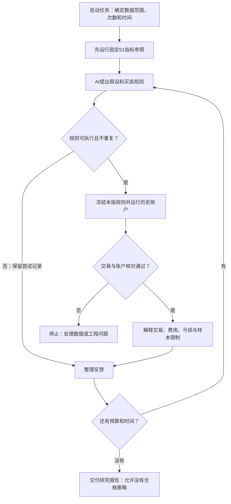

# 小规模自主研究任务

此入口将 AI 候选、公共账户回测、定性诊断、修订和预算停止连接起来。它复用现有策略接口、TrialRegistryV1、SearchBudgetRegistryV1 和 StrategyBatchGovernanceV1；原控制面的合成限制与正式预测授权没有解除。

当前能力限定为两证券的日频指标投票研究。AI 可以选择已注册指标子集及投票门槛，不能改变交易日期、股票池、资金、费用、价格口径或直接提供 Python 代码。固定 51 指标策略作为一份对照账户，不要求新候选使用全部指标。

## 普通用户看到的流程



这里的“修改策略”是产生一份新规则，并保留它为什么从上一版改来。历史版本与结果不会被覆盖。报告中的亏损是事实；对亏损原因没有足够证据时，系统会写明尚未确定。

## 如何运行

在仓库根目录使用已经安装项目依赖的 Python。真实入口依赖既有 S1 本机行情、换手率与状态快照，不联网补数据；先核对 SHA-256，再通过原读取边界加载。模型使用已登录的本机 Codex CLI。

```powershell
python scripts/run_bounded_research_v1.py create --root E:/llmwiki/autonomous-strategy-research-v1/bounded-research-20260926 --approval-statement "按规划实现并验收有预算的真实研究闭环" --attempts 5 --wall-seconds 3600
python scripts/run_bounded_research_v1.py run --root E:/llmwiki/autonomous-strategy-research-v1/bounded-research-20260926
python scripts/run_bounded_research_v1.py status --root E:/llmwiki/autonomous-strategy-research-v1/bounded-research-20260926
```

`create` 记录本次实际用户授权，固定来源、代码、动作范围和截止时间。已有目录只能恢复，不允许覆盖重新创建。一次最多 5 次候选尝试，外加 1 次固定参照；无效候选、重复候选和模型已启动但未完成的尝试也保留预算消费。它们不会获得免费重试。

`run` 从现有 `AutonomousResearchOrchestratorV2.run_bounded_exploration` 入口推进；`tick` 只推进一个参照或候选；`status` 只读状态；`revoke` 停止后续执行。目录内 `SUMMARY.md` 和 `SUMMARY.json` 是可重新生成的展示，不能代替冻结来源及预算、试验记录。

## 看到什么才算完成

每个有效候选留存：模型输入与输出身份、假设和修改理由、父候选、冻结规则、账户结果、独立核对、诊断和结算。下一轮模型只收到定性诊断，不接收账户数字；模型进程禁用工具并在独立临时目录运行。

`ATTEMPT_BUDGET_EXHAUSTED` 表示本次任务按预算结束，**不是策略合格**。`BLOCKED` 表示需要处理具体问题，例如输入变化、授权范围不足、运行中断状态无法确认。所有结果保留 `NOT_ASSESSED`，真实前瞻观察天数仍为 0。

完整工程验收要同时证明：真实模型生成过候选；真实账户完成过至少两版；第二版输入包含第一版诊断；两版规则身份不同；所有尝试计入预算；没有借最终收益决定本次验收是否成功。

## 中断与恢复

- 已保存完整模型成功凭据：恢复使用原输出，不再次请求模型。
- 已保存账户结果：核对冻结计划、输入身份、预算及结算后继续诊断，不再次计算账户。
- 模型或账户已开始，却没有完整完成凭据：停止并保留已消费预算。当前版本不自动重跑一个无法确认完成状态的试验，也不把它认作策略失败。
- 来源代码、数据或规则变化：不能继续使用旧授权。应保留旧任务，明确记录修复与新的运行范围；不得清空旧记录冒充首次研究。
- 需要查看历史记录时可以用 `status`；历史完成记录不代表当前仍有运行许可。
- `revoke` 可在模型或账户运行期间提交，后续执行边界会检查撤销。已经发出的模型请求可能先返回，系统不会因此继续运行账户；它不是强制终止外部进程的命令。
- 账户未核对通过时停止研究，不让 AI 把工程错误当作策略缺陷继续修改。新进程查询会保留撤销、过期和已有失败事实。

## 结论边界

历史行情、换手率与证券状态的发布时间仍按既有模型处理，旧严格资格报告不变。此前曝光的数据也不能作为独立确认集。收益、回撤、费用、基准差异只是探索描述，不能自动授予统计资格或 Paper 准入。

目前对照是固定 51 指标策略，不是市场指数或无风险资产。比较需要相同输入身份、日期序列与执行假设，否则报告 `NOT_COMPARABLE`。费用加回只能说明原成交路径的成本影响，不等于实际运行过另一种费用条件。

完整系统的正式筛选、未污染确认窗口、每日真实 Paper、组合与计划执行反馈仍按总体规划的后续阶段推进。此入口没有券商下单功能。

## 验证与回滚

2026-09-26 已完成规划中的 U1—U4。真实验收见 [研究摘要](../reports/bounded_research_20260926/SUMMARY.md) 和 [证据索引](../reports/bounded_research_20260926/EVIDENCE.json)。

| 验收项 | 本次结果 |
|---|---|
| 真实 AI 提出与修改规则 | 5 次真实 Codex 子进程调用、5 个不同规则、4 次带父版本反馈的修订 |
| 真实数据执行 | 2 只股票、2024-02-01 至 2024-07-31、每份账户 118 个交易日 |
| 交易与账户 | 固定参照加 5 个候选，共 6 份账户，独立核对差异均为 0 |
| 预算与结束 | 5 次候选加 1 次参照全部计数，最终 ATTEMPT_BUDGET_EXHAUSTED |
| 新进程重复启动 | 已完成任务再次运行后，87 份持久 JSON 证据哈希不变，预算不变 |
| 故障恢复测试 | 子进程强制退出后由新进程恢复；模型、账户不重跑，结果及预算身份不变 |
| 自动检查 | 发布相关组合：632 项通过、23 项按既有条件跳过；闭环专项 24 项通过，跨进程专项 1 项通过 |
| 额外旧编排检查 | 55 项通过；另 1 项因仓库未包含历史候选 contracts 样本无法通过。硬链接相关测试移至支持的临时目录后通过 |
| 策略资格 / 前瞻 | NOT_ASSESSED / 0 天；这次没有授予任何策略正式资格 |

R1/R6 由任务范围、预算、停止和恢复测试支持；R2/R3 由规则拒绝、公共入口一致性及六份真实账户支持；R4/R5 由诊断分类、定性反馈身份和四次真实修订支持；R7 由真实模型回执、账户及新进程复核支持。审查发现的运行中撤销、账户不平继续搜索、确认后预算未落盘、重启丢失阻断状态四类问题均已修复并补测试。

真实模型的 CLI 未回报具体服务端模型标识和运行时版本，回执如实保留 NONE / UNKNOWN；以真实子进程成功事件及输出身份作为调用证据，不猜测服务端实际型号。生成假设是 AI 的解释，不等于已证明其经济逻辑。五轮中既有盈利也有亏损，系统没有为了得到赢家而增加次数。

完整原始任务保存在 `E:/llmwiki/autonomous-strategy-research-v1/bounded-research-20260926`。证据索引记录原始文件哈希与每一版规则、模型上下文、反馈、账户及诊断的身份。源码更新后不把旧任务当作新任务继续搜索。

自动测试使用合成数据与可控模型输出，覆盖真账户执行、输入/规则绑定、预算、定性反馈、中断恢复和拒绝路径。真实运行记录另行归档，不把合成模型输出标记为真实 AI。

撤销本次功能时回滚相关代码提交，并保留研究任务目录供审计；不要删除预算或试验记录来重启旧任务。原固定策略入口、旧预测研究政策与历史报告继续保留。
