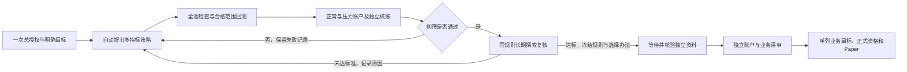

# 持续全池研究交付说明

这次交付把公共全池长周期回测接入持续研究。用户先批准一份有限总目标、范围、预算和期限，启动同一研究 ID；宿主随后自动提出候选、检查规则、检查完整登记股票池、运行合格范围的正常和压力账户、核账、诊断并进入下一批。无需为每个候选编写接入脚本或逐批批准。

软件完成和找到合格策略是两件事。本次没有启动真实收费模型、读取封存行情、追加真实预算或运行新的真实全市场账户。计划保持 `active`，真实研究验收和策略目标尚未完成。

## 这次接通了什么

- 总预算和探索、确认的储备分别核对；增量必须批准具体内容，保留原消费。批次结束自动接续，轮次数量不是策略完成的判断。
- 每次推进最多一个受限 worker。重启沿用原候选、用途和预算；未知调用只核对原请求，超耗记实际债务，不能截短账单或换 ID 重试。
- 短期初筛、同规则 504 日最终探索复核、冻结后 252 日独立业务验证分别推进。独立资料等待不会拖停仍合法的探索；独立结果不能进入设计模型上下文。
- 全池先检查，再按合格范围回测并公开排除清单。资金不足、槽位竞争、信号排序和真实成交分别披露。
- 新 TRAIN 投影必须由固定部署和具体来源授权产生；未来登记须绑定 Owner 批准原件。投影不创造独立性，也不能把已看过的数据重新标为未见。
- CLI、工作台和宿主复用同一控制服务。读状态不启动计算；批准入口与普通运行入口分离。已发生的模型或计算消费在停派后仍可按原件核对结清。

工程验证使用明确标记的合成模型和隔离资料，真实公共受限进程执行。它证明入口、恢复、账本和接续行为；不能证明真实模型已经运行、真实行情足够或策略盈利。测试证据与持续集成结果见本次 PR 和 `progress.md`；现场验收使用[统一验收入口](CONTINUOUS_UNIVERSE_ACCEPTANCE.md)。

## 当前真实依赖

2026-10-10 仅核对主目录登记元信息、日历和原研究状态，没有读取价格表或封存资料：

| 项目 | 真实状态 | 后续所需 |
|---|---|---|
| 既有 TRAIN 日历 | 2022-09-02 至 2024-07-31，共 462 个交易日 | 至少补 42 个合法账户日及预热、状态、公司行动等配套；不能把旧验证期 102 日并入设计来充 504 日 |
| 新总授权与预算 | 旧任务到期/耗尽不自动继承为新余额 | 为具体持续任务批准有限总范围、金额、用途、阶段储备和绝对期限；不重写旧记录 |
| 真实模型 | 具备受限网关客户端与合成回归，未取得可信远端部署及两批真实回执 | 实际强制 token、费用、一次付费派发及未知保留的远端保证；默认 Codex 路径不满足时等待 |
| 独立资料 | 没有已认证的 252 个冻结后未见账户日 | 来源、真实快照、先前访问审查、用途授权及正式登记；下载或切片不自动取得独立性 |
| 合格策略 | 未找到 | 同一冻结规则真实满足探索和独立阶段的全部标准 |
| 正式统计、Paper | 未授资格，真实观察 0 日 | 按原方法适用性及 Paper 准入服务另外判断 |

元信息原件：`data/long_horizon_universe_v1/prepared_v4/manifest_long_horizon_v1.json` SHA256 `694d12b4a7ad28ae454819344af61c03d1a1696f280adaa1fa67f6399c581cdd`；`calendar.json` SHA256 `e730be92c753ce4cf404efafa78d46593c329c2fe57f66736fc1ea62aeccfadd`。该日历总长 564 日，其中合法 TRAIN 交集为 462 日。

既有接续状态 `reports/strategy_research_goal_20261010/RESEARCH_STATE.json` SHA256 `831c8b5007efe9c5dbb8484b0761baaaafd7bbb92b7cc3407bbaed87964e22dd9`，原最终标准 SHA256 `dea472a36e1075e31cf7d2b4315c6aeb4826dcddbf8bc4bacb4c730a433aa015`。这些引用保存原研究来源，不将会话 AI 人工候选伪造为本系统模型调用，也不重复收费。

最终标准保持：各账户初始 5 万元，探索至少 504 日、独立至少 252 日；各阶段分别要求正常成本年化净收益至少 15%、回撤至多 15%、完整扣费回合胜率至少 55%、利润因子至少 1.3、完整回合至少 100，压力成本净收益严格为正。

## 使用和回滚

按[持续研究操作指南](CONTINUOUS_UNIVERSE_RESEARCH_GUIDE.md)配置一份登记任务；按[TRAIN 投影说明](TRAIN_DATASET_PROJECTION_V1.md)准备合法资料。换 AI 时导出只含合法探索历史的接手包；不要把独立报告贴给策略设计端后仍称其未见。

存储上限和最低剩余磁盘在批准摘要中明确。默认上限 16 GiB、最低余量 2 GiB，可在具体授权的 `storage_limits` 指定；它是派发前检查，已经产生的审计原件保留，不能用删账本恢复额度。单段仍受原执行资源限制，不宣称具备操作系统磁盘硬配额。

回滚先暂停/撤销新任务并核对原用量；恢复合并前代码 `78cfd99a489ecd450ce2fba27a2a6c99dd438e40` 和原部署。保留新账本、批准、模型/计算回执及暴露史；回滚代码不退回预算，也不允许复用已暴露验证集。
