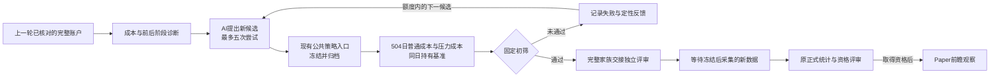

# 根据失败证据继续研究

系统现在可以把上一轮发现的问题交给 AI，生成一批新规则，再统一淘汰不稳健的候选。初筛通过只表示值得交给独立数据继续检验，不等于有效策略，也不自动进入 Paper。



## 初筛具体检查什么

在新候选产生前，冻结政策、历史数据身份和代码身份。每个新候选先走已有118日公共账户和归档，再用已暴露的504个交易日连续账户检查：

- 普通成本和提高费用、滑点两种情景下，净收益都必须为正。
- 两种情景的最大回撤都不得超过25%。
- 前252日、后252日的每日净超额收益之和都必须为正，参照同日、同资金的两证券等权持有账户。

账户连续运行，中间不重置资金或持仓。压力测试重新执行引擎，核对买卖决策一致；不通过直接减费用冒充重跑。两个半段的计算是每日超额之和，不是复合相对收益。先核账，再评判；工程错误不冒充策略失败。

AI只能收到固定的定性反馈和已有规则，不能收到这条反馈路径中的收益数值、排名或独立评审账户。它仍只能使用已有指标目录和投票门槛，不能输出任意Python、改成本、改数据或改筛选规则。因此本次接通研究循环，不扩充策略表达能力。

## 独立评审的边界

通过者交给现有 `FormalAssessmentServiceV1`。正式服务重新读取初筛账户、开始/结算回执、预算和档案，重算通过名单；单独传入 `passed=true` 无效。完整候选家族全部保留，只运行通过者的独立账户。未通过成员保持不可支持位置，不能通过删掉失败者缩小多重检验家族。

没有通过者时，不建立正式批次，也不消耗其统计额度。通过者登记后仍需未来窗口：冻结后真实采集的60个预热交易日及504个账户交易日。历史补抓不能替代这项独立证据。统计方法对真实收益过程的适用性门仍保留，因此数据齐备也不保证取得资格。

本次不启动无人值守定时采集、不部署长期守护任务、不运行Paper或真实券商账户。独立数据齐备后，沿用原生命周期CLI的正式执行入口；当前入口只负责候选、初筛与受控交接。

## 使用

在项目根目录执行；输入和输出放在源码目录以外。`create` 只建立一次新的有界研究授权，不能拿新的空目录冒充旧任务恢复。

```powershell
$env:PYTHONUTF8='1'
$env:PYTHONPATH='src;.'
C:/Python313/python.exe scripts/run_diagnosis_research_v1.py create `
  --root E:/llmwiki/autonomous-strategy-research-v1/diagnosis-research-20260927 `
  --seed-root E:/llmwiki/autonomous-strategy-research-v1/real-process-504-v1/accounts `
  --data-root E:/llmwiki/autonomous-strategy-research-v1/real-process-504-v1/data `
  --approval-statement '根据成本和分阶段表现的问题生成新候选，再将通过初筛的策略交给独立数据评审。'

C:/Python313/python.exe scripts/run_diagnosis_research_v1.py run `
  --root E:/llmwiki/autonomous-strategy-research-v1/diagnosis-research-20260927 `
  --calibration-path E:/llmwiki/autonomous-strategy-research-v1/formal-method-calibration-v2-20260926-format-replay/CALIBRATION.json `
  --not-before 20260928
```

`status --root <目录> --json` 是只读查询；`revoke` 停止本次任务。指定 `--calibration-path` 的 `run` 会在有通过者时交接；也可使用 `handoff` 单独交接。未指定校准文件时明确停在待交接，不暗中选统计方法。`not-before` 是最早日期，不代表已验证交易日，正式执行仍需要原始交易日历证据。

`search/` 保存原候选试验与预算，`archives/` 保存原服务冻结的策略，`screening/` 保存成本账户及初筛，`HANDOFF.json` 指向唯一正式批次。已完成账户只核验读取，不重调模型、不重算、不重复记账。账户中断或失败后不自动重试；模型重复上轮规则也会保留已消费尝试并阻断，不能免费刷候选。源码或输入变更后，旧任务保持记录，不允许改冻结文件续跑。

## 验证说明

合成测试覆盖真实公共账户/归档/预算服务的接线；正式路由状态测试明确使用合成证据，不能作为真实独立评审验收。真实新候选运行结果另列于本次证据目录，区分工程完成、测试完成、真实历史初筛和策略有效。

### 2026-09-27实际运行结果

5次真实Codex调用均成功，生成5个不同于旧家族的新规则；模型每轮收到的定性反馈条目包数依次为5、7、9、11、13，表明本轮已完成候选的短账户诊断和长窗口初筛也进入了后续设计。全部回执通过原模型工具禁用、来源和上下文核验，未用手写策略冒充模型生成。

| 新候选 | 普通成本净收益 | 压力成本净收益 | 压力成本最大回撤 | 初筛 |
|---|---:|---:|---:|---|
| CANDIDATE_001 | -14.34% | -29.62% | 29.76% | 未通过 |
| CANDIDATE_002 | -19.66% | -36.73% | 37.47% | 未通过 |
| CANDIDATE_003 | -4.32% | -18.80% | 25.46% | 未通过 |
| CANDIDATE_004 | -13.51% | -30.75% | 31.53% | 未通过 |
| CANDIDATE_005 | -24.52% | -35.74% | 36.70% | 未通过 |

以上为2022-07-06至2024-07-31的504交易日累计收益，不是年化收益。5个候选均有非正净收益、成本压力失败、回撤超限和至少一半区间超额不足。未调参重试、缩短窗口或更换标的来制造通过者。

5个短窗口候选账户及固定参照完成；11个长账户各504日，合计5544个账户日独立核对无差异。持有基准的逐日收益与上轮完全一致。再次运行CLI只核验已有记录，初筛结果及所有研究预算文件hash不变。

**工程和这次真实历史初筛已完成；独立确认尚未发生，正式合格策略为0。** 没有通过者，所以没有创建独立批次，没有消耗正式确认额度。通过者交接/失败者排除的分支已由合成测试验证，不冒充真实独立评审完成。

相关回归117项通过（418.07秒），最终针对性复测23项通过（50.52秒，含重叠项，不相加）；本地审查无剩余已确认缺陷。证据位于 `reports/diagnosis_research_20260927/`，完整模型回执、逐日账户、治理记录和源码快照在上述外部任务根目录。CI结果以本次PR为准。

回滚：停止该CLI任务并回退本次功能提交即可关闭新入口；保留外部研究记录。不要删除已消费预算、修改旧策略档案或重新使用已经曝光的独立窗口。
