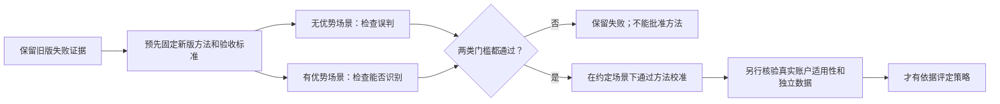

# 正式评审方法 V2：怎样判断这把尺子是否可靠

## 先解决什么
旧版评审把部分偶然收益误判为优势。问题不只是模拟次数少：在收益连续相关的场景里，估计出来的波动比真实波动小，容易过度自信。V1的44项失败完整保留。

已知协方差的独立计算显示，旧版在AR(0.6)场景的均值方差估计平均约为真实值的80%—84%，MA(10)场景约为69%—77%。这是有限窗口与重抽样的系统偏差证据，不是对全部失败原因的唯一解释。计算公式及数值保存在`reports/formal_statistics_v2_20260926/V1_FAILURE_DIAGNOSIS.json`。

## 新版怎么改
评判的问题不变：策略扣完费用后，日平均收益是否高于同口径持有基准。

先完整运行504日账户，再把日超额收益按事先确定的边界分为8段，每段63日。比较8段的平均表现及它们之间的差异，使用7个自由度的单侧t检验；账户不会在分段处清空或重新入金。全部候选共同接受Holm校正，失败或缺失候选也不能从分母中删除。三个终生批次的错误预算保持2.5%、1.5%、1%，实际检验仍只用一半。

方法依据为[Ibragimov–Müller原论文](https://www.princeton.edu/~umueller/tstat.pdf)。在组均值相互独立、服从正态且有共同均值时，低水平的分组t检验可容忍组间不同方差；用在时间序列上需要近似条件。把504日切成8段本身不证明独立，也不能证明市场的收益规律不会改变。

## 怎样避免“做一把永远判不通过的尺子”
无优势场景检查误判；有优势场景检查命中真正优势的能力。功效测试预先指定一个有优势的候选，其余四个没有优势，不能把误判其他候选也算作成功。

新随机种子与旧版不同。18类场景各8192次独立重复：14类支持场景必须全部验收，另外4类域外场景完整披露。保留旧版全部场景，并加入零收益、负均值、波动突变、依据过去信息调仓及费用拖累。账户型场景是明确的合成过程，不冒充真实交易引擎记录。

126项误判检查使用95%同时置信上界，全部不得高于原预算。另有两项功效检查使用各自组内95%同时置信下界：第一批次，标准化年度优势强度2时至少10%，强度4时至少70%。这是最低识别能力要求，不表示一般策略都容易识别。两个验收族各自95%，不把二者合称95%联合保证；联合覆盖保守下界为90%。

## 版本和使用边界
旧方法、旧计划和旧报告保持原解释；V2使用独立method_hash。所有版本共用已有权威目录和终生预算，不通过升级获得免费重试。统一`formal-review/register/run/status`入口按冻结方法分派；调用方不能自填“通过”或提交另一份漂亮报告批准方法。

校准通过只说明有限的预先约定场景过关，不能自动证明真实账户满足共同均值、短程相关及分段近似独立的条件。因此V2即便统计支持，正式策略资格仍受`REAL_RETURN_PROCESS_APPLICABILITY_NOT_ESTABLISHED`阻断。本轮没有提供外部布尔值绕过该门，也不把旧探索窗口标为独立。

理论条件、程序实现、模拟验收、真实数据验证和策略有效是不同层次。真实采集窗口仍沿用现有60预热加504账户日设计；本轮没有缩短窗口或自动启动Paper。后续要解决的是真实收益过程适用性和独立证据，而不是继续增加技术指标。

## 实际验收结果
本版固定设计实际运行并完整重放147,456条记录，**126项误判门全部通过，2项功效门全部通过**。原V1的44项失败不变。以第一批次、全部候选均无优势为例：

| 场景 | 误判次数 / 8192 | 误判率 | 同时上界 | 预算 |
|---|---:|---:|---:|---:|
| 独立正态 | 94 / 8192 | 1.147% | 1.597% | 2.5% |
| AR(0.6) | 94 / 8192 | 1.147% | 1.597% | 2.5% |
| MA(10) | 110 / 8192 | 1.343% | 1.824% | 2.5% |

全部支持项中最接近预算的是第三批次MA(10)全零假设场景：同时上界0.9255%，仍低于1%预算。两项功效：强度2识别率23.68%、下界22.76%；强度4识别率88.82%、下界88.12%，分别超过10%和70%的预定门槛。这些是合成过程的识别率，不是市场策略成功概率。

独立数值积分与t7实现最大绝对差约5.6e-16。项目CI指定的31个测试路径本地共811通过、23跳过、无失败/错误；跳过来自原有真实行情采样及Windows链接/隔离边界。初次窄测的两处测试基准问题已修复且保留记录，没有放宽断言。

完整报告位于`E:/llmwiki/autonomous-strategy-research-v1/formal-method-calibration-v2-20260926/CALIBRATION.json`（约461MB）。仓库`reports/formal_statistics_v2_20260926/`保存预登记、摘要、环境、独立公式核对及JUnit。完整数据先按固定种子逐条重放，再固定报告身份；常规权威读取校验该完整身份而不重复生成全部模拟。未知或改动的报告不能获得同一身份。记录的生成/汇总计时不含持久化与最后完整重放，不能当成全程时长。

V2来源哈希明确归一化换行，避免跨平台签出改变身份；完整数值重放在记录的运行环境验证，不承诺任意NumPy版本之间逐位相同。

## 使用

方法校准命令：`python scripts/calibrate_formal_statistics_v2.py --output <独立新目录> --workers 4`。`--preregister-only`只冻结来源。已有目录只能在完全相同来源下恢复；重复读取不是新增独立校准。不要为了试出好结果删除目录或改种子。

统一`formal-review`配置中的`calibration_path`指向上述V2完整报告，其余候选档案配置不变。V1报告仍走V1验证器。真实数据准备评审的实际输出见`REAL_STRATEGY_REVIEW.json`：5个候选继续研究，正式合格0，确认预算消耗0。

当前阶段是：**方法在固定场景通过 → 真实账户收益过程适用性审查与独立证据 → 策略评定 → 合格后Paper**。不要将此处第一步的通过直接写成策略有效。
