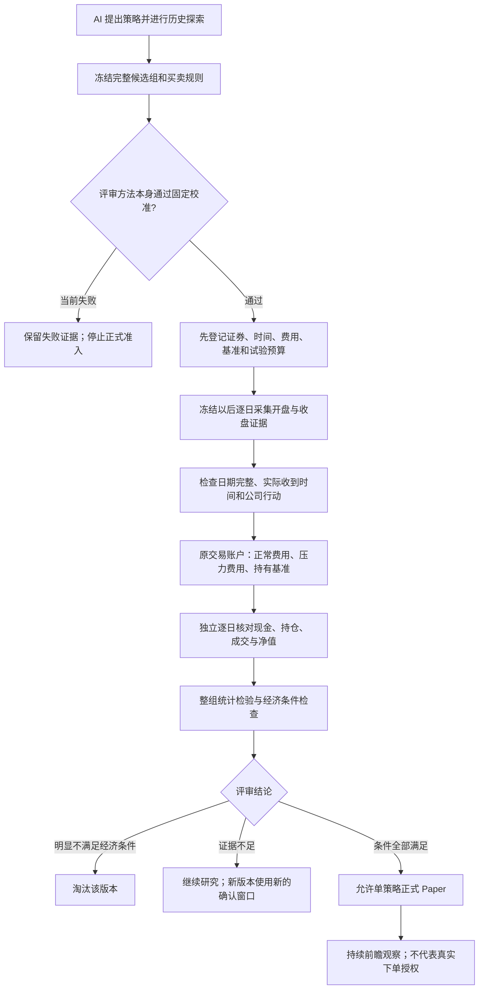

# 正式有效性评审：先验证尺子，再评价策略

## 当前结论（2026-09-26）

本次完成正式评审流程的工程接入，并实际执行一次预先固定的完整统计校准。**统计校准失败，因此当前没有策略取得正式有效性资格，也没有开启真实独立确认窗口。** 这不是证明现有策略无效，而是现阶段没有可信的统计依据宣布它们有效。

工程流程可以运行、测试通过、真实账户核对、策略有效，是四个不同结论。合成数据可检查流程，但不能产生真实资格；历史探索收益也不能充当未见样本的成绩。

## 业务流程



“正式”表示依据事先约定的证据和标准作判断，不表示保证未来盈利。统计结果仍以弱平稳、短期相关、有限高阶矩等假设为条件；合成校准不能证明市场满足这些假设。

## 实际校准结果

方法在运行前固定：504 个账户日、最多 5 个候选、扣费后的日简单收益减去等权持有基准；使用居中的 stationary bootstrap，块长度 10/20/40，每次 4095 次抽样，取三个 p 值的最大值，再按完整候选组做 Holm 校正。

支持范围包含 9 类过程，每类 2048 次重复；另有 4 类域外压力过程。每次重复重新生成数据和独立抽样随机数，候选之间共享时间索引以保留相关性。检查全无效、一个真实零假设、三个真实零假设等组合。3 个终生批次的误差预算为 2.5%、1.5%、1%，实际检验水平分别使用预算的一半。

完整运行保留 **26,624 条记录**。支持范围共 81 项同时置信上界检查，**44 项未通过**。第一批次、全部策略实际无效时：

| 场景 | 误判次数 / 2048 | 误判率 | 同时单侧上界 | 预算 |
|---|---:|---:|---:|---:|
| 独立正态 | 40 / 2048 | 1.95% | 3.15% | 2.5% |
| AR(0.6) | 59 / 2048 | 2.88% | 4.28% | 2.5% |
| MA(10) | 90 / 2048 | 4.39% | 6.05% | 2.5% |

后两项连经验误判率都超出预算，不能简单解释为模拟次数不够。没有删场景、换种子或放宽阈值重试。独立数值对照表明，快速分段求和与逐条展开抽样的最大差异约为 `2.8e-16`，没有发现该优化改变抽样均值。

仓库保留 `reports/formal_assessment_20260926/CALIBRATION_SUMMARY.json` 和数值对照。完整记录、预登记和运行来源保存在 `E:/llmwiki/autonomous-strategy-research-v1/formal-method-calibration-20260926`；摘要附完整文件哈希。摘要本身不能用于批准方法，运行入口要求完整报告并复核所有记录和来源。

CI 静态检查随后要求拆分置信区间入参的复合校验。修复没有改变方法或种子，新源码在 `formal-method-calibration-20260926-ci-replay` 完整重放，26,624 条记录与原记录逐条相同、汇总相同，仍然失败。当前入口绑定该重放报告；原报告未覆盖。仓库新增 `CI_REPLAY_CALIBRATION_SUMMARY.json`、`REPLAY_EQUIVALENCE.json` 记录两次来源和等价对照。配置中的 `calibration_path` 应指向新目录的 `CALIBRATION.json`。

现有 5 个真实候选已完成准备评审，报告为 `reports/formal_assessment_20260926/REAL_STRATEGY_REVIEW.json`，全部为 `CONTINUE_RESEARCH`。真实 CLI 输出与归档报告逐字段一致；确认预算消耗为 0。程序固定绑定本次完整校准身份，不能另提交一份自编 p 值文件把失败改为批准。

绑定 CI 等价重放后，同样的 5 个候选结论保存在 `REAL_STRATEGY_REVIEW_CI_REPLAY.json`，与原判决一致。

方法参考：[stationary bootstrap 原始论文](https://www.tandfonline.com/doi/abs/10.1080/01621459.1994.10476870)、[相关理论条件](https://www3.stat.sinica.edu.tw/statistica/j4n2/j4n25/j4n25.htm)、[Holm 原始论文](https://www.ime.usp.br/~abe/lista/pdf4R8xPVzCnX.pdf)。这些文献不是本实现通过校准的替代证据。

## 已接通的工程行为

- `formal-review`：检查现有冻结档案和完整方法校准，输出准备情况；不重跑历史选股、不打开新窗口、不消耗确认预算。
- `formal-register`：冻结完整候选组，不能只保留历史赢家。失败/缺失候选仍保留在统计家族分母中。真实登记要求方法校准已通过。
- `formal-run`：先记录输入与暴露，再通过公共策略入口执行持有基准及每个候选的 BASE/STRESS 账户，复用原交易引擎与独立核账。每个账户有开始和结算凭据。
- `formal-status`：区分等待独立窗口、失败阻断和已完成评审；报告读取重新检查数据来源、账户授权绑定、统计计算和裁决。
- `formal-feedback`：为后续 AI 研究提供定性原因，不传确认收益和 p 值；修改后的策略必须使用新确认窗口。
- 正式 Paper 读取权威评审，不接受调用方提交“已通过”布尔值。撤销仍优先于准入。

中断后可以复用已经提交的账户结果，未完成计算可按同一冻结输入恢复。失败不返还统计批次预算，不能换数据窗口、费用、规则或源码继续冒充同一次确认。原研究源目录绑定一个权威目录，复制档案另开目录不能重置同一来源的预算。此边界面向受信的单机文件目录，不声称能防御管理员删除或伪造全部历史文件。

确定性重放使用全新的内存账户，没有券商订单或外部账户记账，不另计一次统计试验。预算统计的是不同确认账户及数据暴露，不是计算机重复计算次数。确认期间需保留冻结运行版本，升级源码后不能继续沿用同一次试验身份。校准绑定的五个源文件通过局部 `.gitattributes` 固定原换行字节，避免跨平台签出改变校准身份；其他文件不批量转换。

## 真实数据边界

既有行情窗口有历史研究访问记录；未知窗口也没有覆盖全部访问路径的独立性证明。本轮不把它们重新标为“未见数据”。新路径要求先冻结，再在专用目录采集未来证据：60 个预热交易日，随后 504 个账户交易日。按通常交易日数量，完整窗口超过两年，不能现在报告已经完成。

账户日需要开盘与收盘两种真实快照。成交使用开盘快照**实际收到时的价格和时间**，不能用 09:31 才收到的状态回填 09:30。收盘指标只在收到收盘数据以后用于决定下一交易日的意图。交易日历来自实际通达信响应；缺日、重复修订、额外未纳入快照和来源不一致均拒绝。

首版范围很窄：恰好两只沪深主板证券；不支持停牌窗口；所选指标必须在全部账户日可计算。真实证据遇到公司行动、行动覆盖不明或无法解释的前收盘价格变化即阻断。账户底层已有现金分红处理，并不等于本次真实采集已经具备完整公司行动证明。

正式 Paper 只允许与评审相同两只证券、100 万初始资金及单策略完整资金配置。多策略组合仍可做工程观察，但**单策略通过不代表组合已通过**。

## 使用入口

统一脚本为 `scripts/run_strategy_lifecycle_v1.py`。配置文件必须位于所选档案/权威目录的父工作目录内，禁止路径重定向。以下命令中的目录需替换为实际路径。

```powershell
python scripts/run_strategy_lifecycle_v1.py formal-review --archive-root E:/研究/archives --config E:/研究/review.json
python scripts/run_strategy_lifecycle_v1.py formal-register --archive-root E:/研究/archives --config E:/研究/register.json
python scripts/run_strategy_lifecycle_v1.py formal-status --archive-root E:/研究/archives --batch-id FA_完整哈希
python scripts/run_strategy_lifecycle_v1.py formal-calendar --archive-root E:/研究/archives --batch-id FA_完整哈希 --end 20291231
python scripts/run_strategy_lifecycle_v1.py formal-run --archive-root E:/研究/archives --batch-id FA_完整哈希 --config E:/研究/run.json
```

`review.json` 字段为 `strategy_ids`、`calibration_path`。登记增加 `symbols`、`not_before`（整数日期）、`profile`（真实为 `REAL_OBSERVED`）。运行配置为 `snapshot_root`、`snapshot_ids`、`open_snapshot_ids`、`calendar_root`、`calendar_id`。采集目录必须使用登记状态返回的固定目录；真实采集需要通达信客户端处于运行状态。本轮没有启动每日采集任务。

## 下一步的唯一优先项

**重新设计并预登记统计评审方法，先证明它能控制误判，再投入真实独立确认。** 本次失败结果必须保留为已发生的研究尝试；新方法需要新版本、明确修正依据及新的预登记，不能覆盖本次报告或靠重复试种子选出通过结果。现在继续扩展策略数量、把旧回测包装成合格，或提前运行“正式 Paper”，都会绕开尚未解决的核心问题。

下一版还需针对真实账户收益过程选择假设：首日现金、持仓切换、费用和市场状态变化都会影响收益分布。即便某个模拟场景的误判率达标，也不能直接据此断言真实策略收益满足平稳条件。
