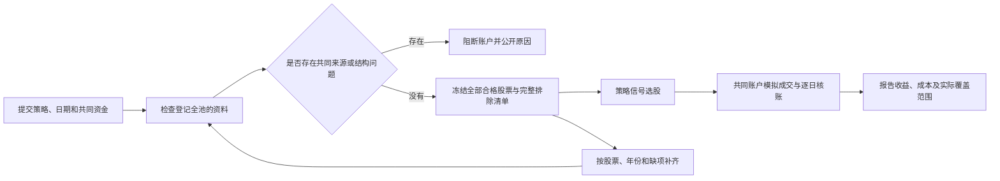

# 全池检查后，在全部合格股票上回测

系统支持两种账户数据范围。**严格全池**要求登记的每只股票资料都齐全；**合格范围**先检查登记全池，再让策略扫描全部资料合格股票，同时公布没有参与本次账户回测的完整名单和原因。两种模式都保留全池登记及补齐能力。



“合格”只表示这份规则、日期和输入资料可以进入账户模拟，**不表示股票值得买、策略有效或未来盈利**。范围不能按收益、交易次数或是否产生买入信号筛选。正常成本和压力成本使用同一份冻结范围与资金条件。

## 用户怎样选择

工作台选择全范围数据目录后，可以选择“严格全池：全部股票资料齐全才回测”，或“检查全池：回测全部合格股票并公布排除清单”。先查看规则预览，点击“核对全范围数据”，查看名单和原因，再冻结并使用已有授权执行。

检查本身不运行账户、不创建或消耗账户预算。无法确认的共同来源错误、未知政策及空合格范围仍阻断，不通过忽略缺口强行运行。合格股票数小于请求的最多持仓数时，计划拒绝；用户须重新预览合理的持仓限制，系统不自动改仓位。

CLI 使用原公共命令，部署配置仍为 `FULL_UNIVERSE_DEPLOYMENT_V1`。规则仍为 V3，无需每份策略新写接入、批次或核验脚本。请求外层示例：

```json
{
  "version": "FULL_UNIVERSE_SUBMISSION_V2",
  "account_scope": "DATA_QUALIFIED",
  "strategy_id": "my_frozen_strategy",
  "dataset_id": "已登记数据编号",
  "universe_id": "已登记全池编号",
  "rule": "替换为合法的完整V3规则对象",
  "feature_start": 20220801,
  "account_start": 20221101,
  "account_end": 20240731,
  "initial_cash": 50000,
  "max_positions": 2,
  "max_symbol_exposure_bps": 5000,
  "costs": ["BASE", "STRESS"],
  "benchmark": "CASH_AND_PRICE_REFERENCE",
  "purpose": "EXPLORATORY",
  "authorization_ref": "已登记授权编号"
}
```

请求不能携带自选 `symbols` 或手填合格名单。`preview → diagnose → freeze → approval → approve → start → status` 命令及部署登记见[公共使用手册](AUTONOMOUS_RESEARCH_USER_GUIDE.md)。本模式下 `diagnose` / `scan` 都做完整账户资料资格检查，不计算策略信号；信号由后续账户入口计算。只研究原始条件时使用原 V1 的 `scan`。

账户授权仍覆盖原登记全池、冻结规则、资金、日期和成本；实际计划同时绑定检查得到的子范围，不能把小池许可扩成全池。

## 能看到什么

检查结果、冻结任务、批准预览和状态查询提供完整 `qualification_scope`。受限检查目录下的 `REPORT_CN.md` 与 `EXCLUSIONS.csv` 逐只说明排除原因；`QUALIFICATION_SCOPE.json` 保存全池、合格和排除名单与证据日期。共同缺口影响整池时，没有局部问题的股票也不能称为可执行合格股票。

排除可能包括缺行情、证券状态不明、除息参考价冲突、送转税务或到账条款不完整，以及账户模型无法可靠处理的事件。不会将缺失资料变为零、删除不明事件，或声称被排除股票没有信号。

每次账户执行从同一任务保存的完整父输入重新计算资格，核对全部合格名单、排除理由及子输入身份。冻结输入、来源、范围或规则改变后不能继续使用旧计划。中断恢复沿用原任务、批准、记录和额度。

## 怎样补齐全池

全池登记和原始资料保持完整。[资料复用与按缺项补齐](BAOSTOCK_UNIVERSE_BRIDGE.md)和[公司行动条款处理](CORPORATE_ACTIONS_V2.md)入口继续使用。补齐后登记新的资料版本，重新预览、检查和冻结；旧名单、排除记录和结果保留。

这是按整个评价区间资料可用性确定的**回顾性研究范围**。它不能证明历史全市场清单完整、资料在当时已公开或已消除幸存者偏差。全池账户验收、合格范围核账、历史盈利、独立验证和真实 Paper 观察分别报告。合格范围结果不能称为全部市场回测通过。

## 本次真实资料验证

本机 V6 登记资料在 feature 20220801..20240731、账户评价 20221101..20240731 的固定窗口下，4,607 只全部检查：3,701 只资料合格、906 只排除、共同未知阻断为 0。原 900 秒、2048MiB 限制下完成，耗时 837.515 秒；没有计算策略收益或消耗账户预算。

这个数量只对应上述资料版本、规则字段及日期。其他策略或窗口要重新检查；不能将 3,701 只解释为未来可投资范围，或将另 906 只永久删除。主目录合并后的固定短窗口账户、远端 CI 和旧开发目录清理分别留本地发布回执。

## 回滚

改回 `FULL_UNIVERSE_SUBMISSION_V1` 即恢复严格全池。源码回滚点为 `6e300d6`；后续使用对应提交的 `git revert` 并保留已有账户与已消费预算记录。旧开发目录归档后的材料能恢复文件，但不会自动恢复物理登记签名或授予执行许可，须重新核验。
