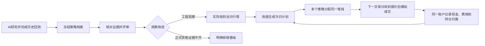

# 策略评审、前瞻观察与多策略组合

这次开发把“研究出一个策略”接到“冻结它、检查它、每天观察它、用同一账户协调多个策略”。工程观察检验系统是否可靠，不表示策略已经有效，也不产生真实券商订单。



## 如何理解结果

| 输出 | 含义 | 不代表什么 |
|---|---|---|
| 档案核验通过 | 已完成研究的规则、试验预算、账户结果和结算相互匹配 | 收益具有统计显著性 |
| 工程观察准入 | 规则可执行，历史账户证据完整，可以检查新观察流程 | 正式策略合格 |
| `REAL_OBSERVED` | 新快照由无缓存通达信采集入口记录实际接收时间 | 真实成交或交易所逐笔时间戳认证 |
| `SYNTHETIC` | 为验证故障而构造的数据 | 真实观察天数 |
| 组合计划 | 固定优先级和限额下的次日意图 | 已成交、实盘指令或最优组合 |

当前正式观察保持关闭：已用于生成候选的历史样本不能充当独立确认；现有统计方法也尚未通过批准所需的校准。有效性评审会说明这些缺口，不能通过传入 `qualified=True` 绕过。

## 运行入口

在项目根目录使用 `python scripts/run_strategy_lifecycle_v1.py --help`。所有命令输出 JSON，失败返回非零退出码。路径示例需替换为实际目录。

```powershell
python scripts/run_strategy_lifecycle_v1.py freeze --archive-root E:/research/archives --research-root E:/research/completed-session --candidate-id CANDIDATE_001
python scripts/run_strategy_lifecycle_v1.py review --archive-root E:/research/archives --strategy-id BS_完整64位标识
python scripts/run_strategy_lifecycle_v1.py create-paper --root E:/research/paper --config E:/research/paper-config.json
python scripts/run_strategy_lifecycle_v1.py capture --snapshot-root E:/research/snapshots --phase CLOSE --symbols 000001.SZ 600000.SH
python scripts/run_strategy_lifecycle_v1.py advance --root E:/research/paper --snapshot-root E:/research/snapshots --snapshot-id SNAP_实际返回的完整标识
python scripts/run_strategy_lifecycle_v1.py status --root E:/research/paper
python scripts/run_strategy_lifecycle_v1.py report --root E:/research/paper
python scripts/run_strategy_lifecycle_v1.py revoke-paper --root E:/research/paper --reason 暂停观察
python scripts/run_strategy_lifecycle_v1.py revoke-strategy --archive-root E:/research/archives --strategy-id BS_完整64位标识 --reason 停用该策略
```

采集前，Windows 本机的通达信客户端必须已安装、运行且登录，TQ HTTP 服务可用。程序只读访问，不替用户安装、启动、登录或下单。OPEN 采集窗口为 09:30–09:35，CLOSE 为 15:00–17:00；还会检查当日交易所日历、行情日期和延迟标志。所有请求禁用缓存。

首次观察日收盘建立计划，不算完成一个观察日。之后必须按下一交易日 OPEN → CLOSE 推进；完整一组才计一天。快照接收和处理必须在冻结窗口内，重复提交相同快照返回原结果；缺阶段、迟到或历史回填被拒绝。没有自动排程，需要在实际交易日运行命令。

## 观察配置

`paper-config.json` 是完整输入，包含以下字段；不接受额外资格开关。先冻结档案，使用返回的 `strategy_id` 和 `rule_identity` 配置成员。

配置文件须放在观察目录的父目录或其子目录内，例如观察目录 `E:/research/paper` 对应配置 `E:/research/paper-config.json`。入口拒绝越界路径、符号链接重定向、非 JSON 文件及超过20 MiB的配置。

```json
{
  "archive_root": "E:/research/archives",
  "strategy_ids": ["BS_来自freeze的完整标识"],
  "purpose": "ENGINEERING_OBSERVATION",
  "profile": "REAL_OBSERVED",
  "policy": {
    "initial_cash": 100000,
    "symbols": ["000001.SZ", "600000.SH"],
    "open_delay_minutes": 5,
    "close_delay_minutes": 120,
    "portfolio": {
      "policy_id": "MY_OBSERVATION_V1",
      "members": [{"strategy_id": "BS_来自freeze的完整标识", "rule_identity": "来自档案的64位哈希", "weight_bps": 10000, "priority": 0}],
      "purpose": "ENGINEERING_OBSERVATION",
      "max_positions": 4,
      "max_symbol_exposure_bps": 5000,
      "max_buy_turnover_bps": 5000,
      "valid_until": "2026-12-01T00:00:00+08:00",
      "overlap": "SEPARATE_STRATEGY_LOTS",
      "lot_size": 100
    }
  },
  "calendar": [20260928, 20260929, 20260930],
  "warmup": {
    "source_profile": "HISTORICAL_REAL",
    "bars": [], "turn": [], "states": [],
    "corporate_actions": [], "corporate_actions_complete": true
  }
}
```

**这是结构示例，不是可以直接启动的配置。** 日历必须来自实际交易所日历，不能用普通工作日替代；开始日不能早于创建日。预热要补入至少 60 个共同历史交易日，每个证券每天一条原始 `bars` 和 `turn`，且全部早于观察开始日。预热标签本身不证明来源，启动者必须保留并核对原文件与公司行动覆盖；本版未提供自动认证预热来源的采集器。

- `bars`：`symbol,date,open,high,low,close,prev_close,volume,amount`，日期为 `YYYYMMDD` 整数，成交量为股、金额为元。价格为未复权价格，不能混入前复权文件。
- `turn`：`symbol,date,turn,tradestatus`，换手率按供应商百分数口径，交易状态为 0 或 1。缺失不得填零。
- `corporate_actions`：沿用已有因果分红价格模块的事件结构；完整性未知不能标成 `true`。观察期间任何公司行动或覆盖不明会停止整个会话，当前未接前瞻分红入账。
- `weight_bps` 为策略最大资金比例，10000 代表 100%，成员合计不得超过 100%。`priority` 越小优先；这只是固定分配，不会自动根据近期收益提高权重。
- `max_symbol_exposure_bps` 限制同一证券跨策略的总敞口；各策略持仓独立归属。不会用尚未成交的卖出款提前买入。费用与实际收到的开盘报价会再次约束数量。

## 当前边界与恢复

观察执行仅支持沪深主板、100 股买入单位和已有日线成交模型。科创板、创业板、北交所不在本版验收范围。实际成交采用收到报价时的现价及模拟费用，不回填为早晨的历史开盘价。没有盘口深度、排队或部分成交真实性认证，因此模拟回报不能当作可实现的实盘收益。

`SESSION.json` 冻结规则、预热、日历、限额、费用与源码身份；`stages/` 保存各次快照、计划、账户结果，`HEAD.json` 标记已提交位置。推进时重建并核对已提交前缀，进程中断后同一输入不会增加第二笔交易。删除已提交记录、改变策略档案或改变运行源码会被拒绝；源码升级应保留旧会话，并在新版本重新建立观察，不能静默续跑。

`status` 提供账户状态、下一日计划、已处理阶段、工程观察天数和合格观察天数。合成测试与历史预热的真实观察天数始终为 0。当前真实来源实测、未来连续观察以及策略有效性证据需分别记录；任何一个都不能用测试通过替代。

回滚本次代码使用对应提交的 `git revert`；保留已有档案、快照及账户目录，不删除证据或重置观察天数。
