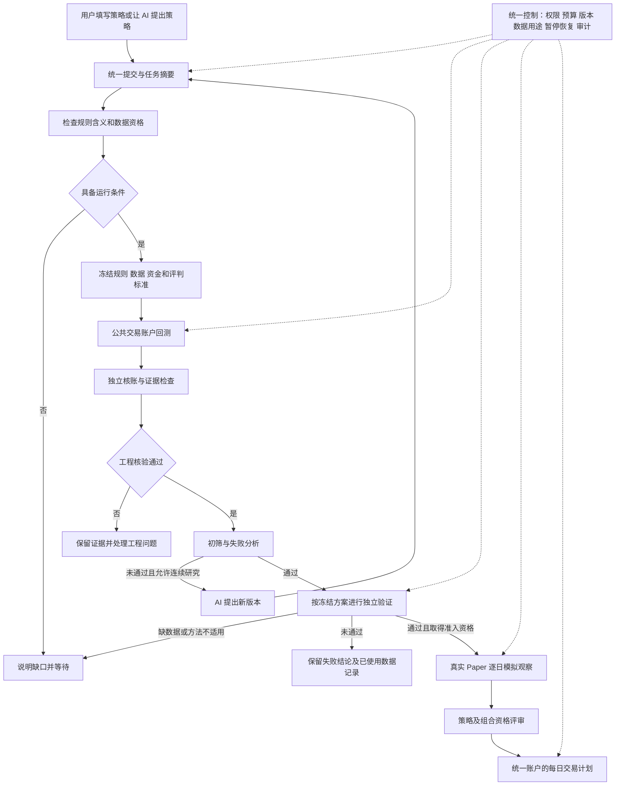

# Trusted Strategy Research

面向普通用户的需求说明；描述要交付的产品行为，不代表这些能力已经完成。

## Summary

用户提交一份买卖策略，选择资金、股票范围与研究额度后，系统自动检查数据、执行回测、核对账户、解释结果，并在条件满足时推进独立验证和模拟观察。开启 AI 连续研究后，系统还能依据失败记录生成下一版策略；关闭或更换 AI，不影响已冻结策略的执行与核验。最终支持合格策略的组合管理和每日交易计划。

---

## Problem Frame

当前已经存在公共策略入口、多股票账户、核账、研究治理、正式评审、Paper 和生命周期管理组件；不能把本需求理解成全部推倒重做。但近几轮研究仍由会话 AI 新建数据装载、批次执行和核验脚本，将这些组件临时组织起来。用户得到的是“有人替我操作了一轮”，还不是“我提交策略后系统能独立办理”。

这产生三个实际问题：没有 AI 或更换 AI 后，用户难以复用同一流程；每套脚本对数据、预算和通过标准的理解可能不同；生成策略的一方还在编写评判该策略的程序，容易把假设或错误变成“验证通过”。

2026-09-29 对新增研究脚本的只读审查发现了可复现的例子：报告称 MA10 而冻结规则实际使用 MA20；绑定检查失败未阻止初筛通过；多池重试会删除未完成任务和预算文件。这些问题说明，接通函数入口与交付可信业务流程之间仍有缺口。旧研究可以保留作探索记录，其证据等级需要复核，不能直接继承到新流程。

---

## Key Decisions

- **系统执行，AI 提案。** 数据资格、账户、预算、核验和通过标准由系统管理。AI 可以提出规则与解释，不能自行改写这些裁判规则。
- **一份明确策略先独立跑通。** 首个交付重点是已有策略不依赖 AI 完成可信研究；自动生成候选建立在这一公共流程之上。不能继续为每个候选复制一套运行和评审脚本。
- **支持的策略主要通过规则提交。** 已支持指标的参数也属于规则，实际参数必须明确显示。新增数据源、交易制度或未知指标属于系统能力扩展，不能在研究过程中悄悄临时实现。
- **连续研究有总任务。** “每批五个”可以是运行组织方式，不自动成为整个任务上限。跨批共享累计额度和历史；找不到合格策略是合法结论。
- **评审通过取决于证据。** 正收益、核账通过、独立验证通过和取得 Paper 资格是不同状态。不会因为用户希望“找到为止”就保证最终发现有效策略。
- **五万元是首要验收场景。** 资金由用户填写；不能用一百万元结果按比例换算，也不能自动继承不覆盖五万元的正式评审结论。

这里选择复用并整合已有能力。只增加一个按钮、背后继续调用候选专用脚本，无法解决可靠性问题；让更强的 AI 临时维护整条链，也无法解决没有 AI 时的运行问题。

---

## Actors

| 角色 | 要完成的事情 | 不应承担的工作 |
|---|---|---|
| A1. 普通用户 | 提交或选择策略，设置资金和边界，查看结论，暂停任务 | 拼接数据路径、编写执行和核验脚本 |
| A2. 系统运行服务 | 准备合格数据，执行任务，累计记账，核验结果，管理状态 | 为了让策略通过而改变标准 |
| A3. 可替换的 AI 研究助手 | 生成候选，解释失败，提出下一项有依据的实验 | 绕开封存数据、扩大额度或自行授予资格 |
| A4. 系统维护者 | 接入新能力、修复缺陷、验证版本 | 为每份已有能力范围内的策略重复开发整套流程 |

---

## User Experience

普通用户的主操作为：**提交策略 → 核对任务摘要 → 启动研究 → 查看状态和报告。**

提交时提供策略规则、初始资金、研究股票范围及模式。成本与风险设置可以来自系统已验证的方案，但启动前必须展示实际采用值。连续研究模式还需明确总尝试额度、执行时间及模型费用上限（如适用）；不能隐含无限调用。

支持两种模式：

- **验证这份策略：** 固定规则，自动走完当前数据和方法允许的阶段；失败后给出诊断，不擅自修改规则。
- **连续研究：** 在同一总任务中，允许 AI 根据诊断提出新版本，系统按统一流程执行；原策略和失败版本全部保留。批次结束自动继续，受整个任务的额度与权限约束。

如果输入的是自然语言想法，系统先转成可读的明确规则，显示实际指标参数、买卖时点和风险限制。无法唯一解释的内容要在运行前澄清。提交明确规则的用户，以及在已授权范围内生成候选的 AI，不应被要求每轮重复确认。

用户可以随时看到“正在做什么、已经花了多少额度、完成了哪些阶段、为什么等待”。不能只显示含义不明的完成百分比，也不能把没有运行服务的聊天回复显示成后台任务。

---

## Business Architecture

这张图表示业务责任，不规定具体技术实现。下方的统一控制贯穿整个流程，AI 不拥有独立的核验通道。

AI 停用时，已冻结任务仍由系统执行；需要生成下一候选的任务进入“等待研究助手”，不能连已开始的账户核算都依赖 AI 来续写命令。

---

## Requirements

**提交与独立运行**

- R1. 人工和 AI 提交相同含义的策略时，必须进入同一套校验、执行与评审流程。支持范围内的新策略只需提交规则及任务设置，不新增候选专用装载器、运行器或核验器。
- R2. 系统提供安装、启动和运行环境检查；缺依赖、数据未就绪或运行服务离线时明确显示。已安装并启动的系统在没有 AI 服务、没有原聊天记录时，可以完成明确规则策略的回测、核账和报告。
- R3. 策略摘要必须准确展示实际执行的指标、参数、买卖条件、冲突处理、持有期及成交时点。MA10 必须对应十日均线；若仅支持固定 MA20，必须拒绝或明确要求更改，不能静默替换。用户提出“止损”时，应展示是否受最短持有期或其他规则限制。
- R4. 不支持的策略能力必须在耗用账户回测额度前给出可理解的原因；新增能力通过公共能力扩展及验证后供所有策略复用。策略不得附带改变交易引擎、数据真实性判定或通过标准的代码。

**数据与交易账户**

- R5. 系统维护统一数据目录，按证券、日期和用途显示可用程度。区别“存在行情文件”“满足研究输入”“满足正式验证”“有实时观察证据”；不再让每个策略自行找到并拼装数据。
- R6. 启动前根据规则和账户需求检查数据。缺失、未知、推算与已证实字段分开保存；占位换手率不能当真实换手率，推算的分红日期不能成为来源凭证。未使用某指标不等于可以忽略账户必须使用的数据。允许的模型假设须公开且绑定研究用途；关键资料不足必须阻断相应阶段。
- R7. 数据、规则、账户条件、来源证据和评判标准按实际内容冻结并可核对，路径名称不能代替内容核验。正式启动后的修改产生新版本，不能覆盖旧任务。提供数据用途和访问记录，避免把已经参与筛选的历史重新称为独立数据。
- R8. 股票池大小与同时持仓数量分别配置；例如研究十二只股票但最多持有两只。多股同时出现买入信号时，优先级和资金分配规则须事前明确、可复现，不能事后按收益选股票，也不能让用户误以为系统做了未定义的选股排名。
- R9. 每次账户以用户实际资金运行，保留整手、费用、滑点、停牌、交易限制与所支持公司行动的处理。正常成本、压力成本分别真实运行；不以比例缩放或事后扣一笔钱替代。不能在缺少真实字段时假装支持任意股票、日期或交易制度。

**统一核验与可信结论**

- R10. 系统用独立计算路线核对成交、现金、持仓、费用、公司行动及每日权益，同时检查规则、输入、授权、预算和结果的一致性。任一必要检查失败，最终状态必须是核验失败，不能仍显示“初筛通过”。核验可复算，不能只相信结果文件自身写出的通过标记。
- R11. 基准在看到候选结果前选定，明确它代表整个股票池、某种风险暴露，还是其他固定对照。不能把池内前两只股票误称为全池等权基准。日期、资金、费用或持仓限制不同的比较要明确边界；事后暴露缩放只能作为诊断，不能自动变成正式检验证据。
- R12. 初筛标准与统计方法由系统版本化管理，并适用到实际资金、股票池、样本量及收益过程。方法计算正确不等于适用；五万元策略不得继承一百万元试验的资格。修改方法属于独立的方法评审，不能为了当前候选过关临时降低门槛。
- R13. 诊断区分事实、待验证解释和未知项。单个候选失败不得排除整个策略方向；不同股票池或日期的改善不得直接归因于规则修改。“去掉最佳交易”等诊断不冒充重新运行的交易账户。
- R14. 报告分别展示工程完成、测试验证、真实数据账户核验、历史初筛、独立验证和策略资格；提供收益、回撤、费用、交易数量、空仓、资金投入、阶段表现及依据。没有足够证据时明确“不足”，不以“通过九项”暗示接近有效。

**连续研究、预算与恢复**

- R15. 总研究任务承接历史和所有批次，分别累计候选尝试、数据评价实验、模型调用与费用、执行时间。换股票池、参数预检及方法对照都要登记；即使不是新候选，也不能从数据访问和资源台账中消失。记录生成于实际事件，不靠手工填总结数值。
- R16. 启动前冻结总限额和自动推进范围。小批次完成后，在剩余授权内自动进入下一批；不得通过另建任务目录或更换名称重置总额度。遇到无效、重复、失败或中断尝试，按预定口径计费计数，不事后免费重试。
- R17. 不断生成规则不能替代研究进展。每个新候选须带父版本、改变理由、可否定的假设和后续诊断。只把可追溯且适用的结论写入研究记录；不同 AI 接手时能读取这些记录继续工作，不依赖某一次聊天的记忆。
- R18. 中断恢复保留未完成任务、已消费预算和原始结果，已完成步骤复用并核验。不能因为缺最终报告就删除任务重跑；无法判断执行状态时暂停并明确原因。重复点击或重启不能造成重复交易、重复记账或额外模型调用。
- R19. 停止、暂停、等待和失败分开显示。额度到达、用户暂停、数据不足、方法不适用、工程阻塞各有明确处理；缺独立验证资料只阻断确认阶段，未被暂停的探索可在授权内继续。“没有值得继续的方向”必须给出已覆盖方向和证据，不得仅凭一次跨池失败宣布所有研究无意义。

**独立验证与最终业务目标**

- R20. 独立验证方案及候选选择办法在读取确认结果前冻结，记录此前所有相关尝试。正式确认集不得用于生成或修改候选；失败后若其结果反馈到设计，该数据不能再次充当未见证据。多候选、多批验证须有适用的反复检验控制，不能轮流试到一份通过。
- R21. 受保护数据只有在满足原权限及预定用途时才能读取。独立数据或适用方法缺失时输出具体等待项；今天补采的历史数据不能自动证明过去何时可见。系统不能为完成闭环而伪造缺失日期、独立性或资格。
- R22. 取得所需资格且在任务授权范围内的策略可进入真实 Paper：随着新的交易日采集信息、执行模拟决策和独立核账。迟到、漏采和补录必须留下记录；历史回放不计入真实观察天数。AI 关闭不影响已冻结策略的日常观察。
- R23. 合格策略可组成共享现金账户，明确成员权重、同股信号冲突和风险限制。组合须独立核验和取得相应资格，不因成员分别合格而自动合格。每日计划说明买卖对象、数量、理由、资金及限制；无合格策略或数据不全时允许输出“今日不交易”。
- R24. 用户界面与 AI 操作入口遵守同一权限和状态规则。用户无需编程即可提交、启动、查看、暂停和恢复；AI 不能获得绕过核验的特殊入口。资格推进可在预先授权范围内自动完成，但本需求不包括券商实盘下单。

---

## Key Flows

- F1. **固定策略独立运行。** 用户提交明确规则与五万元账户设置，核对摘要后启动；系统检查数据并冻结任务，运行两个成本情景和预定基准，核账后出具报告。AI 全程关闭也能完成。覆盖 R1–R14、R24。
- F2. **AI 连续研究。** 用户开启连续模式并给出总边界；AI 提案，系统评估，AI 接收适用的失败诊断并生成新版本。批次结束自动继续；AI 暂不可用时保留已完成工作并等待提案，不影响确定性步骤。覆盖 R15–R19。
- F3. **晋级或等待。** 初筛通过后冻结候选，满足权限和数据条件才进入独立验证；缺资料或方法时显示等待。独立验证失败保留结论，不能自动反复测试同一确认集。覆盖 R12、R20–R21。
- F4. **恢复未完成任务。** 用户重启服务或再次提交相同操作，系统识别原任务，核对记录并从安全位置恢复；无法确认先前步骤是否完成时停止该步骤，保留所有消费。覆盖 R7、R15–R19。
- F5. **前瞻到每日计划。** 已获准策略随真实日期推进 Paper，再评审策略和组合，生成统一账户每日计划。没有新日期、合格成员或必要行情时显示原因，不伪造进展。覆盖 R22–R24。

---

## Acceptance Examples

下列是可验收的业务场景。测试用数据通过只能证明工程行为；宣称真实数据验收还必须提供对应真实来源和账户证据。

| 场景 | 操作与应有结果 | 覆盖 |
|---|---|---|
| AE1. 没有 AI 也能运行 | 关闭 AI 和聊天工具，使用已经安装的系统提交三份不同的受支持策略；不新增脚本，均完成相应数据检查、回测、核账和报告。失败策略也能形成完整报告。 | R1、R2、R14 |
| AE2. 规则含义准确 | 提交 MA10 策略；支持时摘要、冻结记录和计算均为十日参数，不支持时运行前拒绝。不得悄悄运行 MA20。 | R3、R4 |
| AE3. 扩大股票池 | 在至少包含原三只以外股票的两个范围运行同一规则，股票池与最多两只持仓分别生效；无需新写装载器。单股数据不合格时在启动前说明处理，不在结果出来后换股票。 | R5–R9 |
| AE4. 缺资料 | 数据有行情但分红到账日期未知；系统依据研究用途明确允许的假设或拒绝，正式阶段不把推算日标成真实凭证。未引用换手率时也不会把占位数据展示为真实数据。 | R6、R7、R21 |
| AE5. 结果绑定失败 | 在隔离测试中改变输入或结果，使其与冻结凭证不符，即使收益达到全部门槛，系统仍输出核验失败而非初筛通过。 | R7、R10 |
| AE6. 合理基准 | 十二只股票池的全池基准覆盖事前定义的范围，并解释整手导致的闲置；不能因为策略最多两只持仓而无提示地缩成前两只。 | R8、R11 |
| AE7. 多批自动继续 | 任务允许多个批次，第一批结束且总额度足够时自动进入下一批；候选、跨池实验、模型及时间都可从原始事件核对到总数。 | R15–R17 |
| AE8. 中断不会重跑或洗掉预算 | 分别在开始后、结果写入后和报告生成前中断再恢复，失败证据保留，已有有效结果复用；未确认步骤不免费重试。 | R16、R18 |
| AE9. 总额度不能规避 | 用不同批次名、输出目录或入口执行同一总任务，仍受同一总限额约束；超额前停止，报告与实际消费一致。 | R15、R16、R19、R24 |
| AE10. 方法不适用 | 五万元账户历史盈利，但现有评审只支持另一范围；明确显示方法不适用，不借用旧资格，其他受授权探索可以继续。 | R12、R14、R19 |
| AE11. 独立确认失败 | 固定策略在未见数据上失败，保留结果；下一版若使用这段诊断，再次确认必须遵守新的独立数据和试验额度要求。 | R20、R21 |
| AE12. 真实观察不能加速伪造 | 回放十天历史不得增加真实 Paper 天数；漏采当天显示缺口，AI 离线不影响已经冻结策略的后续正常观察。 | R22 |
| AE13. 组合和无交易日 | 两个合格策略同日争用资金，按预定组合规则处理并可核账；组合尚未合格或数据不足时不得输出可执行实盘指令。 | R23、R24 |
| AE14. 历史兼容 | 原研究凭证保持原样，迁移后能够查看并识别其能力与证据限制；新流程不能把旧报告的通过标记直接转成新资格。 | R7、R10、R14 |
| AE15. 接手与环境变化 | 新操作者无需原聊天即可读取规则、总额度和状态并恢复任务；运行环境或版本不一致时明确拒绝伪装成原任务的重复验证。 | R2、R7、R17、R18 |

---

## Scope Boundaries

首个交付以现有沪深主板、日频规则、五万元账户为主，复用已验证的公共执行能力。支持股票池扩大，但不承诺全部 A 股数据都完整，也不假定所有公司行动已经支持。三只股票、十二只股票或特定历史窗口属于验收样本，不能继续硬编码为产品定义。

**本需求内：** 统一提交、公共数据准备、执行与核验、报告、连续研究治理、独立验证、Paper、组合及每日计划。最终范围全部保留，按下节分阶段交付。

**本次文档不执行：** 改代码、运行新候选、安装环境、解封数据、改历史记录、授予资格或启动长期后台任务。新需求本身不是这些操作的授权。

**后续单独扩展：** 分钟级策略、其他市场、任意自定义程序、更多公司行动类型、券商实盘交易。系统可以提示能力缺口，不把它们混入日常候选研究。

**不属于成功承诺：** 保证发现盈利策略、保证未来赚钱、用一次正确核账代替经济有效性、凭一段回测宣布适用于全部市场。

---

## Delivery Stages

**当前：已有公共组件，但会话 AI 仍需拼装研究 → 第一阶段：提交即可信回测 → 第二阶段：可信连续研究 → 第三阶段：独立验证与真实观察 → 第四阶段：合格组合与每日计划。**

| 阶段 | 用户得到的能力 | 必须跨过的验收门槛 |
|---|---|---|
| 第一阶段 | 提交明确策略后，系统自动完成数据准备、回测、核账和报告；不需要 AI 写配套脚本 | 关闭 AI 的真实五万元账户验收；规则一致；必要核验失败必阻断；基准正确；中断保留证据。至少覆盖 AE1–AE6、AE8、AE14–AE15 |
| 第二阶段 | 在一个总任务内自动产生、执行和总结多批候选 | 累计额度不可规避，失败记录完整；换 AI 可接手；批次不会无故中止，也不会悄悄增加额度。覆盖 AE7–AE9 |
| 第三阶段 | 初筛候选按冻结方案进入独立评审，合格后逐日 Paper | 五万元及对应策略范围的方法适用性有证据；独立数据可追溯；真实日期观察有原件；缺条件会正确等待。覆盖 AE10–AE12 |
| 第四阶段 | 合格策略组合共享资金，生成可解释的每日计划 | 组合单独核账和评审，冲突处理确定，无资格时不交易。覆盖 AE13 |

每阶段区分“功能已实现”“自动测试通过”“真实数据验收通过”“策略取得资格”。某阶段的软件验收允许所有策略都失败；真实策略资格不能由工程阶段完成自动产生。第三阶段的工程功能可以先验收，真实观察仍必须等待自然时间积累。

**唯一优先下一步：把第一阶段做成真正可复用的产品入口，用不同策略证明无需新增任何候选配套脚本，也能完成同一套真实账户与失败阻断验收。**

---

## Dependencies And Open Decisions

本说明基于已有需求确定产品边界；以下内容需在实施规划中用证据决定，不交给研究 AI 临时猜测：

- 各数据源的可用字段、覆盖区间、公司行动种类及历史可见性，应形成实际能力清单。缺口不能靠“完整”标记补齐。
- 指标参数目前存在固定目录限制。哪些参数可以开放、怎样验证 MA10 等新参数的含义，需要单独规划；在验证完成前如实拒绝。
- 正式统计方法需要覆盖五万元、实际股票池及策略产生的收益过程。具体方法与数值门槛需独立研究和验收，本说明不预设一定存在可通过的方法。
- 首版股票规模、运行耗时和资源上限，需要在用户机器上测量后写入发布能力范围；先保证正确性，不能用小样本成功宣称全市场规模已支持。
- 自然语言转规则以及 AI 生成候选依赖可用研究助手；固定规则执行不依赖它。长期任务必须有实际运行服务和可恢复状态，不能把模型回复当作调度器。
- 用户界面应复用现有工作台并消除手工拼配置步骤；具体布局、部署方式和组件拆分留给实施规划，不在需求中绑定技术选型。

---

## Glossary

| 词语 | 普通用户解释 |
|---|---|
| 策略冻结 | 给本版规则和运行条件留一份不能悄悄修改的确定记录 |
| 回测 | 用历史资料按固定规则模拟交易，结果受数据和成交假设限制 |
| 独立核账 | 用另一条计算路线检查钱、股票、费用和收益能否对上 |
| 初筛 | 在研究数据中淘汰不符合预定条件的候选，不是未来有效证明 |
| 独立验证 | 用没有参与本次设计与筛选的数据检查冻结策略，不能边看边改 |
| 方法适用性 | 评判方法是否真的适合这类账户和数据，而不只是公式算对 |
| Paper | 随真实日期推进的模拟交易，不使用真钱，也不等于重放历史 |
| 研究预算 | 允许尝试的次数、计算时间和模型费用；与交易本金分开 |
| 数据资格 | 资料是否足以支持某一步研究或交易判断，不仅是有没有文件 |
| 哈希 | 用于检查内容是否变化的指纹；内容一致不自动证明内容真实 |

---

## Sources

以下为当前仓库依据，用于实施时复核现状，不代表本需求已交付：

- `docs/AUTONOMOUS_RESEARCH_USER_GUIDE.md`：整体业务流程与状态解释。
- `docs/STRATEGY_INTERFACE_MIGRATION_V2.md`、`scripts/run_strategy_account_v1.py`：公共账户入口及其边界。
- `src/chanlun_trader/research_factory/rule_account_backend_v2.py`：多股票规则账户、资金及持仓约束。
- `src/chanlun_trader/research_factory/research_rule_strategy_v2.py`：规则表达和固定指标参数范围。
- `docs/LIFECYCLE_SERVICE_V2.md`、`docs/RESEARCH_LIFECYCLE_OPERATIONS.md`：现有生命周期管理与任务恢复。
- `docs/METHOD_APPLICABILITY.md`、`docs/DIAGNOSIS_RESEARCH_V2.md`：真实收益方法适用性与原研究范围限制。
- `scripts/capital50k_candidate_v2.py`、`scripts/capital50k_run_multipool_v3.py`、`scripts/capital50k_verify_batch_v3.py`、`scripts/capital50k_ledger_v3.py`：本轮研究临时接入、重试、核验和累计记录问题的源码依据。
- `reports/capital50k_research_v3/ROUND3_PROGRESS.md`：现有探索结果及其自述限制；不代替原始证据和独立评审。
