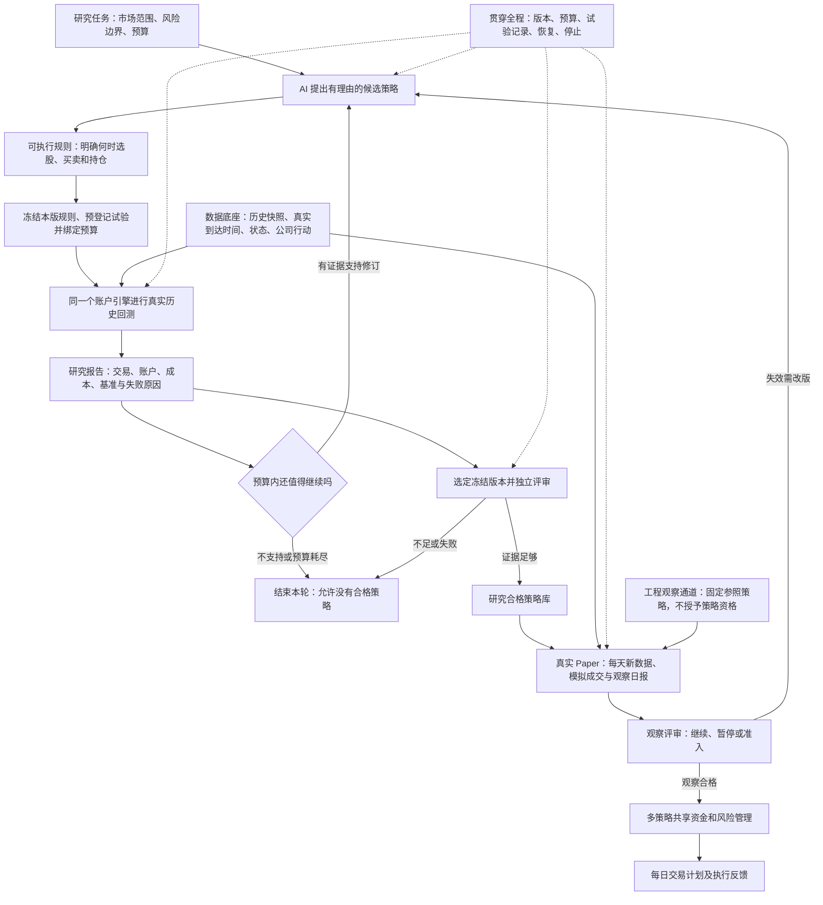

# 从固定策略验收到小规模自主研究闭环

## 结论与调整

**唯一优先下一步：让 AI 在固定预算内，独立完成一轮“提出候选—真实回测—解释结果—修订再试—结束并交付研究报告”。**

现有系统已经有研究编排、候选定义、指标、账户、治理、失败知识、Paper 回放和组合预览。当前最有价值的开发是把已有能力接成同一条真实研究流程，让一个候选从想法到结果、再到下一版都有连续证据。不能把“已有多个模块”说成“业务流程已经完成”，也不应重新建设另一套研究平台。

本规划承接 2026-09-25 总体规划，调整其中的推进条件：历史供应商发布时间取证退出近期开发主线；已有严格历史资格报告保持原结论。历史假设研究可以继续，未来同期数据采集与工程观察可以准备，不再要求先补齐无法获得的旧时间戳。正式策略资格另行评审。

这里的“不使用第一项”指不再追索历史发布时间证明，不自动删除换手率，也不删除交易必需的停牌、上市、ST 等状态检查；更不允许读取决策之后的数据。缺失状态仍要明确处理，不能默认成正常交易。

## 当前系统到底做到哪里

本次按上述 main 基线核对关键业务边界的源码、对应测试和已归档验收报告；未重新运行回测，也未重新验证所有历史运行产物。下表描述可支持的判断，不以代码行数或历史进度记录代替能力证据。

| 能力 | 已有基础与证据 | 距离总目标还缺什么 |
|---|---|---|
| 固定策略真实运行 | 51 指标规则经过公共入口；两证券、118 个账户日、106 个订单、93 笔成交，账户独立核对无差异 | 是小样本工程基线，未证明策略有效，也未证明任意 AI 候选可直接使用同一链路 |
| 除息与恢复 | 两次现金分红的指标价格与原始成交价分离；离线预置信号回测跨进程重放一致 | 不能推广到全部公司行动、实时账户或外部订单恢复 |
| 策略接入 | 公共接口有规则身份、输入绑定、预算回执与账户适配；股票后端支持已有排序规则 | AI 候选物化、旧研究 caller 与公共账户入口仍需贯通；51 指标使用专用适配后端 |
| AI 研究编排 | 有真实 AI 调用与候选治理能力，有失败知识传递 | 受管控制面执行限定合成临时目录；旧编排有结构确认、预测授权等停止边界，尚不能据此宣称真实全自动闭环 |
| 结果与失败诊断 | 公共报告有收益、回撤、费用、交易数；已有多类失败知识 | 公共报告仍是 NOT_ASSESSED，基准默认 NOT_RUN；账户结果到诊断、诊断到下一版的统一证据需补齐 |
| 策略资格 | 有冻结政策、统计裁决、校准原型和多重尝试组件 | 不能把某个统计函数可运行当成正式资格；现有方法原型保留未批准边界 |
| Paper / 前瞻 | 有持久化事件回放、重复请求和恢复测试 | 当前为 SIMULATED_TIME，真实观察天数为 0；缺实际每日到达数据驱动的观察链 |
| 组合与每日计划 | 有共享账户约束、信号冲突处理、计划存档与失效判断 | 当前为研究预览，缺观察合格策略的准入、组合账户运行和执行反馈贯通 |

四种状态继续分别展示：**工程实现、测试覆盖、真实数据验收、策略有效性证据**。本轮已经归档的 PASSED_MODELED 不改成严格历史资格通过。

## 完整业务架构与断点

当前优先打通 B→C→Q→D→E→F→B；H 的正式资格能力是下一阶段主线。每次修订产生新的候选身份，旧冻结版本不改写。P 可以在具备当日数据与运行控制后开始积累工程证据，但不能使未经评审的策略进入 L。所有箭头表示目标连接，不表示当前已全部实现。

用户最终应看到一张研究任务卡：正在验证什么、已尝试多少次、为什么失败、下一版改了什么、还剩多少预算、最终为什么停止。详细证据可展开查看，不要求用户理解内部模块名。

## 下一功能：小规模自主研究任务

首版限定为已有能力支持的 A 股日频研究；使用已经允许研究的历史快照。以一次最多 5 次候选尝试为建议起始预算，候选、修订和已暴露结果按现有治理规则计数，并另设运行时长上限。具体预算在任务启动前冻结，此文不启动试验。

AI 从现有可执行策略组件中选择、组合和调整，先接通一类真正能运行的策略。指标清单应按“候选表达、输入可得、账户后端可执行”三项共同生成，不向 AI 展示实际上无法运行的能力。51 指标固定规则保留为回归参照；研究候选按假设使用相关指标，不强制全部参与，不要求首版支持任意生成 Python 代码。

本功能交付的是可信的研究过程。首轮最后一个策略仍然亏损、无交易或证据不足，都可以是正确结果。系统不承诺必须产生赢家。

### 必须满足的要求

| 编号 | 完成后的业务行为 |
|---|---|
| R1 | 用户启动一项范围和预算明确的研究任务后，系统在该范围内推进，无需人工搬运中间文件；越界时停止 |
| R2 | AI 给出假设、可执行规则和参数；不支持的想法在回测前返回明确原因，不偷换成另一个策略 |
| R3 | 候选通过公共策略入口，规则、数据、交易、账户和试验身份相互对应，继续复用已有引擎与账本 |
| R4 | 报告区分数据/工程失败、交易不可执行、经济表现差、样本不足；有可追溯依据的原因才回传 AI |
| R5 | AI 依据获准反馈提出下一版，保留父版本和修改理由；不擅自改变数据窗口、成本、预算或评审门槛 |
| R6 | 超额、重复候选、模型异常、运行中断均得到明确处置；失败试验保留，不用新任务身份免费重跑 |
| R7 | 完成一轮真实小规模研究，至少展示一次结果驱动的修订和再次运行，并输出完整研究摘要；不自动授予正式资格 |

### 关键设计决定

1. **连接既有研究服务与公共策略入口。** 采用一个明确适配点，复用现有候选注册、Trial、预算和失败知识；不新增第二套总控和资格账本。
2. **数据按用途处理。** 历史时点有假设的输入可用于带限制的探索。已知未来信息仍禁止；实际收到时间从新采集时开始记录。旧报告和冻结数据不改写。
3. **诊断先于大规模搜索。** 首版有固定基准、成本分解、无交易原因、样本覆盖和账户完整性检查，才能给 AI 有意义的反馈。基准与策略使用同一允许范围和适当的费用口径；不可比时明确标记。
4. **训练反馈与独立确认分开。** 默认复用现有定性失败视图，不直接把所有收益明细塞进 AI 上下文。若需更细的训练诊断，单独版本化其可见字段，并验证不泄露封存数据；本规划不撤销原有信息边界。
5. **正式统计资格不阻塞工程闭环，但阻止自动晋级。** 首版输出探索结论；后续评审不采用“跑完即通过”。独立确认必须有真实未参与选择的数据，不能重命名旧窗口。
6. **真实小样本只证明接通。** 扩大股票池和时期时重新验证状态、事件、因子覆盖；不能把两只股票上的正确性推广到全市场。

## 近期实施单元

以下仅细化下一功能。后续 Paper、组合不混入本次实现包。路径是实施定位，最终新增文件名称可随现有结构调整。

### U1. 明确一次真实探索任务的运行边界

**目标 / 对应要求：** R1、R6。形成一个受限真实研究配置，明确数据快照、能力范围、预算、时长和可见反馈；研究结论只能是探索性质。

**文件：** `src/chanlun_trader/research_factory/autonomous_control_plane.py`、同目录 `autonomous_orchestrator_v2.py`；`src/chanlun_trader/execution_policy.py`；相关 `tests/research_factory/test_autonomous_control_plane_v2.py`、同目录 `test_autonomous_orchestrator_v2.py`；新增闭环测试建议 `tests/research_factory/test_bounded_real_research_loop_v1.py`。

**做法：** 核对现有边界后选择单一编排路径，将真实探索接入已有权限模型。禁止把现有 SYNTHETIC 检查直接删掉，或靠环境变量自动取得权限；合成认证路径继续成立。历史资格未知只影响结论等级，不能自动豁免缺失数据、未知状态等其他错误。

任务启动前明确授权覆盖的候选确认、结构检查、回测启动和反馈动作；每次动作继续调用原领域服务并检查范围。已覆盖动作不反复要求用户搬运或确认；缺少覆盖时进入可恢复的等待状态，编排器不得自行伪造确认或授予新权限。

**验证：** 授权覆盖完整的任务可连续完成两轮；缺少某阶段授权时准确停在该阶段之前，不消费其执行预算。不匹配的数据、过期或缺失范围、超额、封存窗口均拒绝；重复启动不重复消耗或执行。此单元依赖现有治理服务，无其他新增单元依赖。

### U2. 把 AI 候选接到已验证的账户执行路径

**目标 / 对应要求：** R2、R3。一个获准候选无需手写专用脚本即可通过公共入口回测。

**文件：** `src/chanlun_trader/research_factory/candidate_executable_materialization.py`、`strategy_interface_v1.py`、`stock_strategy_v1.py`（后三者均在同目录）；`scripts/run_strategy_account_v1.py`；`tests/research_factory/test_candidate_executable_materialization_v1.py`、`test_strategy_backend_migration_v1.py` 与新增闭环测试。

**做法：** 先支持已有账户后端真正可执行的一类规则；候选到执行计划的映射保存可复核身份。不将旧单因子 caller 的限制误判为全系统指标都不可用，也不以通过公共 run 函数代替默认后端兼容性。必要的适配留在策略/研究层，不改写成交引擎。

**依赖：** U1。

**验证：** 两个不同的合法候选均可执行；同一候选由直接入口与研究入口产生一致决策和账户；不支持的规则提前拒绝；改变源码、参数或数据使旧运行回执失效。

### U3. 将真实结果变成有依据的研究反馈

**目标 / 对应要求：** R4、R5。系统可以回答亏在哪里、证据是否够，以及下一次应验证什么。

**文件：** `src/chanlun_trader/research_factory/strategy_report_v1.py`、`failure_adapter.py`、`autonomous_orchestrator_v2.py`（后三者均在同目录）；`tests/research_factory/test_strategy_report_v1.py`、`test_autonomous_orchestrator_v2.py` 与新增闭环测试。

**做法：** 接通成本、固定基准、样本、成交拒绝和账本检查；只报告数据实际支持的原因。现有最终 Trial 事件与详细报告、失败适配器读取的字段形状不同，应明确从哪份可信结果提取诊断，避免仅传回一个笼统分类。多种解释无法区分时标记待验证，不能让 AI 的文字解释冒充已证实因果。把诊断经既有合法反馈视图交给下一轮，并保存父试验、反馈身份及修改理由。基准先用于探索报告，不擅自改变旧 caller 的 HARD_GATE 限制。

**依赖：** U2。

**验证：** 合法无交易、数据不足、费用吞噬毛收益、账户不平、运行错误走不同路径；不平或不完整账户不计算正式收益结论；定性反馈不携带被禁字段。真实修订有证据来源，不要求修订必然提高收益。

### U4. 完整任务验收与普通用户报告

**目标 / 对应要求：** R1、R5、R6、R7。一次任务形成可重复核验的研究过程和易读结果。

**文件：** 复用 `scripts/run_strategy_account_v1.py` 与现有编排入口；新增闭环测试；在 `docs/` 增加真实研究运行说明，在 `progress.md` 记录验证范围。

**做法：** 先完成合成故障场景，再在允许的真实快照上做一轮固定预算研究，至少一次真实模型生成、反馈驱动修订与再次运行。归档模型输出后可重放确定性的执行和账户；不要求重新请求模型一定生成相同想法。

**依赖：** U1、U2、U3。

**验证：** 新进程从持久记录恢复，模型返回后或试验完成后中断不会产生重复候选、重复交易或免费尝试；预算耗尽、所有候选失败、模型不可用都正常停止；报告逐项区分工程、测试、真实验收与策略资格。任何模拟结果替代均不能算真实闭环完成。

## 后续阶段顺序

| 阶段 | 用户得到什么 | 离开该阶段的条件 |
|---|---|---|
| 当前：固定策略小样本工程基线 | 已能核对一个固定规则怎样做决定、交易与记账 | 保留现有证据和限制，不再卡在历史发布时间取证 |
| 下一阶段：小规模自主研究闭环 | 发起一个研究任务，收到候选、试验、失败解释、修订及停止报告 | U1—U4 完成；有真实输入与真实 AI 的有限循环证据 |
| 再下一阶段：可靠筛选与策略档案 | 系统区分值得继续、已淘汰、证据不足和正式研究合格 | 冻结经济标准、成本/延迟/参数压力评估、未污染确认设计、适用统计方法校准；资格可追溯 |
| 随后：真实 Paper / 前瞻观察 | 每天收到冻结策略的信号、模拟交易、持仓与偏差日报 | 每日实际到达数据可追溯；迟到/缺失/修订正确处置；不补造旧信号，不重复记账；按预设观察标准评审 |
| 最终：多策略组合与每日计划 | 在同一笔资金下协调策略，说明今天买卖或不交易的原因 | 成员资格、共同风险、资金竞争、冲突处理和组合账户验证完成；计划绑定实际账户与执行反馈 |

真实前瞻数据留存可在研究闭环开发期间作为后续明确工作包提前建设，以免未来再次缺证。工程观察也可先用固定参照策略开始；它积累运行证据，不自动积累“合格策略观察期”。本次规划不创建定时任务或启动采集。

正式观察策略修改规则后产生新版本，不能将新旧版本的观察天数混合。历史假设数据的资格限制可以通过额外独立证据评审，但不能仅因未来几天运行正常就消失。观察期和收益门槛在启动前根据策略周期、样本需求冻结，不在本规划中随意承诺固定天数即合格。

## 当前不应优先投入

- 继续补齐无法获得的历史发布时间，作为所有开发的前置条件。
- 再扩充一批指标、强制每个候选都使用 51 指标，或围绕固定投票阈值无限调参。
- 从零设计万能 Strategy Contract、第二套回测引擎、第二套总控或第二本试验账本。
- 未形成诊断与停止闭环就大规模 AI 搜索；未形成独立评审就自动晋级。
- 提前做复杂组合优化、券商自动下单或大规模界面改造。

最需要纠正的方向是：**用新增模块和版本数量衡量进展。** 后续每个阶段都应交付一个用户可以完成的任务，以及这项任务在真实条件下成立的证据。

## 证据定位与验证边界

- 固定策略证据：`reports/s1_trusted_baseline_20260925/PRICE_PIT_RESTART.json`；`docs/S1_PRICE_AVAILABILITY_RESTART_V1.md`。
- 公共接口：`src/chanlun_trader/research_factory/strategy_interface_v1.py` 的 `backend_for`、`run`；`stock_strategy_v1.py` 的 `ConfiguredStockRules` 与 `StockAccountBackend`；`scripts/s1_causal_price_strategy_v1.py`。公共报告默认不作资格判断。
- 旧研究输入边界：`src/chanlun_trader/research_factory/caller_inputs.py` 的 `prepare_inputs` 仅接受 DAILY/RAW、单因子、无事件合同。控制面 `_require_execution_policy` 保留合成临时工作区限制。
- 反馈基础：`src/chanlun_trader/research_factory/failure_adapter.py` 的 `FailureKnowledgeViewV1`；既有编排的 `failure_view` 传递。`predictive_executor.py` 的详细结果放在 `validation_row`，而失败适配器期待顶层 `base_metrics` / `cost_stress`，需在接线中核对转换。长循环测试 `tests/research_factory/test_autonomous_orchestrator_v2.py` 使用合成 runtime 与模型 invoker，不作为真实多轮研究证明。
- 统计原型：`scripts/calibrate_statistical_proposal_v4.py` 输出仍为 PROPOSED_NOT_APPROVED；`holm_family_v1.py` 明确不授予资格。`docs/STATISTICAL_PROPOSAL_V4.md` 记录未通过的校准项，本次未重新运行该校准。
- Paper 与组合：`src/chanlun_trader/research_factory/paper_replay.py` 的 `PaperReplaySessionV1`；`portfolio_plan.py`、`daily_plan.py` 的预览函数；`tests/research_factory/test_paper_replay.py` 明确断言真实观察天数为 0。
- 2026-09-25 总体规划保留原文；本计划调整其推进顺序与近期范围，不覆盖旧报告、不改变运行授权。此交付只修改规划与进度记录，不声称上述待建设功能已实现。
