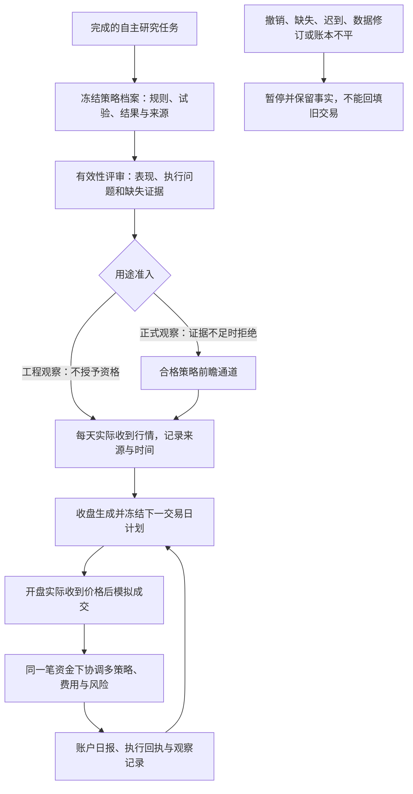

# 从研究结果到策略评审、前瞻观察与共享资金组合

用户已要求合并 PR #21 并继续这三个阶段的开发。本计划连接已有研究成果，保留旧历史回放与正式裁决政策。

## 用户将获得什么

工程观察和合格策略观察分别计数。历史预热、测试、重放恢复均不增加真实观察日。已有获利结果不能替代独立确认；统计方法原型的未批准状态不能被新的准入接口覆盖。

## 实施单元与验收

1. **策略档案与评审。** 从真实研究任务核对规则、预算、试验、结果和结算，生成不可变档案；输出有依据的表现与缺口。准入只读取权威档案，不接收外部 `qualified=True`。支持撤销、版本隔离、重复导出以及篡改拒绝。当前独立确认与正式统计方法缺失时，正式观察必须拒绝。
2. **实际到达快照。** 通达信只通过现有 TQClient 无缓存只读调用，保存请求、业务原响应、服务器接收时间和哈希；OPEN 与 CLOSE 分开，不把历史文件标成真实到达。字段、日期、状态或公司行动证据不完整时明确拒绝。保留合成测试专用通道。
3. **前瞻 Paper。** 冻结策略、范围、费用、交易日历、预热数据和观察用途。收盘只用已收到的数据生成下一日计划；开盘以实际收到的报价和证券状态模拟成交，成交时间不得早于接收时间。复用现有引擎/券商模拟器/账本，不另建交易会计。每天不得结束整个回测并取消次日订单。
4. **共享资金组合。** 多个冻结策略在同一账本运行，保留持仓归属；按冻结优先级、策略资金、单证券累计敞口、持仓数和买入额度分配。开盘再次核对费用、现金、状态、T+1、挂单占用和跳空后的风险，不提前花预计卖出收入。无成员获准时正常停止。
5. **贯通验收和业务说明。** 提供 CLI 完成档案、评审、采集、观察推进、状态、日报和撤销。实际子进程中断后恢复结果一致；重复快照不重复交易、计账或累计天数。归档本次已有真实候选的评审，真实行情不可用时如实记录，不伪造观察。

## 分工与文件边界

- `strategy_qualification_v1.py`：策略档案、评审与用途准入。
- `forward_snapshot_v1.py`：数据到达证据与 TQ 采集。
- `forward_paper_v1.py` / `forward_paper_engine_v1.py`：观察会话、引擎适配、恢复和日报。
- `portfolio_execution_v1.py`：组合政策、计划及交易前风险。
- 统一运行脚本、对应测试、CI 和说明由主集成完成。旧 `paper_replay.py`、旧预览与历史政策不改标签或放宽条件。

## 真实证据边界

当前是 2026-09-26，供应商客户端已安装但未运行。未来有效交易日与真实接收事件无法由开发当天补造。本轮交付可运行功能、合成故障验证及现有真实研究结果的评审；真实 Paper 连续观察和正式策略合格必须等待相应证据。没有启动券商实盘下单或定时任务的授权需求，也不把这些加入本轮。

回滚使用本轮提交的 `git revert`，保留所有研究、档案、快照和观察账本，不通过删除历史重置预算或观察天数。
