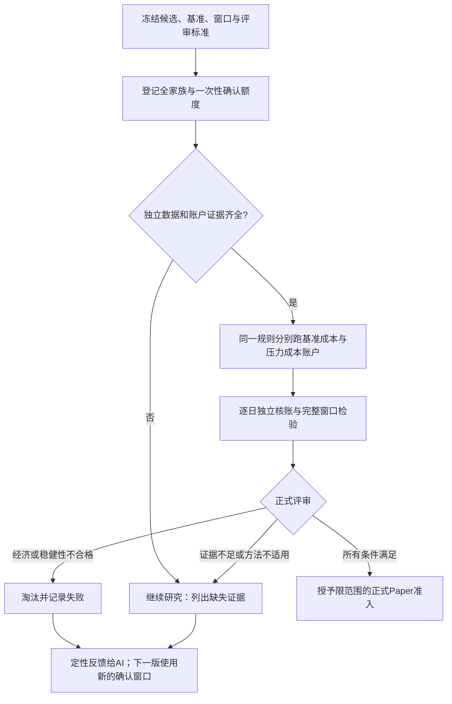

# 用独立证据完成策略正式有效性评审

目标是让已冻结的候选经过真实账户复验、费用压力和统计评审，得到“淘汰、继续研究、允许正式Paper”的可追溯结论。当前5个历史候选没有可证明独立的确认窗口；不得为展示通过而重新标记已有历史数据。旧V4校准失败和旧政策不改写。

## 业务流程

## 冻结原则

- 正式确认首版采用504个共同交易日、最多5个冻结候选，日净简单收益减同口径冻结基准收益。数据不足不缩短窗口，不删除不利日期；正式结果只在窗口结束产生。
- centered stationary bootstrap日均值检验，预登记块长10/20/40，4095次抽样；每成员取三个p值的最大值，再对完整家族Holm校正。零序列p=1，非零常数及非有限输入不可检验。
- 该方法是在弱平稳、短记忆、有限高阶矩假设下的近似推断；最大p值、校准通过或单次平稳性检验均不能证明这些假设。正式结论必须保留这一边界，不宣称未来盈利保证。
- 一个权威目录下最多3个正式批次，错误预算0.025/0.015/0.010，实际检验使用各预算的一半；先登记再曝光，失败/取消不退款。档案绑定权威位置和批次，换任务目录不能继承旧准入或把已用窗口再标独立。此本地权限边界不防御拥有文件系统写权限的人主动伪造整个权威目录。
- 校准设计在生成数据前冻结：2048次独立重复、504日、5成员，数据和抽样种子分开；IID、偏斜、AR(-0.3/0.3/0.6)、MA10、共同冲击、t5、平稳GARCH为支持域，另报告AR0.9、t3、突变、趋势等域外压力及功效。使用多场景校正的单侧Clopper–Pearson上界核对各批次错误预算，失败不修改种子、门槛或删场景。
- 已知旧曝光与缺失完整曝光史均不能得到独立资格。首版真实确认必须在窗口发生前冻结候选和计划，使用实际采集的来源与日期证据；合成验收永不授真实资格。登记未来窗口不伪造交易所日历或观察天数。
- 费用压力必须重新运行原账户，不能从原收益机械扣费。基准也以同一账户口径执行。公共策略接口、已有引擎、现金分红处理及独立核账应复用，旧S1窗口保持兼容。

## 实施单元

1. **统计方法与校准。** 新增formal_statistics_v1、校准脚本及公式/退化/多重检验测试。独立抽样bank、完整校准账本和来源哈希支持复算；校准失败时运行入口明确禁用统计通过分支。
2. **任意冻结窗口账户。** 将现有run_chain组装及逐日核账参数化，新增公共窗口后端与测试；日期、证券、成本、公司行动、日历都进入执行身份。验证不同于旧S1的窗口、未来行隔离、基准/压力实际重跑与旧S1回归。
3. **正式评审权威服务。** 持久冻结全家族、窗口、成本、基准、方法与额度；来源、开始、结果、结算和决策相互绑定。重复运行返回持久结果，损坏或部分失败不能靠换root免费重试。
4. **准入及反馈。** 档案评审和Paper只读取权威服务产出的决策，不能通过外部p值、资格布尔值或自填硬门结果放行。策略/源码/费用/范围变化使旧证据不匹配；撤销优先。向AI仅反馈预定义定性原因，确认数据不再作为同窗口调参材料。
5. **统一入口与验收。** 提供冻结、执行、评审、状态命令和业务报告。验证通过/淘汰/缺证据、完整家族、校准失败、重复和崩溃、证据篡改、旧探索不得晋级。现有5候选只做证据资格核查，不读取新历史窗口或伪造确认结果。

统计模块/校准由统计单元负责；窗口账户与旧run_chain兼容由账户单元负责；权威服务、准入、CLI、文档和集成由主集成负责。各自不同时编辑同一文件，主集成在源码稳定后运行账户类测试。

## 完成边界

交付可运行的正式评审流程、校准真实结果、原账户贯通测试、明确的准入与失败反馈。真实候选是否通过取决于独立数据和方法证据，不保证本轮产生合格策略。若固定校准失败，保留失败、阻止正式晋级并说明待解决的方法问题；不得用“实现完成”替代“方法已通过”。

回滚对应功能提交，保留校准、曝光、预算和策略结果，不删除历史重置错误预算。原用户工作区不动。
