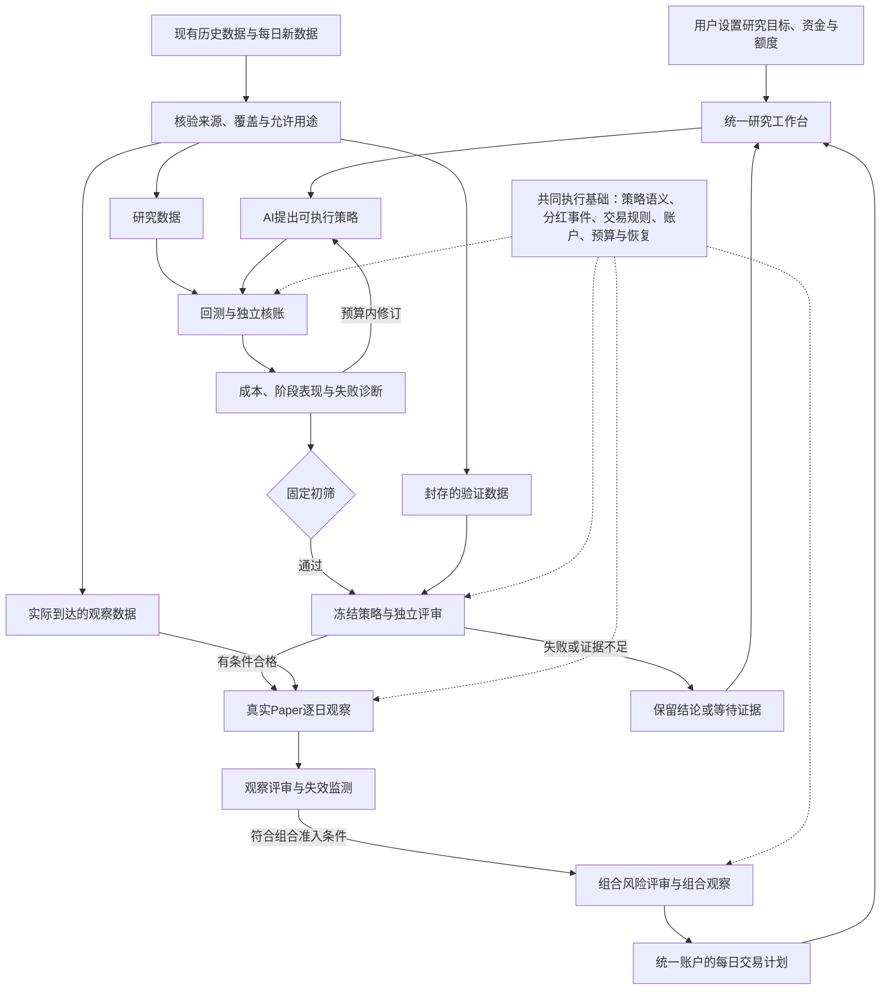

# feat: AI 自主研究系统剩余七项贯通计划

> 2026-09-27 执行记录：实现与验收见 [七项交付矩阵](../AUTONOMOUS_SYSTEM_ACCEPTANCE.md)。三股真实历史账户已核账及重复验证；新规则真实模型调用被模型服务拒绝，独立验证、真实 Paper 和组合观察仍缺外部证据。保留 `active`，不将代码交付等同于全计划实证完成。

## 1. 这份计划要完成什么

把目前已经跑通的小范围 AI 研究循环，建设成一个能够持续研究、可靠评审、逐日观察，并形成多策略每日计划的系统。复用现有数据接入、指标、策略接口、交易引擎、账户和治理服务，重点补齐连接和适用范围。

最终用户只需要明确研究目标、允许的股票范围、资金、风险和研究额度。系统应能解释：正在研究什么、失败在哪里、为什么可以或不可以进入观察，以及今天为什么有交易计划或没有交易计划。

**本次只形成计划。后续执行本计划时，完成所有可以实现和验证的工程工作；真实市场观察必须按实际交易日积累，不用合成数据或历史回放冒充，也不承诺一定找到盈利策略。**

本计划是上一轮七项缺口审查的执行依据。此前固定策略基线和诊断循环已经完成，不重复建设；原始总规划用于理解目标，当前能力以本计划注明的 main 基线及源码为准。

### 1.1 当前已经成立的基础

- 真实 AI 调用能生成受限指标策略，并通过公共策略入口运行。
- 真实历史账户支持费用、相应范围的现金分红、逐日核账和重复验证。
- 失败诊断能影响同一预算内的下一候选；初筛与独立评审之间已经有受控交接。
- 已有策略档案、统计校准、前瞻快照、Paper 恢复、组合资金约束和控制台基础。
- 最新真实批次为 5 个候选、11 个长账户、每账户 504 日；全部未通过初筛，正式独立批次和合格策略均为 0。依据 `reports/diagnosis_research_20260927/RESULT.json`。

### 1.2 七项要求与完成含义

| 编号 | 剩余要求 | 用户最终得到什么 | 主要交付单元 |
|---|---|---|---|
| R1 | 丰富策略表达 | AI 能选择明确的买卖条件、持有期、冷却期和仓位规则，且各执行阶段理解一致 | U5、U7 |
| R2 | 扩大合格数据和股票范围 | 清楚哪些股票、日期和字段可以研究，适用范围不再写死为两只股票 | U1、U6 |
| R3 | 可用的有效性评判 | 按版本固定的标准，给出通过、不通过或证据不足，并说明依据 | U3、U4 |
| R4 | 可执行的独立验证路线 | 有真实可取得的数据路径、使用边界和等待状态，不再只有名义上的评审入口 | U1、U3、U10 |
| R5 | 可持续的真实 Paper | 每日采集、计划、模拟成交、分红、核账和恢复能在支持范围内连续工作 | U2、U8、U10 |
| R6 | 正式多策略组合 | 多个策略共享资金，组合本身经过风险与观察评审，生成账户级每日计划 | U6、U9 |
| R7 | 统一日常入口 | 控制台、CLI 和 AI 工具使用同一业务服务，统一展示任务、证据、等待和异常 | U10、U11、U12 |

---

## 2. 完成标准：四种状态必须分别报告

1. **工程实现完成**：功能存在，入口贯通，异常和恢复路径可执行。
2. **测试验证完成**：相关自动化、跨模块集成和中断测试通过，含正向与拒绝路径。
3. **真实数据验证完成**：在明确证券、日期、资金和规则范围内，原始输入、决策、成交与账户可复核。
4. **策略有效性证据成立**：某一冻结版本满足预先规定的独立评审条件，获得有适用范围和有效期的资格。

每项能力单独记录这四列；尚未取得真实证据写“待验证”，不写“完成”。零合格策略是合法结果，但不能据此跳过正向准入分支的工程测试。反过来，合成策略通过准入测试也不能增加真实合格策略数量。

**工程交付完成与全计划实证完成分开签收。** 工程交付需要 U1—U12 的实现、规定测试、可取得的真实验证和交付报告；全计划实证完成还需真实独立评审、Paper 和组合观察证据。未来数据未到时，工程交付可以完成，计划的实际观察项继续保持等待；不能把整份计划直接标为 `completed`。

---

## 3. 业务架构与推进路线

顺序不是把七项按编号逐一堆起来，而是先解决后续能力共同依赖的问题。

| 阶段 | 主要工作 | 出口标准 |
|---|---|---|
| P0：明确证据路线 | U1 数据资格与暴露记录、U3 验证协议 | 每份数据有用途；独立路径可取得或明确等待，不靠改标签过关 |
| P1：打通评价基础 | U2 公司行动、U4 方法适用性；开始 U10 的采集与任务基础 | 历史、正式账户和观察能使用一致的事件语义；方法给出可核验的支持范围 |
| P2：扩大研究能力 | U5 策略表达、U6 股票池与共同账户、U7 研究循环 | 在扩展范围完成真实历史研究，结果能进入正确的评审队列 |
| P3：持续真实观察 | U8 Paper、补齐 U10 生命周期调度 | 实际日期的数据驱动观察，正常事件可处理，异常停得住且可恢复 |
| P4：组合与日常使用 | U9 组合资格、U11 统一工作台、U12 全链验收 | 账户级每日计划可解释可核对，七项状态和剩余等待清楚可见 |

U10 的采集可以在 P1 开始，避免工程完成后才开始积累数据；它不能提前运行尚未取得资格的正式策略。UI 在每个服务稳定后逐步接入，不等最后才发现业务入口不兼容。

提前采集的数据不自动成为任何后续候选的独立样本：候选冻结前的记录按 U1/U3 判定用途，冻结后符合协议的记录才可累计对应验证窗口。U10 可先交付采集与等待调度，研究、Paper、组合推进分别在其依赖单元完成后验收，不形成相互等待的循环依赖。

---

## 4. 关键决定与范围边界

### 4.1 复用现有能力，增加经过验证的适配

继续使用 `src/chanlun_trader/research_factory/strategy_interface_v1.py`、原交易引擎及账本、策略档案和研究治理。原条件层、退出规则、排名和组合组件先做能力对照，不因为新链路没接入就重写一套。允许新增版本化适配器，不建设任意 Python 代码生成和执行平台。

51 个指标保留为能力目录和回归基准；不要求每个新候选同时使用全部指标。此前“全部指标参与”的固定规则继续作为工程基线。新的研究候选按假设选择已支持指标，并记录未采用指标与能力缺失的区别。

### 4.2 历史研究、独立验证和前瞻观察分开

优先核验现有 TDX、BaoStock 及项目数据，按覆盖和来源决定用途。文件存在、时间较新、换一个目录、只输出定性反馈，都不能证明数据未被用于研究。

计划提供两条验证路径，但都需资格审计：

- **封存历史验证**：仅限有证据表明未参与相关设计、选择或评价的数据。需检查历史访问、策略家族、相关目标和研究人员/AI 已知信息；无法证明时只用于研究或稳健性检查。该路径不自动继承旧正式协议的资格，须由 U3/U4 的新协议明确其证据含义。
- **冻结后的真实观察验证**：使用实际到达的数据。没有合格封存历史时，这是默认正式路径；预热与评价样本分开，是否允许历史预热必须在新方法验证前冻结。保留当前 V1 的 60＋504 交易日协议和历史记录，不原地缩短或改写。

工程观察可以先验证采集与账户是否可靠；正式策略观察须取得相应资格。两者可以共用真实行情来源，但不得把同一段策略表现重复计为独立确认和独立的后续观察；窗口重叠时明确依赖，不重复授予证据权重。

### 4.3 统计适用性不是一个可手动勾选的开关

不直接删除 `REAL_RETURN_PROCESS_APPLICABILITY_NOT_ESTABLISHED`，不因某策略收益好而改变方法。新方法或支持范围必须有预登记、独立数值核对、已知答案的校准，以及从真实引擎生成收益过程的适用性研究。

有限样本诊断不能证明真实市场满足独立性、平稳性等全部假设。报告应写清条件、范围与证据不足；无法建立支持范围时保留阻断，同时继续不依赖正式准入的开发。

### 4.4 股票池、公司行动和资金规模必须显式限定

首轮扩展以沪深主板日线、多证券、仅做多现金账户为边界。股票池依据数据资格和预先冻结的选择规则形成，不以回测收益挑选。历史成分变化、退市和缺数必须可见；仅有当前幸存股票时，不宣称代表整个 A 股市场。

先贯通有来源、可核对条款的现金分红；复用已有受支持的送转股能力时，必须验证股权、到账、可卖时间及整股限制。配股、未知税务条款、缺失事件和无法验证的退市结算保持明确不支持，保留资产与待处理事项，不伪造成交或把资产归零。

本轮不建设融资融券、期权、分钟级/盘口撮合或券商实盘下单。普通用户的每日计划仍是模拟与辅助核对用途。

### 4.5 有限自主运行，保留停止条件

后续执行时可在已授权目标、尝试次数、模型费用、运行时长和数据用途内自动推进。额度、时间、数据或资格不足时停在对应状态；不通过新建目录、目标或家族获得免费重试，也不因为用户说“做完整个计划”而无限研究。

本次不创建定时任务。后续开发调度能力时，配置真实采集范围、到期时间和停止条件，并按当时已有授权启用；未启用必须明确显示。恢复沿用同一任务和既有预算。源码升级通过冻结运行版本和显式迁移处理，不关闭原有源码身份校验。

---

## 5. 可执行交付单元

以下文件均为仓库相对路径。“拟新增”是建议落点，实施时先检查是否已有等价组件；可调整文件组织，不可省略业务要求或另建竞争性权威账本。每单元必须形成可独立审阅的改动和验证记录。

### U1. 建立数据资格与已用数据清单

- **目标／要求**：R2、R4；知道哪些数据可研究、可核账、可独立验证，不能只按文件名判断。
- **依赖**：无。复用上一轮盘点及数据读取权限，先查已知数据目录，再按缺口扩大只读检索。
- **文件**：`src/chanlun_trader/research_factory/historical_process_v1.py`、`src/chanlun_trader/research_factory/formal_evidence_v1.py`、`src/chanlun_trader/research_factory/forward_snapshot_v1.py`；拟新增 `src/chanlun_trader/research_factory/research_data_qualification_v1.py`、`tests/research_factory/test_research_data_qualification_v1.py`、`docs/RESEARCH_DATA_QUALIFICATION.md`。
- **做法**：记录来源、抓取时间、证券、日期、字段、单位、复权、状态、公司行动和已访问用途；引用现有试验、输入哈希与预算记录，跨目录同内容识别。资料缺失写未知，不补造历史可见时间。核验封存样本时先读元数据，获准前不读取其价格与收益供研究使用。
- **测试场景**：同内容异路径不成为新样本；同窗口不同复权文件仍视为相关暴露；未知访问记录不能获得独立资格；单位或状态缺失限制用途；新股与退市股票不会被静默丢弃。
- **验收**：真实数据目录形成可复核的资格报告和缺口表，列出可立即使用与必须等待的范围。盘点不足以判定的内容保持未知，不阻塞其他可开发部分。

### U2. 贯通公司行动与账户处理

- **目标／要求**：R4、R5；让已支持的分红事件在历史、正式评审和 Paper 中有相同的资产含义。
- **依赖**：U1 的来源和事件范围；不依赖合格策略。
- **文件**：`src/chanlun_trader/engine/corporate_accounting_v1.py`、`src/chanlun_trader/engine/corporate_action_engine_v1.py`；`src/chanlun_trader/research_factory/causal_dividend_features_v1.py`、`src/chanlun_trader/research_factory/formal_evidence_v1.py`、`src/chanlun_trader/research_factory/forward_paper_engine_v1.py`、`src/chanlun_trader/research_factory/forward_paper_v1.py`；`tests/research_factory/test_corporate_accounting_v1.py`；拟新增 `tests/research_factory/test_corporate_action_lifecycle_v1.py`、`docs/CORPORATE_ACTION_LIFECYCLE.md`。
- **做法**：明确公告何时收到、股权登记、除权除息、到账、税费及修正版本。动态接收事件仍复用原账户；复权只影响指标视图，成交保持实际价格口径。缺条款或未知事件暂停受影响用途，不以 `TodayDRFlag=false` 单独证明完整事件覆盖。
- **测试场景**：登记日前后买卖、应收与可用现金区别、到账重试不重复派息、支持范围内送转、迟到更正不能改写过去决策；在事件提交前后杀进程，恢复与连续执行的资产一致；未知事件保留持仓和错误。
- **验收**：已有真实分红案例在各执行入口逐日现金、持仓、应收、净值一致。历史重放只证明历史处理；未来实际分红处理另列真实观察证据。

### U3. 明确独立验证协议与证据通路

- **目标／要求**：R3、R4；候选通过初筛后，有可以实际执行的下一站。
- **依赖**：U1；协议设计可先完成，带公司行动的执行依赖 U2。
- **文件**：`src/chanlun_trader/research_factory/formal_assessment_v1.py`、`src/chanlun_trader/research_factory/formal_evidence_v1.py`、`src/chanlun_trader/research_factory/strategy_qualification_v1.py`；拟新增 `src/chanlun_trader/research_factory/validation_protocol_v2.py`、`tests/research_factory/test_validation_protocol_v2.py`、`docs/VALIDATION_EVIDENCE_PROTOCOL_V2.md`。
- **做法**：协议冻结数据来源、暴露范围、研究家族、基准、成本、起止规则、预热、样本要求和评定次数。新协议保留旧版本只读解释；历史封存路线只有通过审计且被方法支持才允许使用。未来路线明确每日采集需求、丢失阶段处理、公司行动覆盖和预计等待的交易日数。
- **测试场景**：已用历史不能冒充封存；无访问记录不视为未访问；评价期与预热越界拒绝；旧协议结果仍可复读；新增样本或更换方法不能重复消费同一确认机会；无证据时输出等待且不授予资格。
- **验收**：为当前数据条件生成一份实际可执行的验证准备报告；即使没有任何候选通过，也能核对路径和等待原因。不得以“登记成功”声称独立评审完成。

### U4. 建立方法支持范围与资格证据

- **目标／要求**：R3；把硬编码阻断替换为有证据约束的适用性判定，而不是放宽标准。
- **依赖**：U1、U3；带分红的账户过程验证依赖 U2。
- **文件**：`src/chanlun_trader/research_factory/formal_statistics_v2.py`、`src/chanlun_trader/research_factory/formal_assessment_v1.py`、`src/chanlun_trader/research_factory/formal_account_backend_v1.py`；拟新增 `src/chanlun_trader/research_factory/method_applicability_v1.py`、`tests/research_factory/test_method_applicability_v1.py`、`docs/METHOD_APPLICABILITY.md`；复用 `tests/research_factory/test_formal_statistics_v2.py`。
- **做法**：先独立核对净超额收益、费用、基准与家族校正。保留现行 V2，评估其条件支持范围；如不能支持目标过程，先提交新版本方法说明及主来源依据，再冻结校准方案，不在本计划中预先认定某替代检验有效。冻结误报和检出能力标准、样本要求、校准随机种子、方法选择预算及失败处理。批内家族和跨批确认额度都继承权威治理。
- **测试场景**：无超额收益、已知正效应、强相关、厚尾、均值/波动变化、空仓、费用拖累、路径依赖持仓；引擎生成的账户与直接构造收益分开校准；数值实现与独立实现交叉核对；删除失败候选、反复查看验证结果或不匹配的支持证书不能通过。
- **验收**：输出支持范围、失败范围、校准置信界和真实账户过程诊断；合格判定依赖匹配的策略/数据/执行/方法版本。真实市场假设无法确认时仍写条件性或证据不足。禁止用自相关“不显著”充当独立性证明。
- **范围约束**：方法支持记录还必须绑定股票池、资金规模、收益构造、样本数、候选家族上限和确认额度。当前 V2 的五候选及两证券账户证据不能自动认证 U5/U6 扩展后的范围；扩展完成后须补充对应过程验证，之后 U7 才能使用该范围的正式资格。
- **执行边界**：方法研究也是有限实验。首次执行前冻结本轮研究预算；预算结束仍不支持时保留报告与准入阻断，继续其他工程单元，不无限更换方法直到出现通过结果。

### U5. 让 AI 表达更有意义的策略

- **目标／要求**：R1；针对成本和阶段失败，AI 真正能改变交易行为。
- **依赖**：U1；与 U4 可独立实施，但不得绕过正式准入。
- **文件**：`src/chanlun_trader/research_factory/bounded_candidate_v1.py`、`src/chanlun_trader/research_factory/strategy_interface_v1.py`、`src/chanlun_trader/research_factory/bounded_model_v1.py`；`src/chanlun_trader/engine/conditions_v2.py`；拟新增 `src/chanlun_trader/research_factory/research_rule_strategy_v2.py`、`tests/research_factory/test_research_rule_strategy_v2.py`、`docs/RESEARCH_STRATEGY_CAPABILITIES_V2.md`。
- **做法**：先对照已有条件、退出与排名组件，接入指标输出比较、交叉、阈值、与/或组合、独立买入卖出条件、交易日持有期、冷却期、市场条件过滤及有界目标仓位。第一版市场过滤只引用合格价格/成交数据；指标参数和组合深度设上限。冲突默认退出优先；缺指标默认不新增买入，不把缺失当看空信号；持有期和强制退出依交易日及 T+1 处理。原投票规则保持兼容。
- **测试场景**：同样行情下低频规则减少无意义反复交易；周末不增加持有交易日；同时买卖时退出优先；指标多输出不总取第一个；缺数据、非法参数、未来数据引用、任意代码拒绝；公共回测与 Paper 同一输入的决策一致。
- **验收**：真实 AI 能生成至少不同机制的合法候选，解释与执行规则一致；不要求候选盈利。每个新增原语都有对应支持声明和行为测试。

### U6. 扩大股票池并统一多证券账户

- **目标／要求**：R2、R6；从两证券实验扩为明确范围的股票池研究和执行。
- **依赖**：U1、U2、U5；正式统计用途还依赖 U3/U4 的对应范围支持。
- **文件**：`src/chanlun_trader/research_factory/historical_process_v1.py`、`src/chanlun_trader/research_factory/formal_account_backend_v1.py`、`src/chanlun_trader/research_factory/formal_assessment_v1.py`、`src/chanlun_trader/research_factory/forward_paper_engine_v1.py`；`src/chanlun_trader/engine/universe.py`；拟新增 `tests/research_factory/test_multi_symbol_account_lifecycle_v1.py`、`docs/MULTI_SYMBOL_RESEARCH_SCOPE.md`。
- **做法**：将两证券、固定 50% 仓位等试点限制移到冻结配置；不原地改变旧实验定义。使用实际交易所日历、逐证券上市/停牌/退市与数据资格；不能取所有证券日期交集而悄悄删除市场交易日。排序、同分处理、现金分配与基准事先固定，多证券共同账户处理资金竞争。
- **测试场景**：证券顺序变化不改结果；新上市、停牌、缺数、退出股票池、退市事件不丢资产；排名不能看到未来成分；资金不足按固定优先级分配；2 只兼容用例及至少 3 只证券的账户集成；真实数据通过资格后逐步扩大规模并记录耗时和内存。
- **验收**：用超过两只、按非收益规则确定的真实合格股票完成研究和重复核账。数据不足时明确范围未完成，不能用合成扩容冒充市场覆盖。回测、正式评审和 Paper 接受相同范围定义。

### U7. 扩展失败驱动研究并闭合评审交接

- **目标／要求**：R1、R3、R4；诊断不仅改变投票门槛，还能驱动新的可执行假设。
- **依赖**：U3、U5、U6；正式资格判定使用 U4。
- **文件**：`src/chanlun_trader/research_factory/diagnosis_research_v1.py`、`src/chanlun_trader/research_factory/research_screening_v1.py`、`src/chanlun_trader/research_factory/research_diagnostics_v1.py`、`src/chanlun_trader/research_factory/bounded_research_v1.py`；`scripts/run_diagnosis_research_v1.py`；拟新增 `tests/research_factory/test_diagnosis_research_v2_lifecycle.py`；更新 `docs/DIAGNOSIS_DRIVEN_RESEARCH.md`。
- **做法**：诊断覆盖频繁交易、费用、不同阶段、空仓/满仓、股票集中和不可成交原因。模型收到能力目录、既有规则与允许的失败反馈；新候选保留父子关系和机制解释。不同任务间去重依据已有档案与暴露记录，不新建另一套预算。正式失败窗口一旦进入后续设计即成为研究数据，新候选使用新的验证机会。
- **测试场景**：成本失败产生带冷却/持有约束的合法候选；无有效动作时不虚构修复；重复规则不免费重试；零通过者不消耗确认额度；通过者执行验证、未通过者保留家族位置；恢复不再次调用模型或重跑已结算账户。
- **验收**：在预先冻结的有限预算内完成真实 AI→扩展规则→历史核账→诊断→下一候选。真实是否有晋级者单列；正向交接用清晰标识的合成夹具验收，不制造真实优胜策略。

### U8. 完成真实 Paper 的连续运行和观察评审

- **目标／要求**：R5；观察可持续，并能说明策略是否需要继续、暂停或退回研究。
- **依赖**：U2、U3、U5、U6；正式观察依赖 U4 的有效资格，工程观察不依赖策略通过。
- **文件**：`src/chanlun_trader/research_factory/forward_snapshot_v1.py`、`src/chanlun_trader/research_factory/forward_paper_v1.py`、`src/chanlun_trader/research_factory/forward_paper_engine_v1.py`、`src/chanlun_trader/research_factory/strategy_qualification_v1.py`；`scripts/run_strategy_lifecycle_v1.py`；`tests/research_factory/test_forward_paper_process_recovery_v1.py`；拟新增 `tests/research_factory/test_forward_observation_lifecycle_v2.py`；更新 `docs/STRATEGY_FORWARD_PAPER_V1.md`。
- **做法**：启动前冻结观察目的、窗口、允许缺失、风险阈值和评审时点。工程观察与正式观察分账解释；实际阶段按真实时间推进，支持事件处理、断线、晚到、撤销和版本升级。对达到冻结风险阈值或来源失效的策略停止新买入，保留可合法执行的退出计划；观测结果变化不自动改策略参数。
- **测试场景**：真实收盘信号只能用于后续合法阶段；重启不重复交易或派息；迟到数据不能回填为准时成交；多日停牌持仓保持；升级旧运行版本不能静默混用；资格撤销后保留退出；工程观察天数不能转为合格观察天数。
- **验收**：交易时段内的真实采集→计划→模拟执行→核账链路留下证据；持续观察按实际达到的交易日记录。短期工程冒烟不替代预登记的策略观察窗口，也不证明实盘成交真实性。

### U9. 组合资格、风险评审和每日计划

- **目标／要求**：R6；从多个策略到一个可解释的账户级行动计划。
- **依赖**：U4、U6、U8；无真实合格策略时先交付工程能力与合成正向验证。
- **文件**：`src/chanlun_trader/research_factory/portfolio_execution_v1.py`、`src/chanlun_trader/research_factory/portfolio_plan.py`、`src/chanlun_trader/research_factory/daily_plan.py`、`src/chanlun_trader/research_factory/strategy_qualification_v1.py`、`src/chanlun_trader/research_factory/forward_paper_v1.py`；拟新增 `src/chanlun_trader/research_factory/portfolio_qualification_v1.py`、`tests/research_factory/test_portfolio_qualification_v1.py`、`docs/PORTFOLIO_QUALIFICATION.md`；复用 `tests/research_factory/test_portfolio_execution_v1.py`。
- **做法**：首版采用预先冻结的固定权重及风险上限，不做自动寻优。组合有独立版本、研究/观察记录和准入条件；单策略合格不自动等于组合合格。检查同股暴露、共同回撤、资金争用、成本和策略退出；相关性只是诊断，不单独证明分散有效。组合开始可作为工程观察，正式资格须经过组合自身规定的证据评审。
- **测试场景**：两个策略买同股、一个卖一个买、资金不足、跌停卖不出、费用占用、同开盘卖款不预支、成员撤销、权重到期；计划与真实账户不一致拒绝执行；重复生成/执行不增加订单；没有合格成员时输出有原因的无交易计划。
- **验收**：至少两个策略在共享账户中完成集成与恢复测试。每日计划含日期、资金依据、现有/目标持仓、买卖数量、策略归属、成本、冲突和不可执行原因。真实组合资格及观察证据单列，不能由单策略报告相加替代。

### U10. 持续采集、任务推进与恢复

- **目标／要求**：R4、R5、R7；让可执行的业务服务按交易日和任务状态持续运行。
- **依赖**：U1、U3 定义来源与用途后可开始；U7/U8/U9 完成后逐项接入对应适配器。
- **文件**：`src/chanlun_trader/research_factory/autonomous_orchestrator_v2.py`、`src/chanlun_trader/research_factory/bounded_research_v1.py`；`src/chanlun_trader/research_daemon.py`；拟新增 `src/chanlun_trader/research_factory/research_lifecycle_jobs_v1.py`、`tests/research_factory/test_research_lifecycle_jobs_v1.py`、`docs/RESEARCH_LIFECYCLE_OPERATIONS.md`。
- **做法**：复用现有控制面、运行锁和持久任务记录；按目标/会话/交易日/阶段幂等推进。捕获错过的时段并说明后果，不用后补行情伪造过去快照。统一等待数据、等待资格、预算耗尽、用户暂停、工程失败与完成状态。任务到期停止；持续研究有跨批总额，不自动扩大权限。冻结运行版本可重放，升级创建明确接续或新会话，保留旧身份。
- **测试场景**：双触发只执行一次；进程杀死后续接；非交易日不采集；缺 OPEN 或 CLOSE 标记缺口；电脑关机后不会补造及时到达；账户故障不记为策略失败；额度耗尽不建新家族；版本升级不污染旧会话。
- **验收**：统一入口能启动、查看、停止和恢复已有授权任务；真实采集至少完成可取得的有效阶段，长期无人值守能力另按实际运行证明。等待中的任务不忙循环、不消耗模型预算。

### U11. 统一控制台、CLI 与 AI 可调用入口

- **目标／要求**：R7；用户不需要理解目录、哈希和多个脚本才能判断系统状态。
- **依赖**：U10 的状态和服务接口；各阶段能力随 U3/U7/U8/U9 稳定后接入。
- **文件**：`src/chanlun_trader/research_console.py`、`src/chanlun_trader/webapp.py`；`frontend/src/console/ResearchConsole.vue`、`frontend/src/console/api.ts`、`frontend/src/console/types.ts`；`scripts/run_strategy_lifecycle_v1.py`、`scripts/run_diagnosis_research_v1.py`；拟新增 `tests/research_console/test_research_lifecycle_console_v1.py`、`frontend/src/console/lifecycle.test.ts`、`docs/AUTONOMOUS_RESEARCH_USER_GUIDE.md`。
- **做法**：在现有控制台增加统一的研究、验证、观察、组合和每日计划视图；统一业务服务成为状态依据。每页先显示目的、当前状态、阻断原因和下一动作，再展开技术证据；四种完成状态分开显示。用户操作与 AI/CLI 操作经过相同授权、预算和幂等校验；复用原本机写入边界，不新增远程控制权限。
- **测试场景**：零候选、全失败、等待真实数据、方法不支持、观察中、暂停、过期、故障恢复；前端不能因请求成功就显示研究通过；刷新页面不启动任务；页面与 CLI 对同一任务显示一致；撤销后旧页面不能继续执行；默认中文、机器标识保持原值。
- **验收**：浏览器完成一个有限研究任务的操作与查看；等待和无交易也有完整解释。可调用入口覆盖用户能做的授权操作，不需要 AI 改内部 JSON 推动状态。

### U12. 全链验收、发布与交接

- **目标／要求**：R1—R7；以业务旅程签收，而不是按新增文件数签收。
- **依赖**：U1—U11；外部等待不阻止工程验收，但必须留在待实证清单。
- **文件**：拟新增 `tests/research_factory/test_autonomous_lifecycle_acceptance_v1.py`、`docs/AUTONOMOUS_SYSTEM_ACCEPTANCE.md`；更新适用的 `.github/workflows/`、相关业务文档及 `progress.md`；验收结果写入新的 `reports/` 批次目录。
- **做法**：复用同一策略和数据身份走完整旅程，核对每个交接及拒绝分支。真实证据与合成证据分开；保留模型来源、输入清单、逐日决策、交易账本、独立核账、预算与资格变化。各交付批次按已有授权提交、CI 和合并；当前文档编写不等于已启动实施或外部发布。
- **测试场景**：真实有限研究零通过路径；合成完整通过→Paper→组合→每日计划路径；篡改输入/资格拒绝；数据缺失等待；跨阶段杀进程后恢复；有合格真实数据和策略时再执行对应真实正向旅程。
- **验收**：七项要求都有实现、测试、真实数据和策略资格四列记录；每项未完成实证都有具体数据需求、现有任务引用和恢复入口。工程完成不伪装为全计划完成；没有可行方法、必要数据或合格策略时如实报告。

---

## 6. 全链业务验收例子

- AE1：AI 因成本过高生成带持有期/冷却期的新规则；同一规则在回测与 Paper 的同输入重放中决策一致，费用和交易次数从账户重算。
- AE2：已有历史曾用于候选设计，提交给独立评审时被拒绝；系统转为正确等待状态，不重置历史暴露。
- AE3：策略通过初筛但方法不适用，显示“证据不足”，不进入正式 Paper；工程观察仍按单独用途运行。
- AE4：持仓跨过现金分红，指标和成交各用正确价格，股权、应收、税费及到账可核对；在到账中断恢复后不重复记账。
- AE5：市场停牌或采集缺失，系统保留持仓，解释不可执行或证据缺口，不凭后来的信息补造交易。
- AE6：两个合格策略同时要买同一股票，统一账户按冻结规则处理资金与风险；组合仍需要自身的观察和准入。
- AE7：用户暂停后重启，同一个候选、确认机会和交易日不重复消耗预算或产生第二份成交。
- AE8：一轮没有任何合格策略，用户看到明确的结束报告和无交易计划；这不被描述为系统崩溃，也不冒充“目标已找到有效策略”。

---

## 7. 实施节奏、回滚与交付证据

后续收到执行指令后，按阶段依赖持续推进，不在每个常规实现选择上反复询问。执行前核对最新 main 与本计划基线的差异，复用已完成能力；将确实新增或改变范围的事项单独说明。使用隔离工作区，保留用户原有未提交文件。

每个可独立交付的单元完成相关验证后及时提交；不规定固定 PR 数量，也不把整个系统压成一个巨大变更。真实账户、统计方法、公共接口及控制台分别采用适合的测试；不因纯文档改动运行完整应用测试。

新增协议和策略版本保留旧读取与重放能力。若需要改变核心合同、账户结构或并发恢复语义，先用版本化方案列明影响；已有明确执行授权覆盖的计划内修改不重复索批，超出范围的改动另行说明。

回滚以对应功能提交的反向提交或功能入口停用为主，保留数据、模型回执、暴露、预算、资格与成交事实。撤销软件版本不能退还已消费的研究机会。账户或方法不支持旧版本时，保持旧冻结运行环境可读，不能强制用新解释覆盖历史结果。

最终交付包括：业务架构与使用说明、策略能力目录、数据用途清单、验证协议和方法支持报告、Paper 与组合运行手册、七项验收矩阵、实际测试与 CI 记录，以及真实观察仍需等待的明确清单。

---

## 8. 已知风险与实施时必须查明的事实

| 事项 | 当前事实或未知 | 本计划的处理 |
|---|---|---|
| 独立历史数据 | 尚未证明存在未暴露且符合条件的窗口 | U1 审计；不合格则保持研究用途，采用未来路线 |
| 实时公司行动细节 | 当前快照主要识别当日标志，不能替代完整条款与到账证据 | U2 核验现有供应商与本地事件数据；不足时明确暂停 |
| 统计适用性 | V2 只完成有限合成过程校准，真实适用性未成立 | U4 有限研究和条件支持，不保证研究必然成功 |
| 更大股票池 | 试点仅两股，扩大后可能暴露缺数和性能问题 | U6 按非收益规则逐步扩大，报告真实覆盖与容量 |
| 长期运行 | 电脑、TDX 服务、实际交易日和及时数据构成外部依赖 | U10 记录健康与缺口，不伪造过去实时数据 |
| 正向真实资格 | 当前没有真实合格策略 | 工程正向使用标识清楚的合成证据，真实项保持待验证 |
| 新旧多条研究路径 | 控制台、原守护流程与新有限研究链尚未全部统一 | 复用业务服务并增加适配；不另造主账本和资格来源 |

这些不是需要用户现在逐项回答的问题。先按本计划取得证据并完成能独立推进的工作；只有实质改变范围或需要新的外部授权时再提出具体事项。

---

## 9. 规划依据与下一步唯一优先项

本计划主要依据：`docs/DIAGNOSIS_DRIVEN_RESEARCH.md`、`docs/FORMAL_STRATEGY_ASSESSMENT_V1.md`、`docs/STRATEGY_FORWARD_PAPER_V1.md`、`docs/HISTORICAL_PROCESS_RESEARCH_504.md` 及上述各单元的源码、测试。较早文档的状态描述可能滞后，冲突时以冻结版本源码和实际报告为准。

本次不预选新的统计检验、不承诺供应商存在尚未核验的字段；实施 U2/U4 时再核查实际供应商合同及所选方法的原始资料，并保存来源。这样避免将未验证的外部假设写成既定能力。

**唯一优先项：执行 P0，形成“数据资格清单＋可执行的独立验证协议”。**

该项完成后，立即推进共同账户事件处理与评判方法支持；之后扩展策略和股票池。整条路线为：

**小范围研究循环 → 数据与独立验证路线 → 可信评价基础 → 扩展自主研究 → 持续真实 Paper → 正式组合与每日计划。**
