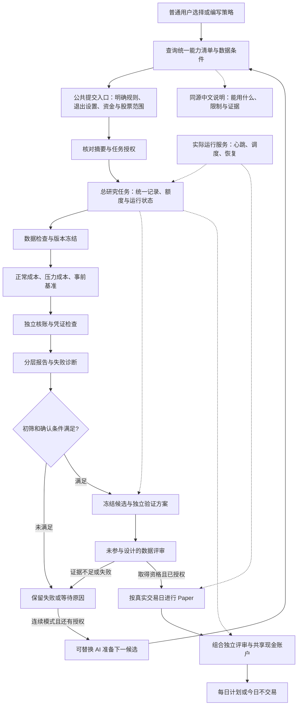

# feat: Trusted Strategy Research Workflow

**中文名称：提交一份策略，系统自动完成整套可信研究——完整开发计划。**

本计划覆盖原需求全部 24 条要求、5 条业务流程和 15 个验收场景，并纳入 2026-09-29 用户追加的统一能力说明与查询、已有止损止盈接入要求，新增 R25–R26、AE16–AE19；合计 26 条要求、19 个验收场景，仍沿用 U1–U15 的稳定开发编号。面向用户的路线在前，实施文件、依赖与测试安排在后。文中的“新增”“扩展”“验收”均为待执行工作，不表示已经实现。本次只修改计划，不改变原需求文档或运行中的研究。

## Summary

先把已有公共组件接成普通用户可以独立使用的研究流程：查询当前能力与数据条件，提交明确规则和退出设置后，由系统准备数据、运行真实资金账户、核账和出具报告。能力清单与使用说明同源，已有止损止盈通过公共入口配置，不再依赖 AI 翻代码猜测。再让 AI 在同一总任务、同一额度和同一评判规则下连续提出候选，最终衔接独立验证、真实 Paper 和组合每日计划。

**路线：现有组件与临时研究脚本 → 提交即可信回测 → 可信连续研究 → 独立验证与真实观察 → 合格组合与每日计划。**

**唯一优先下一步是第一阶段。** 用三份不同规则、两个股票范围和五万元账户证明：关闭 AI 后，不新增任何候选专用脚本，系统仍能完成回测、失败阻断、核账、恢复和报告。策略亏损不影响这项工程验收；核验错误却必须使验收失败。

---

## Problem Frame

问题不是缺一个会写策略的 AI，而是目前会话 AI 还承担了数据拼装、运行组织和结果判断。每轮新增配套脚本，会让实际规则、预算和“通过”的含义发生变化。此前出现的 MA10 实际执行 MA20、绑定失败仍被初筛放行、删除未完成作业后重跑等问题，都必须由公共流程阻断。

规划基线为本机 main 提交 `2931cbde08cef9c81bbd9807a79eef12ad1259ab` 及 2026-09-29 读取到的工作区。已有未提交研究文件保留；它们可作为回归问题的来源，不作为新产品必须依赖的运行器。实施前重新核对当前版本和他人改动，不能覆盖正在进行的工作。

本计划基于公共入口、规则和账户后端、预算、生命周期、正式评审、Paper、组合、工作台以及对应测试的源码定位；未把文档中的完成描述当作运行证据。本次未运行这些测试或新回测。这里不选择新的统计方法，也不根据旧收益结果设计新策略，因此无需以外部资料替代仓库依据；U12 的方法研究另有独立证据要求。

| 现有基础 | 已确认的能力 | 这次要补的连接或限制 |
|---|---|---|
| 公共策略入口 | `strategy_interface_v1.py` 可准备、执行并绑定治理凭证 | 用户仍需提供装载器、工厂和依赖文件；要增加用户级声明式入口 |
| 规则与账户 | `research_rule_strategy_v2.py`、`rule_account_backend_v2.py` 支持规则和多股票实际资金账户 | 指标参数固定；数据声明仍含固定换手率和预热要求；不能静默支持新参数 |
| 能力说明与退出规则 | `rule_capabilities`、指标注册器已有局部说明；`daily_exit_v1.py`／`daily_exit_v2.py` 及行为回测服务已有成本止损、止盈和跟踪退出 | 当前规则研究入口未接通完整退出模块；缺少统一的入口支持、数据条件和验证证据视图，不能把底层存在等同于可提交使用 |
| 数据资格 | `research_data_qualification_v1.py` 可投影目录和既有暴露记录 | 元数据就绪不等于来源认证，更不等于独立验证可用 |
| 公共报告 | 已有基准和报告机制 | `run_strategy_account_v1.py:write_reports` 对规则结果的 `daily_accounts` 不兼容；要修公共结果口径 |
| 总预算与生命周期 | `run_budget.py` 有跨批身份与事件；`research_lifecycle_jobs_v1.py` 有先记开始、恢复和等待 | 资源维度不全；单条串行阶段会被等待卡住；不能另造一套预算 |
| 实际运行与工作台 | 有旧 `research_daemon.py` 和生命周期服务、CLI、界面 | 当前生命周期 start 不启动常驻进程，真实 Web 写入受限；需受控接线 |
| 正式评审 | 已有协议、方法、证据和资格服务 | 当前规则范围受两股、一百万元等约束；不能改常数就授予五万元资格 |
| Paper 与组合 | 已有真实采集、模拟账户、共享现金和组合资格组件 | 要补用户入口、宿主、全过程核验及真实日期验收，不能重新实现交易引擎 |

上述模块的完整路径在各开发单元列出。这里只说明“可复用”，不声称它们已经满足新需求。

---

## Requirements

编号继承[原需求](../brainstorms/2026-09-29-trusted-strategy-research-requirements.md)，下表是实施追踪摘要，不能缩减原文中的条件。U 编号在 Implementation Units 定义。

### Submission And Account

| ID | 交付要求 | 主要开发单元 | 验收场景 |
|---|---|---|---|
| R1 | 人工与 AI 共用提交、执行、核验，不新增候选配套脚本 | U1、U3、U7、U8、U10 | AE1、AE15 |
| R2 | 安装、环境检查、实际运行服务；无 AI、无聊天仍能执行 | U6、U7、U8 | AE1、AE15 |
| R3 | 摘要与实际指标参数、冲突、持有期及成交时点一致 | U1、U3 | AE2 |
| R4 | 不支持能力在账户消费前拒绝；策略不携带裁判代码 | U1、U3、U9 | AE2、AE9 |
| R5 | 统一数据目录，按股票、日期和用途显示资格 | U2、U3、U7 | AE3、AE4 |
| R6 | 未知、推算、真实分开；指标和账户分别检查依赖 | U1、U2、U4 | AE4 |
| R7 | 内容冻结、版本留存、用途与访问记录 | U2、U3、U5、U8、U11 | AE5、AE8、AE14、AE15 |
| R8 | 股票池与持仓数量分离；多信号顺序及分配事先确定 | U1、U3、U4 | AE3、AE6 |
| R9 | 使用实际资金和交易约束，正常与压力成本各自运行 | U4、U8 | AE1、AE3、AE6 |

### Evidence And Conclusions

| ID | 交付要求 | 主要开发单元 | 验收场景 |
|---|---|---|---|
| R10 | 独立核账与全部绑定共同决定核验结果，不能自报通过 | U5、U6 | AE5、AE8、AE14 |
| R11 | 事前选择、如实标注基准范围和比较边界 | U3、U4、U5 | AE6 |
| R12 | 初筛、统计方法版本化；核对实际资金及收益过程适用性 | U5、U11、U12 | AE10 |
| R13 | 事实、假说、未知分开；不夸大单次失败或跨池改善 | U5、U10 | AE7、AE11 |
| R14 | 分开显示工程、测试、真实账户、初筛、独立验证和资格 | U5、U7、U15 | AE1、AE5、AE10、AE14 |

### Continuous Research And Final Use

| ID | 交付要求 | 主要开发单元 | 验收场景 |
|---|---|---|---|
| R15 | 总任务累计候选、数据实验、模型、费用和执行时间 | U9、U10 | AE7、AE9 |
| R16 | 总授权跨批有效；失败、中断和重命名不重置额度 | U6、U9、U10 | AE7、AE8、AE9 |
| R17 | 候选有父版本、假说、诊断；不同 AI 可读取持久记录接手 | U10 | AE7、AE15 |
| R18 | 恢复不删除原件、不重复副作用、不免费重试 | U6、U9、U10、U13 | AE8、AE15 |
| R19 | 停止、暂停、等待、失败分开；阶段等待不阻断其他授权工作 | U6、U9、U10、U11 | AE7、AE9、AE10 |
| R20 | 确认前冻结选择和验证方案；记录全家族及反复检验控制 | U11、U12 | AE11 |
| R21 | 遵守封存权限；补采历史不能伪造当时可见性或独立性 | U2、U11、U12 | AE4、AE10、AE11 |
| R22 | 合格且获授权才真实 Paper；真实日期、缺口和恢复可核对 | U6、U13 | AE12 |
| R23 | 组合共享现金、独立资格、风险与冲突规则、每日计划 | U14 | AE13 |
| R24 | 用户与 AI 同权，可不编程操作；不含券商实盘下单 | U3、U7、U10、U13、U14 | AE9、AE13、AE15 |

### User Additions

以下两项来源于原需求之后的明确补充，不反写为原需求已有内容；它们细化 R1、R3、R4、R7、R24 的交付边界。

| ID | 交付要求 | 主要开发单元 | 验收场景 |
|---|---|---|---|
| R25 | 提供统一、可查询、版本化的能力清单与中文使用说明；区分底层存在、入口可用、数据满足和证据等级。人工与 AI 同源查询，AI 设计前获取当前清单，提交时系统再次校验；旧文档和模型记忆不能覆盖实际能力 | U1、U2、U3、U7、U8、U10、U15 | AE16、AE17 |
| R26 | 将已有固定成本止损、固定止盈、收盘高点移动止损接入公共策略入口；明确真实成交成本锚、持有期优先级、日线触发、次日尝试成交、公司行动口径和恢复状态。其他退出类型按已接通及验证范围列示，不冒充可用 | U1、U4、U5、U6、U8、U13 | AE18、AE19 |

---

## Business Architecture

图中“总研究任务”是已有预算和生命周期的上层业务组织，不是新交易引擎。固定模式也有一份总任务记录，第二阶段才增加自动生成候选与多批推进。

AI 只提出候选和研究假说，不能修改数据凭证、账户引擎、核验门槛、预算或资格。用户和 AI 发起同一业务动作时，走同一服务检查；界面不能只是把候选专用脚本藏到按钮后面。

---

## Key Technical Decisions

- KTD1. **扩展公共服务，不重写现有引擎。** 公共提交层负责生成维护者接口所需的工厂、装载器和依赖绑定；用户只选系统提供的能力，不提交 Python 模块、路径或命令。现有可信插件接口继续服务旧作业，但不能成为新总任务绕开预算或资格的入口。
- KTD2. **规则按版本解释。** 新增规则版本表达受支持的指标实例参数，复用指标注册器计算；V2 规则、目录哈希及既有凭证保持原语义。首批支持清单由注册器校验及测试确定，至少验证 MA10、MA20 同时存在；不开放任意自定义公式或未经验证的市场过滤。
- KTD3. **数据源共享，资格按用途判断。** 目录扫描只读取元数据；读取内容、构建输入、评价收益分别留事件。来源内容指纹证明内容一致，不证明历史事实真实。字段保存原件引用、供应商说明、处理步骤和已证实／推算／未知状态；研究用途允许的模型假设不得传递成正式资格。
- KTD4. **先冻结，再执行。** 冻结策略、日期、股票池、资金、成本、基准、初筛版本、数据身份、能力版本与软件环境。选定池内任一证券不合格，默认整次不启动；如用户允许预检排除，必须在查看收益前形成新的池摘要和版本。执行中不能静默删股。
- KTD5. **全部必要核验共同构成一道门。** 离线独立重建账户，加上输入、规则、授权、预算、结算与结果绑定，得到 PASS／FAIL／INCOMPLETE。只有 PASS 才能进入初筛；报告展示层和模型无权覆盖。允许未通过的策略完整出报告。
- KTD6. **固定策略也要可恢复；连续研究复用原总预算。** 基于 `AutonomousRunBudgetV1` 扩展资源事件，保留 `SearchBudgetRegistryV1` 的账户授权约束，并建立统一操作身份与对账映射。禁止另造可重置的“汇总台账”；不同维度各有意义，不把一次操作重复当两个候选扣除。
- KTD7. **一个运行宿主推进多个生命周期子任务。** 扩展现有 `ResearchDaemon` 的生命周期运行模式和 `LifecycleServiceV2` 的受控绑定；首版单个权威宿主，沿用已有进程隔离及修改锁，不引入分布式队列。确认队列等待不阻塞探索队列；全局暂停和总额度限制控制所有新增操作。
- KTD8. **恢复以持久证据为准。** 开始前先持久占用和操作身份，提交后核验原结果。缺报告只补报告；未知模型调用状态或账户副作用保持 RECOVERY_REQUIRED，不自动重放。相同幂等操作不会重复消费，但新数据实验即使规则相同也须登记。
- KTD9. **正式评审的范围是证据，不是用户参数。** 五万元、不同股票池或样本范围必须由版本化方法适用性证明支持。优先复用现有方法及 FUTURE_OBSERVED 路线；封存历史目前为 UNSUPPORTED_ROUTE，本计划不靠修改 guard 解封，也不把历史执行能力算作已有能力。
- KTD10. **真实前瞻与研究确认严格分工。** 为独立确认采集的未来快照先服务冻结的验证方案，不因此获得 Paper 资格；验证通过后，Paper 继续使用真实日期推进。历史回放、补录和合成时钟不能增加真实观察天数。
- KTD11. **普通用户操作复用工作台。** 扩展已有本机界面及服务动作预览，不引入新前端框架。真实写操作必须绑定本机部署、任务授权、预览身份和执行政策，不能直接删除原有禁止真实 Web 写入的判断。部署提供可检查的实际进程状态。
- KTD12. **实现范围与证据范围分别发布。** 初版沪深主板、日频、已有交易和公司行动支持范围；不承诺任意停牌样本、所有公司行动或全 A 股容量。支持股票数、时间窗口、资源上限由验收测量写入能力清单，而非硬编码三股或十二股为产品定义。
- KTD13. **一个权威能力服务，多种阅读方式。** 聚合实际注册器、公共后端接线、数据资格及带版本的验收凭证，不再维护独立的人工“已支持”布尔列表。机器查询、工作台及使用说明中的能力表由同一服务描述生成；人工教程只补操作与词语解释，不覆盖机器判定。能力发现不读确认集收益、不授予执行权限。
- KTD14. **退出规则由系统共用，不交给策略伪造持仓成本。** 复用已有退出评估器，新增显式版本的退出配置及账本投影；同一配置用于规则回测和 Paper。旧 V2 的持有与卖出语义保持不变，新版本的风险退出与普通信号退出分开，优先级和价格口径见下节。不能只把 `entry_price` 加到模型字段列表就宣称接入完成。

---

## Capability Discovery And Exit Semantics

### One Capability Source

用户入口是“系统能做什么”，AI 对应的是同一服务的只读结构化查询。按指标／参数、买卖表达式、退出、账户与交易制度、数据、研究阶段分类；不要求新建网站或通用插件框架。

| 能力条目必须说明 | 具体含义 |
|---|---|
| 能力身份、软件与接口版本 | 稳定能力编号、实际注册器／执行适配版本、说明生成时间和内容指纹 |
| 实现与接线状态 | 明确“底层已实现但本入口未接入”“本入口可提交”“当前不支持”；代码存在不自动成为可提交 |
| 参数与执行语义 | 实际允许值、默认值、单位、是否启用、信号时点、成交时点、冲突和持有期规则 |
| 数据和任务条件 | 所需字段、预热、价格口径、股票／日期／用途限制；查询任务上下文后显示缺口，静态支持不保证当前任务可运行 |
| 验证证据 | 分别列测试、真实数据验证和方法资格证据的版本、范围与引用；无证据标未验证，证据过期不继承。证据未覆盖不等于底层不存在 |
| 正式使用方法 | 公共入口、可通过预检的声明式示例、失败原因和下一步处理；不用候选专用脚本作推荐用法 |

能力服务分开返回“代码支持范围”“发布验证范围”“本次任务可用性”，避免把三者压成一个“支持”。查询只校验元数据和已有凭证，不在查询时自动启动回测来生成证据；数据内容资格仍经 U2 的授权检查。无法确认的能力显示未知并拒绝相应执行。

统一流程为：**查询能力和数据条件 → 生成或填写明确规则 → 公共预检 → 展示实际执行摘要 → 冻结并执行**。AI 必须收到当前能力快照后再提案；提交服务对所有请求重新校验，不能只靠提示词约束。冻结任务记录能力版本及指纹；升级后新提交重新预检，旧任务只能在匹配的冻结环境复算，不能自动替换规则。能力查询只证明“允许表达什么”，不证明策略有效。

S1 交付查询服务、公共 CLI／工作台展示、同源中文说明与示例；S2 的 U10 将该服务接入模型上下文。不要求 S1 先完成 AI 自动生成，因此不改变阶段依赖。使用说明至少覆盖：如何查能力、如何提交规则及退出参数、如何预检和执行、如何看证据分层、遇到不支持时怎样申请公共扩展。维护者能力扩展与日常研究提交明确分开。

### Public Exit Policy

首阶段必须接通三类已有退出：**固定成本止损、固定止盈、最高收盘价移动止损**，以及原有普通卖出信号和最长持有退出。ATR（按价格波动幅度确定距离）、结构价等已有实现也进入清单，但只有公共接线及对应数据、价格口径验证具备时才标可用；它们不作为首阶段必须全面开放的承诺。盘中触价立即成交仍不支持。

新规则版本的退出配置遵循以下固定含义，不改旧 V2 历史规则：

- 成本锚来自账本内每笔实际买入成交价，沿用原退出模块含滑点、不含佣金的定义；盈亏报告仍计全部费用。模型不能自报买入价，聚合持仓不得丢失分笔成本身份。
- 风险退出仅对实际持仓生效：固定成本止损、固定止盈、移动止损与最长持有退出不受策略的最短持有期限制；普通指标卖出仍受明确显示的最短持有期约束。新版本普通卖出在空仓时沿用原 `EXIT_PRIORITY` 规则并提示买卖冲突，不能把风险止损条件塞回这个空仓判断。
- 日线收盘确认触发，最早下一交易日开盘尝试卖出；交易制度、可卖数量与成交限制仍由原引擎裁定。触发价不是承诺成交价，不保证亏损恰好止于设定比例。
- 多个退出同时命中时记录全部原因，主原因采用冻结顺序；每个持仓只形成一份退出意图，不因多个触发重复下单。未成交或部分成交继续保留待退出状态，价格反弹不撤销已触发退出；冷却从实际完成退出计算。
- 收盘高点、激活条件、止损线和待退出状态纳入持久检查点，恢复不能清零或放宽。公司行动后，成本锚、高点、比较价格和持仓数量必须按明确版本的同尺度政策处理；不能直接拿复权指标价和原始成交成本比较。U4 必须为首批支持的现金分红场景冻结政策并提供反例，未解决的事件组合运行前拒绝且不得标为可用。

无真实持仓锚、缺必需价格、无法一致处理的公司行动，以及未验证退出组合，均明确阻断对应能力，不静默关闭止损或退化成均线卖出。上述首批三类退出的版本化配置、触发和账户核验属于 U1、U4–U6、U8 的首阶段交付；Paper 的真实运行验收仍归 U13。

---

## Runtime And Evidence Contracts

以下是必须确定的业务边界，具体类名可沿用既有实现，不要求为每个概念新建框架。

| 记录 | 至少应绑定的内容 | 权威职责 |
|---|---|---|
| 总任务 | 稳定任务身份、原授权、模式、限额、到期时刻、数据用途、允许自动推进范围 | 界定本次研究可以做什么；目录名不是身份 |
| 策略版本 | 规范化规则、实际参数、父版本、变化原因、执行语义和能力版本 | 保证摘要、执行和恢复所指的是同一策略 |
| 能力快照 | 注册器和公共接线版本、可用参数、退出语义、验证凭证、任务资格检查与内容指纹 | 让文档、用户、AI、预检和执行引用同一能力事实；不能代替任务授权 |
| 数据版本 | 原件内容哈希、证券日期范围、字段来源与假设、用途和访问记录 | 保证可复算，明确真实性与独立性的限制 |
| 执行作业 | 总任务、冻结计划、成本情景、操作身份、输入、开始与结算凭证 | 绑定账户执行及资源消费 |
| 核验凭证 | 独立重建结果、绑定检查、核验器版本、完整性与差额 | 晋级唯一工程门，不依赖结果自报 passed |
| 评审与资格 | 初筛／方法／协议版本、范围、完整家族、证据引用、撤销条件 | 区分历史线索、独立验证及准入 |

**预算口径在启动前冻结：**

| 事件 | 计量及恢复规则 |
|---|---|
| 语法或能力预检 | 记录提交与拒绝，不消费账户额度；AI 已经生成该无效候选则模型调用仍计费，候选尝试按冻结政策登记 |
| 重复提交同一操作 | 返回原操作状态，不产生第二次副作用；新候选提案被判重的事实保留，不能通过改名视为新机制 |
| 跨池、参数预检、持有期对照等数据评价 | 执行前预留实验额度并记录数据用途；不是新候选也不能不记实验和暴露 |
| 正常／压力／基准账户 | 每个实际作业记录执行成本与身份；同一冻结基准可复用已核验结果，但本次访问、引用和复用原因仍留档 |
| 模型请求 | 发送前登记请求和额度；成功回执恢复不再调用；调用结果未知时保留占用，不按失败退款 |
| 模型费用不可取得 | 保存未知状态并依据固定计价上界预留；无法给出可信费用上界时拒绝启用承诺货币硬限额的自动模式，不能记为零 |
| 时间 | 同时记录总任务到期时刻、实际执行时长及等待／暂停时长；重启不重置，资源执行上限与日历到期分别生效 |

候选等待数据、等待适用方法、等待 AI、工程失败、用户暂停、额度用尽和正常完成分别显示。单个候选的确认等待不传播成整个总任务暂停。用户暂停后不派发新的操作；已经开始的原子结算应安全完成并记录，不以强杀方式承诺立即停止记账。已消费或状态未知的额度不因暂停、换目录或重启退回。

---

## Delivery Stages

| 阶段 | 开发单元 | 普通用户得到什么 | 发布门槛 |
|---|---|---|---|
| S1. 提交即可信回测 | U1–U8 | 先查可用能力，配置规则、止损止盈、资金和股票池即可得到可信报告，不需要 AI 写脚本 | 三份规则、两池、五万元、关闭 AI 的真实账户验收；AE1–AE6、AE8、AE14–AE19 的固定任务部分；模型查询接线归 S2，真实 Paper 部分归 S3 |
| S2. 可信连续研究 | U9–U10 | 一个总任务跨多批研究，失败后继续提出有依据的新候选 | AE7–AE9 及 AE16–AE17 的模型接线；真实模型最小有界接线证据与可替换模型测试分开登记 |
| S3. 独立验证与真实观察 | U11–U13 | 候选按冻结方案确认，合格后自动逐日模拟观察 | AE10–AE12 及 AE19 的 Paper 部分；方法、独立数据、真实日期分别提供证据 |
| S4. 组合与每日计划 | U14–U15 | 合格策略合用资金，给出可解释每日计划或不交易原因 | AE13；组合自己取得相应资格，并完成全系统接手和恢复验收 |

开发依赖顺序为 **U1、U2 → U3 → U4 → U5 → U6 → U7 → U8 → U9 → U10 → U11 → U12 → U13 → U14 → U15**。U1 与 U2 可独立研究和实现；正式接线按依赖推进。每单元可分为小提交，但不得通过拆提交绕过验收。

第三阶段方法研究不保证得到适用结论，真实独立样本和 Paper 必须等待自然时间。工程功能可以以正确等待或拒绝通过测试；不能据此宣布“真实资格已完成”。计划分开跟踪“软件开发交付”和“真实业务验收／资格目标”：找不到合格策略不要求无限延长编码任务，依赖合格策略的真实观察仍保留为等待，不能标为通过。如果这些条件不足，继续不依赖它的工作。

---

## Implementation Units

文件标注“新增”为拟建文件；其余为已定位的现有落点。`src/chanlun_trader/research_factory/` 是主要复用区域。每单元实现后同步对应用户文档和 `progress.md`，文档与测试变更属于该单元，不另设空泛文档阶段。

### U1. Versioned Strategy Semantics

**目标：** 规则说什么，系统就执行什么；支持范围和数据依赖可以在运行前说明。

**追踪：** R1、R3、R4、R6、R8、R25、R26；AE2、AE16、AE18。**依赖：** 无。

**文件：** 复用 `src/chanlun_trader/engine/indicator_registry_v2.py`、`src/chanlun_trader/research_factory/research_rule_strategy_v2.py`、`src/chanlun_trader/research_factory/strategy_interface_v1.py`；新增 `src/chanlun_trader/research_factory/research_rule_strategy_v3.py` 及 `tests/research_factory/test_research_rule_strategy_v3.py`；扩充 `tests/research_factory/test_research_rule_strategy_v2.py`。

**实现安排：** 增加版本化指标实例参数、显式退出配置和标准化规则摘要，复用注册器参数校验与公式。动态推导实际使用的字段及预热需求，避免未使用换手率仍要求伪造值。旧 V2 的卖出、持有和身份保持原样；新版本按 Public Exit Policy 分开风险退出和普通信号退出，显示最短持有期作用范围。多股信号沿用确定顺序，说明它不是收益排名。输出供 U3 聚合的能力描述，不在此复制维护全系统说明。

**补充落点：** 复用 `src/chanlun_trader/engine/daily_exit_v1.py`、`src/chanlun_trader/engine/daily_exit_v2.py` 的配置与参数校验，U1 只完成声明和语义，U4 完成真实接线。退出类型、参数、禁用状态及语义版本入新规则身份；不接受模型写入账户成本。

**测试场景：** MA10 与 MA20 同策略计算互不串用；参数改变造成身份改变；未知参数在消费前拒绝；动态预热不足、指标 unknown、同时买卖、最短持有和强制到期均有预期结果；旧 V2 固定样本身份和决策不变。

**补充测试：** 止损比例与移动止损激活／回撤参数校验；未启用与零值不混用；普通卖出受最短持有限制而风险退出不受限制；空仓不会因成本止损配置而得到 EXIT_PRIORITY；尚未接入退出类型不能因底层注册成功被标可运行。

**验证与完成条件：** 规则、摘要、冻结实例和实际注册器计算四者一致；已有指标公式测试可复用，新增测试必须能抓住“名称十日、实际二十日”的回归。交付明确支持清单，不声称开放了全部参数。

### U2. Shared Data Providers And Qualification

**目标：** 系统知道有哪些资料、哪些股票日期能支持哪种研究，不再由候选脚本拼数据。

**追踪：** R5、R6、R7、R21；AE3、AE4。**依赖：** 无，与 U1 汇合于 U3。

**文件：** 新增 `src/chanlun_trader/research_factory/research_data_provider_v1.py`、`tests/research_factory/test_research_data_provider_v1.py`；扩充 `src/chanlun_trader/research_factory/research_data_qualification_v1.py`、`src/chanlun_trader/research_factory/formal_account_backend_v1.py`、`tests/research_factory/test_research_data_qualification_v1.py`；参考 `scripts/run_historical_process_research_v1.py`，不把其固定窗口直接当生产接口。

**实现安排：** 维护者登记数据根和已支持的 BaoStock／通达信原件适配器；用户按证券、日期和用途选择，模型不提供任意 loader。分开列行情、换手率、证券状态、复权／公司行动、历史可见性及来源覆盖。提取公共输入验证函数，避免构造半个后端调用私有校验。处理公司行动时，指标价格和实际成交价格各自标出口径及转换依据，不能用复权价格记真实现金。

**测试场景：** 路径相同内容改变；不同路径相同原件；无行情、空窗口、缺一股一天、重复冲突原件；没有换手率且策略不引用／引用两种情况；分红到账日推算、来源哈希实为路径、假完整标记、未知可见时间；不支持停牌或公司行动时明确拒绝。元数据未暴露不能自动变为独立资格。

**验证与完成条件：** 产出机器可读能力清单及中文缺口说明；每个 bundle 可追溯到原件内容。测试数据证明分级行为，真实覆盖清单在 U8 用原件复核；不承诺本机一定有可正式验证的数据。

### U3. Public Submission And Frozen Tasks

**目标：** 用户提交规则和任务设置，不必知道工厂、装载器和预算文件位置。

**追踪：** R1、R3、R4、R7、R8、R11、R24、R25、R26；AE1、AE2、AE3、AE5、AE16–AE18。**依赖：** U1、U2。

**文件：** 新增 `src/chanlun_trader/research_factory/strategy_submission_v1.py`、`tests/research_factory/test_strategy_submission_v1.py`；扩充 `src/chanlun_trader/research_factory/strategy_interface_v1.py`、`scripts/run_strategy_account_v1.py`、`tests/research_factory/test_strategy_interface_v1.py`。

**新增能力落点：** `src/chanlun_trader/research_factory/research_capabilities_v1.py`、`tests/research_factory/test_research_capabilities_v1.py`、`docs/RESEARCH_CAPABILITIES.md`。能力服务聚合 U1 描述、U2 数据资格及后续公共接线和发布凭证；不以存在某个类名判定可用。扩充 `scripts/run_strategy_account_v1.py` 的公共只读查询，用同一结构生成中文能力表和声明式示例。U4 未接通时先显示“底层存在、入口未接入”，U8 用整链验收证据更新发布状态，避免要求 U3 预先证明后续功能。

**实现安排：** 提供预览、冻结、启动和状态服务。请求包括规则、数据目录条目、日期、资金、股票池、最大持仓、成本方案、基准、用途及已有授权引用。服务生成固定白名单插件配置，建立总任务身份和子作业映射。自然语言转换在 U10 接入，明确规则在此不依赖模型。摘要完整显示实际参数、假设和数据缺口，预览后任何内容变化均须重新生成身份；明确规则和已授权自动模式不反复要求人工确认。

**查询与提交约束：** 用户、外部 AI 和内置 AI 共用能力查询；提交服务重新检查最新能力、版本、任务数据和退出配置。冻结能力指纹与实际摘要，过期清单不能静默升级规则。只读查询不评价收益、不消费账户额度、不绕过封存权限；元数据不足时展示未知。文档生成和查询响应由同一结构渲染，持续检查示例能否被当前预检接受。

**测试场景：** 人工／模型结构化请求得到相同规范化规则身份；不同金额或参数不能复用旧冻结；缺字段和未知能力拒绝；预览不读收益、不扣账户额度；任意模块、路径跳转、裁判代码或自报资格拒绝；数据不合格不静默缩池。

**补充测试：** 底层有止损而入口未接时准确显示；入口已接但本次数据不足时准确拒绝；能力版本改变／旧文档缓存／伪造测试证据／证据缺失；机器结果、中文能力表、摘要一致；能力查询完全不调用 AI。缺真实验证凭证不能显示已完成真实验证。

**验证与完成条件：** 无候选专用代码也能生成三个成本／基准子作业所需完整配置；真实授权仍使用原治理机制，准备成功不等于获得执行权限。旧 CLI 冻结作业保持兼容。

### U4. Account Scenarios And Honest Benchmarks

**目标：** 五万元真的按五万元交易，基准真的代表其声明的范围。

**追踪：** R8、R9、R11、R26；AE3、AE6、AE18、AE19。**依赖：** U3。

**文件：** 扩充 `src/chanlun_trader/research_factory/rule_account_backend_v2.py`、`src/chanlun_trader/research_factory/portfolio_execution_v1.py`、`scripts/run_strategy_account_v1.py`；新增 `src/chanlun_trader/research_factory/research_benchmark_v1.py`、`tests/research_factory/test_research_benchmark_v1.py`；扩充 `tests/research_factory/test_rule_account_backend_v2.py`、`tests/research_factory/test_strategy_backend_migration_v1.py`。

**退出接线落点：** 复用 `src/chanlun_trader/engine/daily_exit_v1.py`、`src/chanlun_trader/engine/daily_exit_v2.py`，参考 `src/chanlun_trader/engine/behavior_service_v2.py` 的成本与依赖绑定；扩充 `src/chanlun_trader/research_factory/forward_paper_engine_v1.py`；新增 `tests/research_factory/test_rule_exit_integration_v3.py`，回归 `tests/behavior/test_daily_exit_rules_v1.py`、`tests/exits_v2/test_exit_rules_and_account_chain_v2.py`。复用退出评估逻辑，不调用另一套完整账户服务再拼接两份账。

**退出实现安排：** 将首批三类退出配置绑定到共享引擎的真实持仓批次，建立受控账本投影、退出意图及检查点；规则回测和 Paper 共用此路径。普通信号退出与风险退出统一合并一次，记下成本锚、高点、触发线、全部命中原因、待卖数量、下单与实际成交时点。若现有目标权重接口不能表达分笔退出，扩充系统内部退出意图及批次分配，按批次核对实际卖出；不得把一笔触发暗中变为全部清仓，或复制一套持仓账。冻结公司行动的锚与价格同尺度处理政策；未解决组合预检拒绝。

**实现安排：** 接入新规则版本和公共输入验证，继续复用原账户和交易引擎。正常和压力成本分别执行；可能改变可买数量、成交和后续决策，不假定仅收益不同。提供事前冻结的全池买入持有基准，记录目标覆盖、资金分配、整手不足和残余现金；不继承策略最多两只持仓后仍称全池。保留现有基准版本语义，新增通用研究基准不改写旧正式基准。统一后端结果视图，修复 RULE + `benchmark_id` 的日期键问题。

**测试场景：** 5 万与 100 万实际运行有整手／最低费用差异；12 股池、最多持仓 2；同日多个信号稳定排序；压力成本使订单规模变化；全池基准不足买整手时如实记录；零成交、退单、现金分红／税、实际成交价格与指标价格不同口径；RULE 和现有 ETF 基准报告均可完成。

**退出测试：** 以确定输入分别触发成本止损、固定止盈及移动止损；同日多个退出只下单一次；10 元买入、5% 止损只产生 9.5 元触发线，次日跳空按实际撮合价记账；最短持有未到也能触发风险退出；空仓不误拦截；多批持仓仅部分触发与部分成交；T+1／不可成交时保留待退出；现金分红前后无错误尺度比较。测试金额只是反例，不是策略推荐参数。

**验证与完成条件：** 同日期、资金、成本比较及不同约束均明确展示；基准选择不读取候选收益。账户语义发生变化时使用新版本，不原地改旧冻结记录。

首批三类退出必须真实接入并通过账户链验证，不能仅用“不支持”响应算 R26 完成。公共能力清单只有取得对应版本的接线与验证依据后才更新状态。

### U5. Independent Evidence Gate And Reports

**目标：** 钱和证据都核对后才评价历史表现，收益好不能遮住核验失败。

**追踪：** R7、R10、R12、R13、R14；AE5、AE10、AE14。**依赖：** U4。

**文件：** 新增 `src/chanlun_trader/research_factory/research_evidence_verifier_v1.py`、`tests/research_factory/test_research_evidence_verifier_v1.py`；扩充 `src/chanlun_trader/research_factory/rule_account_backend_v2.py`、`src/chanlun_trader/research_factory/strategy_report_v1.py`、`src/chanlun_trader/research_factory/bounded_research_v2.py`、`tests/research_factory/test_strategy_report_v1.py`。

**实现安排：** 将已有独立重建提取为可从冻结资料、成交和结算离线运行的公共核验，不能依赖活的引擎余额或结果自身 passed 标记。共同核对授权、START 消费、来源、规则、输入、结果和结算；删除必要证据为 INCOMPLETE，矛盾或差额为 FAIL。初筛只接受 PASS，标准版本事前绑定。报告展示收益、回撤、费用、成交、拒单、空仓、投入、阶段表现、基准差异和模型假设；阶段收益使用经过测试的复合收益口径。诊断将会计反推和真实重跑分开。

**测试场景：** 逐项篡改绑定且收益全部达标仍不能晋级；伪造 passed、删除结算或来源凭证；现金／持仓／权益逐日差额；零交易合法结果；去掉最佳交易仅显示诊断；跨池改善不自动归因于规则；五万元盈利但方法不适用时只显示历史结果。

**验证与完成条件：** 正常／压力／基准都可重复离线核验，不新增候选或账户额度。报告的六层证据互不替代；允许模型假设下的账户对账通过，但必须标明其真实性边界。

**R25／R26 补充验收：** 报告引用本次冻结能力、退出设置和证据范围，分开显示触发价、预期退出意图、实际成交价及未成交原因。公共核验器从冻结规则、行情和成交独立检查成本锚、收盘高点及触发时点；只对上现金而止损没有执行，也不能通过相应行为验收。新增场景复用本单元的核验和报告测试文件，不能信任引擎自报“止损成功”。

### U6. Lifecycle Host And Safe Recovery

**目标：** 已冻结任务由真实运行服务完成，关闭聊天、重启进程也不需要 AI 续写命令。

**追踪：** R2、R7、R16、R18、R19；AE1、AE8、AE15。**依赖：** U3、U5。

**文件：** 扩充 `src/chanlun_trader/research_factory/research_lifecycle_jobs_v1.py`、`src/chanlun_trader/research_factory/lifecycle_service_v2.py`、`src/chanlun_trader/research_daemon.py`、`scripts/lifecycle_deployment_v2.py`、`scripts/run_strategy_lifecycle_v1.py`；扩充 `tests/research_factory/test_research_lifecycle_jobs_v1.py`、`tests/research_factory/test_lifecycle_service_v2.py`；新增 `tests/research_factory/test_trusted_research_host_v1.py`。

**实现安排：** 在现有宿主中增加固定生命周期模式及公共账户 dispatcher，保持一个权威派发者。提供环境检查、启动、停止、心跳、健康和安全恢复；安装沿用 `requirements.txt`／`pyproject.toml`，补齐本流程实际依赖及版本记录，隔离可选 AI 依赖。按现有 `next_check_at` 有界推进；真实离线时界面不显示正在后台研究。作业分别保存执行、核验、报告检查点，恢复先核原件再决定推进。沿用现有锁和先记 START 约定。

**测试场景：** 缺依赖／数据未挂载／宿主离线；两个宿主竞争只能一个派发；开始后、结果后、结算前、核验后、报告前强制中断；不完整写入、源码或环境变化、未知状态；再次点击不重复交易或消费，报告丢失只补报告；关闭 AI 不影响确定性步骤。

**R26 恢复补充：** 在移动止损激活后、止损触发未成交、部分成交后分别中断，恢复保留持仓批次、高点、止损线、退出意图及能力版本；与连续运行逐日账户和退出行为一致。沿用本单元进程测试，不能只比较期末收益。

**验证与完成条件：** 进程级恢复结果与连续运行一致；旧生命周期和守护模式回归通过。提供清洁环境安装与接手说明；具体可支持 Python 版本由现有依赖与 CI 实测发布，不能仅凭项目最低版本声称所有版本都可用。

### U7. User And Agent Workbench

**目标：** 普通用户无需编程即可提交、启动、查看、暂停与恢复；AI 没有特殊通道。

**追踪：** R1、R2、R5、R14、R24；AE1、AE9、AE15。**依赖：** U6。

**文件：** 扩充 `src/chanlun_trader/webapp.py`、`src/chanlun_trader/research_factory/lifecycle_service_v2.py`、`frontend/src/console/components/LifecycleWorkbench.vue`、`frontend/src/console/lifecycle.ts`、`frontend/src/console/lifecycle.test.ts`、`tests/research_factory/test_lifecycle_ui_launch_v2.py`；更新 `docs/AUTONOMOUS_RESEARCH_USER_GUIDE.md`、`docs/LIFECYCLE_SERVICE_V2.md`。

**实现安排：** 复用工作台，增加四步流程：选择／录入规则、填写资金和股票范围、核对摘要、查看状态及报告。分别展示宿主状态、总任务状态和各阶段证据。受授权的本机真实动作经动作预览、执行政策和幂等身份落到公共服务；CLI／AI 调用同一服务，不能上传任意 callable 或覆盖资格。保留真实写入默认受限的安全部署方式，显式登记可操作范围。错误信息说明缺什么和如何补齐，而非只显示内部异常码。

**R25／R26 使用说明：** 增加“系统能做什么”视图，读取 U3 的同源清单，支持按当前入口、参数和数据条件查看；退出设置明确展示成本依据、比例、最短持有优先级和成交时点。手册链接生成的 `docs/RESEARCH_CAPABILITIES.md`，提供先查询再提交的 AI 接手流程；不另写一份与服务无关的功能承诺。复用本单元界面测试覆盖同源显示、未接入灰显、数据不足原因和旧版本提示。

**测试场景：** 同一请求通过 UI／CLI／AI 得同一状态与身份；过期预览、无授权真实写入、重复点击、后台离线、缺数据、核验失败和成功报告；键盘操作、表单错误位置、专业词解释；页面刷新能恢复状态而非丢任务。

**验证与完成条件：** 新操作者只读用户手册即可完成固定任务；界面测试和真实本机授权入口接线分开验收。此单元涉及接口与权限路径，后续执行授权须覆盖这些明确改动，不因本次规划自动视为已经授权实施。

### U8. Fixed Workflow Acceptance And Legacy Records

**目标：** 第一阶段成为可复用产品，而不只是新的样例脚本。

**追踪：** R1–R14、R18、R24–R26；AE1–AE6、AE8、AE14–AE19。**依赖：** U1–U7。

**文件：** 新增 `tests/research_factory/test_trusted_fixed_workflow_v1.py`、`docs/TRUSTED_RESEARCH_ACCEPTANCE.md`；扩充 `src/chanlun_trader/research_factory/strategy_report_v1.py`；更新 `docs/STRATEGY_INTERFACE_MIGRATION_V2.md`、`docs/AUTONOMOUS_RESEARCH_USER_GUIDE.md`、`.github/workflows/autonomous-completion.yml`。

**实现安排：** 为三份不同受支持规则准备声明式验收配置，差异覆盖参数、多条件与退出机制；在两份事前冻结股票池运行，其中包含原三只之外证券。以 5 万为主，另用不同资金验证非比例缩放。全部通过公共入口完成正常／压力／基准／核账／报告，AI 和聊天工具关闭。规模与耗时测量写入发布能力清单。旧研究只读导入索引，保留原始身份和不完整证据标记，不把旧 PASS 转成新资格，不改旧结果。

**测试场景：** 六组规则／股票池组合完整执行及代表性中断恢复；真实原件缺口；旧规则和旧作业兼容；未提交研究文件原样保留；复核旧记录时失败可展示，不自动重跑或补签授权。

**补充首阶段验收：** 三份策略分别包含固定成本止损、固定止盈和移动止损设置。确定性样本必须触发三种退出并核验，真实账户运行必须展示实际配置和逐日评估；真实样本没有命中时如实标“该分支未触发”，不能调参挑窗口冒充原验收。同源能力清单、生成说明、公开示例与预检做一致性检查，输出带版本和范围的验收凭证。外部 AI 可通过查询与文档使用系统；内置生成模型的查询接线在 U10 验收。

**验证与完成条件：** 合成数据集成回归进入 CI；本机真实验收需后续明确执行授权并遵守真实数据测试标记及原权限。实测记录输入身份、环境、耗时、原件资格和逐日核账结果。不能把合成通过替代真实验收，也不能把六组通过推广为全市场支持。数据确实不够时列为未完成，不用伪造字段补齐。

### U9. Campaign Budget And Stage Queues

**目标：** 一次授权管理整个研究，多批、跨池和重启都不会重置额度。

**追踪：** R15、R16、R18、R19、R24；AE7–AE9。**依赖：** U6、U8。

**文件：** 扩充 `src/chanlun_trader/research_factory/run_budget.py`、`src/chanlun_trader/research_factory/budget.py`、`src/chanlun_trader/research_factory/mutation_boundary.py`、`src/chanlun_trader/research_factory/lifecycle_service_v2.py`；新增 `tests/research_factory/test_campaign_budget_v2.py`；扩充 `tests/research_factory/test_budget_registration_evidence.py`、`tests/research_factory/test_research_lifecycle_jobs_v1.py`。

**实现安排：** 扩展原总预算契约的候选、数据实验、模型、费用及时间资源事件；新版本读取旧记录时明确其缺失维度，不反推零消费。总任务在维护者登记的唯一根定位，子目录只作引用。多个生命周期子任务分为探索、确认和观察，统一受总授权管理；新增总任务也不能自动继承另一任务权限，确需新增授权须显式留痕。原账户预算与总任务预算按共同操作身份核对，任何差异停止新派发。

**测试场景：** 两批以上、跨池对照、无效提案、重复请求、模型失败、时间到期；并发预留不超额；改目录、改名称、旧入口直调不能获得总任务新额度；事件回放重建汇总；等待确认而探索继续，全局暂停后停止新增；账本缺失或矛盾失败关闭。

**验证与完成条件：** 汇总可以从原始事件独立重算；批次大小和总限额明确区分；不存在候选脚本自行维护预算路径的写入口。修改锁只按所需边界扩展，不增加未经授权的新并发架构。

### U10. Continuous Research And Transferable Memory

**目标：** AI 提案、系统验证、保存事实和失败原因，再在授权内继续；换 AI 也能接手。

**追踪：** R1、R13、R15–R19、R24；AE7–AE9、AE15。**依赖：** U8、U9。

**文件：** 复用并扩充 `src/chanlun_trader/research_factory/bounded_model_v1.py`、`src/chanlun_trader/research_factory/diagnosis_research_v2.py`、`src/chanlun_trader/research_factory/bounded_research_v2.py`、`src/chanlun_trader/research_factory/lifecycle_service_v2.py`；新增 `src/chanlun_trader/research_factory/diagnosis_research_v3.py`、`tests/research_factory/test_diagnosis_research_v3.py`；扩充 `tests/research_factory/test_bounded_model_v1.py`、工作台及 `docs/DIAGNOSIS_RESEARCH_V2.md` 的迁移说明。

**实现安排：** 新研究版本调用 U3–U5，不继承旧 DiagnosisV2 的两股固定窗口和一百万元范围。复用受限模型调用和回执，部署注册可替换提供者；输入仅为授权探索资料、适用诊断和能力清单，不向设计助手暴露确认集结果。持久保存父版本、机制假说、反证条件、修改原因、证据等级和适用股票日期。每批结束自动检查总额度并继续；模型离线只阻断新提案。自然语言想法先转明确规则，歧义澄清后冻结；自动模式中明确候选不重复索取确认。

**R25 模型接线：** 每次提案绑定当前能力快照及任务条件，版本未变可复用已核验缓存；指纹变化先刷新再生成，确认资料仍不进入上下文。模型输出必须经 U3 再校验，不因提示词说“支持”而放行。测试模型使用过期说明、误称系统无止损、以均线卖出替代成本止损、伪造已验证状态以及更换 AI 后接手的情况；均使用本单元测试文件，并覆盖 AE16、AE17。

**测试场景：** 至少两批自动运行；候选相同、只改名称、无效能力、无交易、负收益、过度声称；模型成功后回执中断、请求状态未知、不再调用；更换模型读取同一记录；所有候选失败正常结束；阶段等待与其他探索并存。

**验证与完成条件：** 合成模型验证流程，另做获授权的最小真实模型接线验证，分别报告证据。不把会话助手手写候选冒充系统模型调用，不用“找到盈利”为无限循环停止条件。连续研究直到获授权目标达到、额度到限、用户暂停或有明确阻塞；停止理由有证据。

### U11. Independent Confirmation And Exposure Control

**目标：** 规则与选择方案冻结后，才查看真正没有参与设计的确认结果。

**追踪：** R7、R12、R19–R21；AE10、AE11。**依赖：** U2、U5、U9、U10。

**文件：** 扩充 `src/chanlun_trader/research_factory/validation_protocol_v2.py`、`src/chanlun_trader/research_factory/formal_assessment_v1.py`、`src/chanlun_trader/research_factory/research_data_qualification_v1.py`、`src/chanlun_trader/research_factory/lifecycle_service_v2.py`；扩充 `tests/research_factory/test_validation_protocol_v2.py`、`tests/research_factory/test_screened_formal_handoff_v1.py`；新增 `tests/research_factory/test_campaign_confirmation_v1.py`。

**实现安排：** 将完整候选家族、跨批尝试／暴露记录、候选选择规则、数据用途及方法范围绑定协议。已获授权且初筛通过的候选自动准备晋级，条件不足明确等待。保留现有未来真实观察确认路线，按协议采集并封存；确认数据不可进入生成上下文。失败反馈一旦用于新设计，相应资料标记已使用，不能换目录重称独立。反复检验政策由 U12 提供已验证版本，政策缺失时拒绝确认执行。

**测试场景：** 协议冻结前读结果、遗漏失败家族成员、另起批次轮流试、相同历史改路径、补采后自报历史可见；确认失败再次提交；全局暂停与候选等待；冻结协议后来源或选择规则变化；无可用确认数据准确等待。

**验证与完成条件：** U11 先交付协议、适用性检查接口和失败关闭路径，使用受控测试凭证验证接口成功分支，不依赖 U12 已获得真实方法资格。U12 依赖这些接口，发布结论后负责补做 U11／U12 集成验收；只有真实方法适用时才启用相应确认执行，因此不存在要求 U11 先完成真实确认的循环依赖。现有封存守卫及最终测试锁回归保留。SEALED_HISTORICAL 不受支持时如实返回，不把开发本流程当解封授权；未来路线需要多少真实天数由适用协议明确，不能用回放凑足。

### U12. Method Applicability For Actual Accounts

**目标：** 证明评判方法适合五万元及实际账户收益过程，再用它评定策略。

**追踪：** R12、R14、R20、R21；AE10、AE11。**依赖：** U4、U5、U11。

**文件：** 保持 `src/chanlun_trader/research_factory/formal_rule_adapter_v2.py` 的旧范围；扩充 `src/chanlun_trader/research_factory/method_applicability_v1.py`、`src/chanlun_trader/research_factory/formal_statistics_v2.py`、`src/chanlun_trader/research_factory/formal_assessment_v1.py`；新增 `src/chanlun_trader/research_factory/formal_rule_adapter_v3.py`、`tests/research_factory/test_formal_rule_adapter_v3.py`、`docs/FORMAL_ACCOUNT_METHOD_V3.md`；扩充 `tests/research_factory/test_method_applicability_v1.py`、`tests/research_factory/test_formal_statistics_v2.py`。

**实现安排：** 这是独立的方法研究与发布单元，不是扩大白名单。先列既有方法假设和支持范围，冻结目标资金、股票池特征、信号／持仓产生过程、收益定义、比较基准、最小样本、零假设、错误控制和选择历史处理。数值门槛必须在评估校准结果前形成方法协议，附理论或原始研究依据；不能由当前候选是否通过倒推。以可独立核账的真实引擎收益过程检查离散手数、稀疏成交、时间依赖、集中收益及多候选选择影响；分别做公式核对、零假设校准、检验能力和范围边界检验。使用专用方法开发／校准资料，不消耗策略确认集后再称其未见。

**测试场景：** 旧范围仍按旧方法；5 万与更大资金、不同池规模、低交易数、全现金、退化方差、单笔支配、自相关、跨批选择、重复查看；模拟已知无效策略不被系统性判好，已知可识别效应验证能力边界；缺证据或范围越界返回方法不适用。

**验证与完成条件：** 发布可复查方法报告、冻结协议、校准输入、程序版本、结果和适用范围；支持或不支持均需明确证据。完成 U11／U12 集成回归：可信适用凭证放行、无凭证或不适用拒绝、过期或范围变更重新检查；测试凭证不能进入真实归档。适配器和工程门可先完成，但未通过校准的范围始终禁用正式资格。五万元方法真实适用性未证明时，S3 的相应真实验收仍未完成；不允许把“正确拒绝”写成“已证明适用”。

### U13. Real Forward Paper Operations

**目标：** 取得资格且获授权的策略，随真实交易日运行，不依赖 AI 在线。

**追踪：** R18、R19、R22、R24；AE8、AE12。**依赖：** U6、U7、U11、U12。

**文件：** 扩充 `src/chanlun_trader/research_factory/forward_paper_v1.py`、`src/chanlun_trader/research_factory/forward_paper_engine_v1.py`、`src/chanlun_trader/research_factory/forward_snapshot_v1.py`、`src/chanlun_trader/research_factory/lifecycle_service_v2.py`；扩充 `tests/research_factory/test_forward_paper_process_recovery_v1.py`、`tests/research_factory/test_forward_observation_lifecycle_v2.py`、`tests/research_factory/test_rule_paper_parity_v2.py`；更新 `docs/RESEARCH_LIFECYCLE_OPERATIONS.md`。

**实现安排：** 复用 CAPTURE_OPEN／CLOSE、真实快照和 Paper dispatcher，绑定冻结规则、资格范围、用户授权与账户核验。界面展示下一观察时间、有效天数、漏采、迟到及资格变化。真实时间与合成时钟路径隔离；机器关闭或采集失败保留 MISSED_WINDOW，不用次日下载行情补成当时观察。资格撤销停止新增风险，已有持仓按事前冻结退出政策处理并继续记账，不直接删除账户。

**测试场景：** 重放十天不增加真实天数；同一天重复快照、迟到、漏采、来源异常、模型离线、资格撤销；开盘执行后回执丢失恢复不重复成交；无交易日只等待；冻结规则的回测与 Paper 在相同已知输入下语义一致。

**R26 同源退出验收：** 复用 U4 的退出评估与持仓锚，增加三类退出的回测／Paper 对照、移动高点恢复及能力版本绑定测试，归入 `tests/research_factory/test_rule_paper_parity_v2.py`。首阶段共用引擎接线不等于已经完成真实 Paper 验收，仍须原资格和自然日期证据。

**验证与完成条件：** 工程测试使用合成时钟；真实验收使用新的自然交易日、原始采集时刻、原件和独立核账证据。没有真实合格策略时验证拒绝和等待功能，不能伪造准入策略或把合成观察标为真实完成。

### U14. Qualified Portfolio And Daily Plans

**目标：** 多个合格策略在一个资金账户内合作，用户看到实际可解释的计划。

**追踪：** R8、R9、R10、R22–R24；AE13。**依赖：** U13。

**文件：** 扩充 `src/chanlun_trader/research_factory/portfolio_execution_v1.py`、`src/chanlun_trader/research_factory/portfolio_qualification_v1.py`、`src/chanlun_trader/research_factory/lifecycle_service_v2.py` 及工作台；扩充 `tests/research_factory/test_portfolio_execution_v1.py`、`tests/research_factory/test_portfolio_qualification_v1.py`；新增 `tests/research_factory/test_trusted_daily_plan_v1.py`。

**实现安排：** 复用成员权重、确定性顺序、共享现金和组合风险组件，冻结同股冲突、资金争用、持仓及退出政策。组合独立核账、观察和评审，不继承成员资格为组合资格。成员变更或资格失效产生新版本并重新检查；历史版本留存。每日计划展示证券、数量、理由、资金、约束、有效时段、证据及不可执行原因，始终为研究／模拟计划，不对接券商下单。

**测试场景：** 两成员争用现金、相反信号、同股持仓、超权重、退出和整手限制；成员失格／组合失格／数据不足；计划过期、重复生成与版本变更；无合格成员明确“今日不交易”；独立重建组合每日权益。

**验证与完成条件：** 模拟组合的账户一致性与资格门分别通过。现行真实组合最少 20 日是既有流程条件，不能直接宣称足以证明经济有效性；真实组合验收仍须适用方法、真实观察和独立资格证据。

### U15. System Acceptance And Operational Handoff

**目标：** 换操作者、换 AI、重启机器后仍能按同一规则运转，并如实说明已完成和仍在等待的部分。

**追踪：** R1–R26；AE1–AE19；F1–F5。**依赖：** U8–U14。

**文件：** 更新 `docs/TRUSTED_RESEARCH_ACCEPTANCE.md`、`docs/AUTONOMOUS_RESEARCH_USER_GUIDE.md`、`docs/RESEARCH_LIFECYCLE_OPERATIONS.md`、`.github/workflows/autonomous-completion.yml`；新增 `tests/research_factory/test_trusted_research_system_v1.py`，复用前述界面及阶段测试。

**实现安排：** 汇总各阶段已有证据，补跨阶段接线场景，不重复跑已经有效且未受影响的验证。编写从安装、提交到暂停、恢复、数据缺口处理和不交易日的中文手册。发布能力清单写清资金范围、股票／日期范围、方法版本、实际服务限制和真实证据状态。总验收表每项链接原件及结果，不以进度百分比掩盖阻塞。

能力表必须由 U3 服务生成并链接验收凭证，人工不另填“已验证”结论。CI 比较生成说明、公开配置示例与当前注册器／接线；版本变更而示例失效或证据范围不匹配，阻止发布相应能力。发布后新操作者和新 AI 仅通过统一说明及查询即可识别成本止损与信号卖出的区别。

**测试场景：** 一个候选等待五万元方法或独立数据，另一个继续授权探索；随后 AI 离线，已授权且合格的 Paper 子任务照常推进；重启后所有额度、结果、资格和计划一致。更换操作者无聊天恢复；软件升级发现身份差异不得伪装为原版本复算；旧历史记录只读可查。

**验证与完成条件：** 全部需求都有工程与测试结论；真实数据、方法、Paper 和组合资格分别填写证据或等待项。软件开发交付要求 U1–U15 的功能、反例、集成与接手检查完成，S1 必需的真实固定账户验收完成，方法研究产生可复查结论，并完成当前获授权且具备前置条件的真实接线验收。没有合格策略不阻止“软件开发完成”的结论；依赖其资格的 Paper、组合真实验收单独保留等待项。不得把这种交付说成“全部真实业务闭环已经验证”，也不得为凑齐真实验收不断寻找赢家或放松标准。

---

## Acceptance And Verification Matrix

此表保留原 AE1–AE15 编号，并追加本次用户要求的 AE16–AE19；测试与真实验收是两列，不得混写为一个“通过”。本次规划未执行其中任何运行验收。

| 场景 | 主责单元 | 自动化检验重点 | 真实交付所需证据 |
|---|---|---|---|
| AE1 | U7、U8 | 无模型依赖，三种规则走同一入口 | 关闭 AI 的真实五万元完整作业与报告 |
| AE2 | U1、U3 | MA10／MA20 参数、摘要、计算、身份一致 | 真实作业冻结规则可核对 |
| AE3 | U2、U4、U8 | 两池、原三股之外、池与持仓分离 | 实际来源覆盖与两个池的账户原件 |
| AE4 | U2、U5 | 未知／推算字段不冒充真实，不越级 | 真实数据能力和缺口清单；模型假设明确 |
| AE5 | U5 | 逐项篡改与证据缺失均阻断晋级 | 对真实冻结作业在隔离副本复核，不动原件 |
| AE6 | U4 | 全池目标覆盖和整手闲置，日期比较正确 | 预先冻结的基准定义及实际持仓／现金 |
| AE7 | U9、U10 | 跨至少两批，计数事件重建，换模型接手 | 获授权的有界实际运行记录；模型真调用另标 |
| AE8 | U6、U9、U13 | 不同提交点崩溃及重启，不重交易或扣费 | 实际进程恢复日志与相同结果凭证 |
| AE9 | U7、U9 | 改名、目录、入口、并发都不增加权限 | 原总授权与真实汇总核对 |
| AE10 | U11、U12 | 范围不适用明确等待，探索不受误阻断 | 五万元方法适用性报告；不存在则保留等待 |
| AE11 | U11、U12 | 全家族、选择历史、确认失败后暴露 | 真正未参与设计的数据、冻结协议和访问证据 |
| AE12 | U13 | 合成／回放／迟到／漏采不能伪造天数 | 自然交易日采集原件与逐日账户核验 |
| AE13 | U14 | 共享资金、冲突、失格和不交易日 | 合格成员、组合独立资格与真实观察 |
| AE14 | U8 | 旧 PASS 不晋级，旧凭证不改写 | 迁移前后原件内容身份一致 |
| AE15 | U6–U10、U15 | 无聊天接手、版本变化拒绝冒充重放 | 新操作者安装／恢复演练及环境记录 |
| AE16 | U3、U7、U8、U10 | 同源查询、文档、示例；底层存在但未接入准确显示；AI 设计前取得清单 | 固定入口真实能力与数据缺口可查询；S2 另核实际模型上下文凭证 |
| AE17 | U3、U8、U10、U15 | 过期清单、伪造验证状态、能力指纹变化及旧示例不能绕过预检 | 发布版本、能力快照和任务冻结身份对应；没有凭证不声称已验证 |
| AE18 | U1、U4、U5、U8 | 三类退出配置到实际账户；成本锚、持有期优先级、空仓不误触发、次日成交 | 五万元真实任务记录退出设置与评估；触发／未触发分别披露，行为正反例另用确定性样本证明 |
| AE19 | U4–U6、U8、U13 | 多触发去重、部分成交、公司行动同尺度、移动止损状态恢复及 Paper 一致性 | 实际进程恢复与账户核验；真实 Paper 证据按 U13 资格和自然日期取得 |

对应业务流程：F1 由 U1–U8 交付；F2 由 U9–U10 交付；F3 由 U11–U12 交付；F4 贯穿 U6、U9、U10、U13；F5 由 U13–U14 交付，最终由 U15 串联验证。A1 用户通过工作台操作，A2 系统承担运行与核验，A3 AI 只提案，A4 维护者负责公共能力和版本发布。

验证采用分层顺序：单元与反例 → 公共流程集成 → 真实进程中断恢复 → 界面接手 → 获授权真实数据验收 → 自然日期观察。保留原 CI 和旧版本回归；新增文件只接入有关检查。测试数据不得混入真实研究归档、预算或资格。

---

## Migration And Rollout

1. **先保留身份。** 实施起点记录版本和已有本地改动；原研究目录、冻结计划、预算、源码依赖和结果不删除、不覆写。旧报告仍按其原来的范围显示。
2. **新流程先独立版本发布。** 新策略版本、新总预算版本和新方法范围显式标识；旧作业继续可读与复核。不能把代码升级后的重算伪装为旧结果的字节级重放。
3. **以固定任务切入。** S1 验收后，受支持新研究默认走公共入口。候选专用脚本退出正式操作指南，但保留历史；如需复核旧研究，先只读索引，重新执行则必须生成新任务与授权记录。
4. **逐阶段启用自动动作。** S2 开启跨批提案，S3 开启符合数据／方法条件的验证与 Paper，S4 开启合格组合计划。每阶段受预先授权范围限制，未满足资格的路径继续显示等待或拒绝。
5. **回滚只停止新流程。** 出现问题时暂停新增派发、保留已开始作业和预算，退回先前发布版本的只读查看与受支持执行。新版本记录由新版本只读工具解释，不能让旧程序误写；禁止用删除任务或额度文件回滚。

本次只授权计划文档。后续实施、真实数据运行、模型费用、权限路径变更、封存资料读取和长期服务运行，按用户后续具体授权与现有规则处理；已有具体授权覆盖的事项不重复索取。计划不是任意解封或实盘权限。

---

## Risks And Dependencies

| 依赖或风险 | 负责人／单元 | 处理方式与验收影响 |
|---|---|---|
| 原件缺公司行动到账日或历史可见证据 | 数据维护者／U2、U8 | 公布字段级缺口；只在允许用途使用明确模型假设；正式范围不放行 |
| 现有输入拒绝某些停牌或公司行动样本 | 账户维护者／U2、U4 | 能力清单提前拒绝，不能凭有行情声称支持；超出原范围的制度另行扩展 |
| 方法无法证明适用于五万元和目标池 | 方法维护者／U12 | 保留方法不适用结论，允许授权探索；不把改范围常量当验证 |
| 真正独立数据不存在或观察期不足 | 研究运行服务／U11、U13 | 采用已支持未来采集路线并等待；不能承诺一个固定开发日期结束真实观察 |
| 运行宿主与旧守护进程重复派发 | 运行维护者／U6、U9 | 明确唯一宿主和共享操作锁；接入前做进程恢复与竞争测试 |
| 模型调用成本或完成状态无法确认 | AI 适配维护者／U9、U10 | 保留未知和预留，禁止默认为零或自动重试；有可信上界才承诺费用硬限制 |
| 旧独立脚本绕开总任务治理 | 公共服务维护者／U3、U9 | 新资格只接受公共任务凭证；旧结果保持历史等级，不能导入后自动提升 |
| 清单称支持但执行未接通，或文档和代码漂移 | 能力服务维护者／U3、U8、U15 | 同源生成、按入口区分、版本绑定与示例预检；缺验收证据不自动标验证完成 |
| 止损锚与复权／公司行动口径冲突，或恢复丢失高点 | 账户维护者／U4–U6、U13 | 分笔真实成本、统一退出意图、同尺度政策及状态检查点；不支持组合提前拒绝，不以均线退出替代 |
| 全市场规模、内存和耗时未测 | 发布负责人／U8、U15 | 测量实际支持边界，超出发布上限预检拒绝；先不增加分布式技术栈 |
| 实际策略全部失败 | 研究负责人／U10–U15 | 正确保留失败和未取得资格结论；这不是放松门槛或无限消耗资源的理由 |

不待用户重新决定的实施选择已经明确：复用原系统、先固定策略、参数版本化、一个实际运行宿主、原预算扩展、未来真实确认优先、五万元方法单独证明。必须经实施获得而不能现在假定的证据包括：真实字段覆盖、性能上限、方法适用范围、独立样本和自然观察日。这些都有负责单元和拒绝／等待结果，不是留给 AI 临时猜测的空白。

---

## Definition Of Completion

每个阶段记录六个独立结论：**工程实现、自动测试、真实账户核验、历史初筛、独立验证、策略／组合资格**。前两项可以完成而后几项失败或等待；所有记录必须注明适用版本和范围。软件开发是否完成按照 U15 的交付条件判断；真实业务目标是否达到另有逐项证据，不共用一个“整计划全部通过”标记。

第一阶段完成的标志是：用户提交不同策略后，无需 AI 或新脚本，系统能准确运行、独立核验、恢复和报告。第二阶段完成的标志是：同一套可信流程可以被 AI 在统一边界内反复使用。第三、四阶段还必须靠独立资料、方法证据和真实时间，不能由开发完成自动兑换成有效策略。

本次补充也是第一阶段完成条件：能够查询与实际入口一致的能力，中文说明和示例同源，首批三类止损止盈已接入真实账户链。只增加一篇说明文档、只显示底层函数名，或只有校验没有实际退出执行，均不满足 R25／R26。

整份计划的目标是交付一个能自主研究、也能诚实说“尚未找到”的系统。**不以跑出一个正收益数字或一定找到合格策略作为软件开发完成标准。** 真实策略资格和真实组合目标可能长期不能达到，必须一直如实显示其等待或失败状态；这不构成无限追加开发或研究额度的授权。

---

## Planning Review

本计划以 ce-plan 组织，读取公共模块并进行提交／数据／账户和连续研究／生命周期两部分只读定位，另做跨阶段流程检查。随后按 ce-doc-review 的无交互模式检查原需求覆盖、阶段依赖、可实施性及完成定义。这里记录规划审查，不代替未来代码审查和运行验收。

主要已处理的设计边界：生命周期 start 不等于后台运行；旧真实 Web 只读需受控扩展；确认等待不串行卡住探索；旧方法范围不自动扩大；结果核验必须与绑定共同放行；旧作业不因缺报告删除重跑。最终流程审查补充了两项澄清：U11 先完成协议接口，U12 完成方法结论后承担回接验收；软件开发完成与真实资格目标分别记录，避免把“必须找到合格策略”变成无限编码任务。未发现 R1–R24 或 AE1–AE15 覆盖遗漏。

文档一致性和可实施性由主代理本地检查，独立流程检查聚焦依赖与完成定义；未作运行验收。剩余真实资料、方法结论、模型可用性、机器资源及自然日期依赖已列入对应单元和风险表。源码核验只足以支撑实施落点，后续动手前仍应查看对应文件当前版本。

2026-09-29 按用户追加要求原位修订：新增 R25–R26 与 AE16–AE19，扩充现有单元而不改变 U 编号。增量按 ce-doc-review 无交互方式做本地一致性和可实施性审查，关注能力服务与后续接线的先后关系、V2／V3 退出语义隔离、分笔成本和目标权重接口差异、S1 与 S2／S3 验收边界；本次没有追加独立代理审查或业务测试。

---

## References

- [完整需求、业务流程与验收示例](../brainstorms/2026-09-29-trusted-strategy-research-requirements.md)。
- [现有用户手册](../AUTONOMOUS_RESEARCH_USER_GUIDE.md)、[公共入口迁移说明](../STRATEGY_INTERFACE_MIGRATION_V2.md)。
- [生命周期服务](../LIFECYCLE_SERVICE_V2.md)、[生命周期运行说明](../RESEARCH_LIFECYCLE_OPERATIONS.md)。
- [方法适用性](../METHOD_APPLICABILITY.md)、[现有诊断研究范围](../DIAGNOSIS_RESEARCH_V2.md)。
- 核心源码与测试落点见 U1–U15；旧临时研究脚本仅作为已发现问题的复现依据，不作为新流程实现模板。
