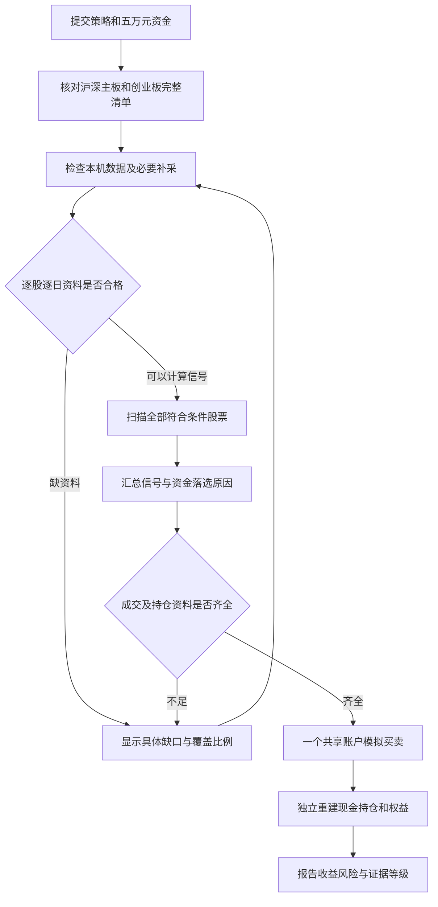

# 全范围选股与可信账户研究实施计划

## 要交付什么

用户提交一份 V3 策略，系统检查沪深主板及创业板的完整证券清单，扫描所有数据合格且当日满足条件的股票，由信号产生买入候选，再用同一个五万元账户分配资金、成交和核账。几千只股票是寻找机会的范围，不是几千个独立的五万元账户。创业板是本次正式交付范围，数据接入、指标组合、信号扫描、仓位分配、三类退出、核账、恢复和公共操作入口与主板同等覆盖；一致的是业务能力与证据标准，各板块交易规则仍分别执行。

这次交付重点是打通全范围研究基础，不继续在原八只股票上搜索更多参数，不承诺找到盈利策略。工程实现、自动测试、真实数据覆盖、真实账户验收和策略有效性分别记录。本文件是实施计划，不是已完成功能的声明；本次规划不修改业务源码。

## 为什么需要这次开发

2026-09-30 在 `157945d` 基线核对到：

| 事实 | 已确认的证据 | 业务影响 |
|---|---|---|
| 大范围行情已在本机 | `data/research/daily_all.parquet`：4,172,730 行、4,536 个代码，20210802—20250731 | 不能再把八只已登记股票称为全部可研究对象 |
| 当前规则账户代码范围较小 | `rule_account_backend_v2.py`、`research_data_provider_v1.py` 接受 `00xxxx.SZ`、`60xxxx.SH`；缓存符合者 3,159 个，其余 1,377 个为 `30` 开头 | 3,159 是缓存中的代码匹配数，不是完整历史主板证券总数或合格数 |
| 公共数据路径绑定 BaoStock | `ResearchDataProviderV1` 接受 `BAOSTOCK_RESPONSE_JSON_V1` | TDX 需要真实来源适配，不能改名伪装厂商响应 |
| 缓存的昨收是计算值 | `scripts/m6_build_daily_cache.py` 使用 `close.shift(1)` | 不能直接当除权日交易参考价；也不能覆盖原缓存 |
| 行情表不包含完整交易状态 | `daily_all` 无历史 ST、停牌、生命周期列；`pit_security_master.json` 存在 `UNKNOWN` | 能算指标不等于能模拟可信成交 |
| 当前账户要求规则矩形数据 | `FormalAccountBackendV1._validate_bundle` 要求每股每交易日数据，并拒绝非交易状态 | 上市、停牌、缺行需要版本化交易语义，而非删除校验 |
| 停牌影响多个组件 | `ForwardPaperEngineV1.decisions` 使用行情索引作策略日历；`RuleExitAdapterV3.evaluate` 要求当天 RAW close | 直接删除缺行会改变持有期；沿用估值不能伪装真实收盘触发止损 |
| 公共账户、退出、核验和预算已存在 | `strategy_submission_v1.py`、`portfolio_execution_v1.py`、`research_evidence_v1.py`、`research_campaign_v1.py` | 扩展现有系统，不另建候选专用回测栈 |

2026-10-01 用户明确将创业板纳入本次计划。上述主板限制是旧版现状，不再是本次目标范围。现有缓存对应深圳主板 1,478、上海主板 1,681、创业板 1,377，合计 4,536 个代码，全部进入本次目标盘点；这些是库存数量，不是已经通过数据资格的数量，也不是代码中固定的容量上限。

旧需求 `docs/brainstorms/2026-09-29-trusted-strategy-research-requirements.md` 的“系统执行、AI 提案、五万元、同源公共入口”继续适用。本计划针对此次明确提出的全范围能力扩展，不重开旧计划全部功能。`reports/capital50k_v3_run/HANDOVER_FULL_MARKET_POOL.md` 作为待核事实材料，不作为源码修改或数据访问授权。

---

## 业务范围与要求

### 全范围与真实数据

R1. 本次正式支持深圳主板 `00xxxx.SZ`、上海主板 `60xxxx.SH` 及创业板 `30xxxx.SZ`，三类股票均按当日生效的板块交易制度执行。科创板、北交所、实盘或杠杆不在本次范围。建立来源可追溯的历史证券清单，板块归属不能仅凭交易所推断，不把缓存代码集合自动当作完整历史清单。

R2. 逐只登记目标证券、已找到数据、字段资格、当日可扫描性、可成交性及缺口原因。目标数、代码范围符合数、数据合格数、实际扫描数、产生信号数和实际持仓数必须分开，并提供三个板块各自的分项；数量不得硬编码为 3,159 或 4,536。

R3. 先盘点全 E 盘相关数据的路径和元信息，再按现有授权读取内容、整理和补采。TDX/BaoStock 各自保留原来源、单位、价格模式、日期范围和哈希；历史可见时间未知不能补成已知。因子标签、未来收益和已封存数据不进入信号输入。

R4. 数据资格按用途分层：仅可计算指标、可扫描信号、可执行账户、可独立确认分别判定。未知状态、缺公司行动或无法解释的价格断点不可降格成正常交易。新增采集不自动获得独立性。

### 扫描、交易与复现

R5. 每个交易日对当时范围内的股票判定资格和预热；所有符合条件者均进入信号扫描。缺资料留下缺口，不能仅处理首批成功的股票，也不能利用未来状态或收益决定股票名单。

R6. 同一候选所有股票共用 50,000 元账户，统一处理现金、整手、T+1、涨跌停、停牌、持仓数量、单股上限及退出。股票分批只能改变计算组织，不能改变候选集或资金结果。

R7. 延续 V3 指标组合、固定止损、止盈和移动止损；将有效行情序列与账户交易日历分开，明确停牌、复牌、上市预热及退市状态。不得虚构缺行的 OHLC 来让旧引擎通过。

R8. 信号同时出现而资金不足时，使用事前冻结的确定性分配政策并公开排序依据及落选原因。第一版复用现有先卖出、再按策略优先级及代码的稳定顺序；它不代表收益评分，不顺带引入未经需求验证的横截面排名语言。

R9. 全范围执行须支持有界资源和中断接手；不同分批大小与遍历顺序得到同一经济结果。恢复不得重复成交、记账、读取未授权数据或重置累计预算。

### 可信结论与交付

R10. 独立核验覆盖全局扫描清单、信号到成交链、账户资金与公司行动。零成交的超额收益只说明持币效果；交易笔数不等于独立样本数。

R11. 保留原 BaoStock 路径、旧冻结合同及原件，不把旧发布验收自动继承到新全池路径。新能力使用独立版本、输入身份与验收凭证；旧证据能按原源码快照复查。

R12. 用户和 AI 使用同一公共能力说明、CLI 与工作台状态。全池范围、缺口、分批进度和受阻原因可查询，不要求用户编写研究脚本。数据根与授权仍由可信部署登记，不通过策略请求传任意路径。

R13. 工程完成不等于盈利或正式资格通过。此次用事前冻结的规则验收链路，不继续调 T7；不重置此前 174 个候选及其他历史尝试。跨阶段资料的独立性由原治理服务判断。

R14. 创业板与主板达到同等工程能力和验收标准，不得只允许代码通过或计算指标，就宣称创业板支持完成。规则、预览、数据准备、共享账户、成本止损/止盈/移动止损、分红处理、独立核验、暂停恢复、CLI与页面均须覆盖创业板。真实资料不足或交易制度未实现时必须分板块显示缺口，主板通过不能替代创业板通过；同等能力不代表绕过共同的数据资格、正式评审或其他交易约束。

### 不包含与后续工作

本次不开发新指标大全、ATR 退出、市场指数过滤、任意评分 DSL、券商实盘、新统计显著性方法或无限模型调度。已有多指标 V3 规则作为接口验收对象，不把寻找赢家作为软件交付门槛。

暂不实现新的送转、配股、退市清算制度。本次必须检测和报告这些事件，已有会计组件能支持的类型也须有完整字段与公共路径验证，不能凭底层类存在就宣告支持。需要这些新制度才能完成目标账户时，应列为未解决范围和后续设计，不能通过永久剔除相关股票来宣告本次全范围真实验收完成。

---

## 普通用户看到的流程

“盘点完成”表示每只目标股票都有明确结论；“全范围扫描完成”表示所有规定应扫描的股票均已处理；“账户验收通过”表示同一账户完成并核对。任何一个不能替代其他两个。缺口报告是可交付的阶段结果，但不是完整目标完成。

---

## 关键实施决策

### K1. 为来源增加版本化适配，复用现有业务栈

新增 TDX 来源适配文件，保留 `ResearchDataProviderV1` 原响应校验。通过显式数据适配版本选择新路径，不在旧 BaoStock 分支中塞入伪厂商值。复用 `tdx_data.py`、`data/tdx/owner_export_v1.py`、受控数据读取器及现有公司行动模块；新适配只负责规范化与证据，不重新实现账本。

新全范围输入采用独立契约及后端版本；旧 `RULE_ACCOUNT_BACKEND_V2` 的矩形与来源要求不全局放宽。V3 买卖规则表达保持兼容；全池范围引用和执行政策属于版本化提交/部署扩展，并进入冻结身份。HTTP 与 CLI 共用服务，不提供任意模块导入能力。

### K2. 清单完整性与数据覆盖分别证明

历史证券主清单与本地行情代码做双向对账；当前缓存的 1,478/1,681/1,377 分别是深圳主板、上海主板、创业板库存快照，4,536 是三者之和。无法证明历史证券主清单完整时显示 `UNIVERSE_COMPLETENESS_UNKNOWN`。按当天上市状态与预热决定是否具备信号条件，不因整个窗口末尾的状态提前排除。新增创业板不能仅靠放开正则：须消除“深圳股票统一为SZ_MAIN”的错误映射，并规范已有 `GEM` 与 `CHINEXT` 别名，原始来源值保留。

计划验收研究窗口优先沿用已被研究的 20220706—20240731，另含实际指标要求及账户下限所需预热；实施前以数据资格和原授权冻结确切范围。本窗口不是独立验证集，不因跨年重新采集升级。

### K3. 资格缺口不能成为选择赢家的过滤器

数据检查在收益计算前形成清单和不可变身份。交易禁入、指标未预热、资料缺失、系统不支持四类原因分开。探索性部分覆盖任务必须明确声明其范围和偏差，不冒充全范围验收；无收益介入地补齐资料后产生新数据版本。

全范围严格账户对目标执行范围中的未知状态或不完整关键事件先拒绝准备；运行中出现未预期缺失时，持仓账本保留并中断该账户，不能删掉持仓继续计算漂亮的收益。信号扫描可记录逐股错误，但任何未知输出不能伪装成 FALSE/零信号。

### K4. 价格与交易日历分离

保存原始行情、交易参考昨收、因果指标价格和账户估值四种语义。缓存 `prev_close` 视为派生线索，不覆盖原件、不冒充官方昨收；只有来源和公司行动递推可核对时才生成执行参考价。

持有期、冷却期、T+1 和下单日期使用冻结交易所日历；指标使用该证券实际有效行情序列，并记录最后有效行情日。证实停牌时不新增虚假 bar、不生成新买入、不用沿用估值触发价格止损；时间到期退出可以挂起，已有退出等待实际可成交日。复牌跳空按真实执行价格处理，不按止损线强制成交。

停牌估值只沿用最后可验证估值并标为陈旧；发生公司行动时必须先按会计事件更新数量、现金与估值依据。状态未知或事件缺条款不是“停牌估值”例外。退市后不假设零价值或按最后收盘强平，保留未结算持仓并阻止完整绩效验收，直到取得支持的处理证据。

历史开盘成交继续只使用开盘前可得的流动性信息。新路径的默认规则为上一交易所 session 的有效 volume/amount；停牌后首次复牌缺此前日有效行情时，开盘不成交，记录 `LIQUIDITY_REFERENCE_UNAVAILABLE` 并保留退出，待取得一整天复牌行情后的下一合法开盘再尝试。不拿当天全日成交量支持当天开盘，不无限沿用停牌前旧成交量；这项保守模型延迟进入预览与冻结政策，不宣称等同券商实际可成交性。

### K5. 全部信号汇总后，只做一次资金分配

独立于持仓的特征可按股票、日期分片计算并复用；其缓存身份包括原数据、日历、指标参数、价格政策、算法版本及使用范围，改变任何一项均失效。按日汇总全范围信号后统一投影账户状态并分配资金，禁止在每批先成交再处理下一批。

分片内排序不能影响最终选择。初版公布现有稳定顺序产生的选择偏差；若用户未来需要按信号强弱选优，再单独扩展策略声明。性能目标是全范围可执行，不靠删除股票、减少日志证据或扩大预算掩盖资源超限。

### K6. 读取权限约束物理读取，而不只过滤后输出

缓存目录和新分片必须核对物理日期范围、来源与哈希。不能先读取含封存期的整文件再过滤后宣称零访问；复用授权检查与访问记录。`gbbq` 特殊 OWNER 导出例外只在既有明确合同内使用，不能扩散到其他全历史数据。

当前规划没有调用外部行情接口，也不依赖未经核实的新厂商能力；实施涉及新增外部字段或事件规则时，须核实厂商资料与原始响应，保留来源，不能用文档中的 `READY/PIT_safe` 标签代替验证。

### K7. 固定交易路径压力与完整账户成本情景分开

`CLAUDE.md` 要求既有固定路径成本压力不能改变订单、退出或 lot 生命周期，继续遵守。新全范围账户若在不同费用下完整重跑，必须另标为“账户成本情景”，按各自真实资金重新核验；不把这种可能影响资金可买数量的运行冒充固定路径压力。冻结规则、排序和数据不变，差异逐项解释，不能把费用变化作为改变策略的机会。

### K8. 板块规则分别生效，业务流程保持一致

复用 `src/chanlun_trader/engine/security_state.py` 已有创业板识别和价格限制分支，但不把其中的固定比例实现当作全部历史与新股情形的完备证明。建立明确版本的板块执行政策，绑定板块、规则生效区间、上市交易日序号、ST状态、交易参考价、申报数量及价格舍入等所需证据。实施前核对交易所原始规则与已获准历史资料，不凭当前规则倒推全部历史。

新股特殊交易阶段、规则切换日和未知上市日期均有明确处理；策略预热不足可以暂不出信号，但不能以预热通常会跳过新股期为由省略交易规则验证。ST是否允许买入属于既有策略资格政策，不能与不同板块的涨跌幅计算混为一谈。行情归一、交易执行、独立核账和基准必须绑定同一规则版本；核验器使用独立计算和手算反例，不能调用同一撮合函数自证正确。旧版合同仍按原版本拒绝创业板，只有新全范围路径承担扩展。

---

## 实施单元与验收

以下新文件名是计划落点；允许根据既有组件合并减少重复，但不得移除对应责任或测试。所有单元的执行状态由后续实际记录决定，本计划不预勾选完成。

### U1. 完整证券清单和数据覆盖账

**目标与要求：** 对应 R1—R4；先回答到底要扫描谁、拥有什么、缺什么。无前置依赖。

**文件：** 新增 `src/chanlun_trader/research_factory/research_universe_v1.py`、`tests/research_factory/test_research_universe_v1.py`；复用 `src/chanlun_trader/research/guard.py`、`scripts/m6_build_daily_cache.py` 的来源线索、已有证券生命周期记录；只读盘点来源文件，不改缓存。

**实现：** 形成目标清单、来源清单和逐股逐日资格摘要，沪深主板及创业板均为必选目标类别。本机 E 盘先枚举相关路径元数据、去重后再读取获准内容；目录扫描不会授予行情使用权限。名单与数据清单分别哈希，记录缓存缺失的目标证券及缓存中范围外证券。输出机器可读清单和中文缺口摘要，建立分批准备队列及可恢复状态，复用现有采集器而非降低请求治理。

**测试场景：** 1. 历史主清单比缓存多一只，必须显示缺失而非减少分母；2. 00/60/30 开头证券均纳入并正确分类，科创板及北交所仍标范围外，未知身份不猜测；3. 中途上市/退市按日判定，不能用今天状态回填；4. 重复数据根与同一原件去重；5. 未知 ST/停牌保留 UNKNOWN；6. 封存期仅允许元数据诊断，内容访问被拒；7. 分批中断后覆盖计数不重复。

**完成证据：** 当前本机库存计数可复算，每只候选证券都有状态，清单完整性未知可见；不读取策略标签或收益来选择证券。

### U2. TDX 来源规范化与价格资格

**目标与要求：** 对应 R3、R4、R11、R14；依赖 U1。

**文件：** 新增 `src/chanlun_trader/research_factory/tdx_research_adapter_v1.py`、`tests/research_factory/test_tdx_research_adapter_v1.py`；接线 `research_data_provider_v1.py`；复用 `src/chanlun_trader/tdx_data.py`、`src/chanlun_trader/data/tdx/owner_export_v1.py`、`tests/research_factory/test_owner_export_v1.py`。

**实现：** 以新适配器身份读取登记的 TDX 原件/派生缓存，分别绑定原件和转换版本。验证价格、成交量单位、排序、重复键、日期范围及价格模式；昨收必须区分上一有效成交日收盘与除权参考价。必要的状态和公司行动可由其他来源补充，但保留字段级来源和冲突，不混成单一厂商包。仅当规则引用换手率时要求该字段，不填零。

**测试场景：** 1. TDX 不经过 BaoStock 响应冒名；2. 缓存首行 NaN 与除权日前收不能静默修复；3. 股/手单位差异须阻断或按有证据的版本转换；4. 同证券同日冲突来源不能任取；5. 不引用换手率可进行相应阶段，引用时缺列拒绝；6. 原件哈希、转换版本或物理范围变化拒绝复用；7. 多源数值一致不自动证明历史可见时间；8. 三板块使用相同来源资格流程，创业板不能误归深圳主板；9. 新来源适配的创业板通过不改变旧BaoStock合同的原始范围。

**完成证据：** 合成反例及已有重叠证券的同源逐行核对通过；输出显式用途资格，尚未保证账户可跑。

### U3. 动态证券与公司行动输入契约

**目标与要求：** 对应 R2、R4、R5、R7、R14；依赖 U1、U2。

**文件：** 新增 `src/chanlun_trader/research_factory/universe_account_inputs_v1.py`、`tests/research_factory/test_universe_account_inputs_v1.py`；复用 `src/chanlun_trader/research_factory/corporate_action_lifecycle_v1.py`、`src/chanlun_trader/engine/corporate_accounting_v1.py` 及 `tests/research_factory/test_corporate_accounting_v1.py`；旧 `formal_account_backend_v1.py` 校验语义保留。

**实现：** 新输入版本显式表达未上市、预热不足、正常交易、ST、证实停牌、退市和未知。日历独立于行情，状态用索引/区间表查找，不复制数百万字典。拆开信号可用与成交可用；核对现金分红登记、除息、支付及税务证据，延迟到账按已有会计能力显式接通并验证，不能强制改成除息日到账。非现金/未知事件形成具体阻塞记录。

**测试场景：** 1. IPO 前无 bar 合法但不得提前扫描；2. 正常交易缺 bar 为错误，证实停牌缺 bar 为已知状态；3. 缺失与实际零成交量可区分；4. ST 按当日状态禁止新增买入，原持仓按可执行规则管理；5. 分红到账晚于除息时不提前加现金；6. 送转或退市清算条款不全拒绝，不丢弃事件；7. 历史可见时间为模型假设时保持 MODELED；8. 已持仓证券即使退出当日选股范围仍必须覆盖。

**完成证据：** 同一日历内的稀疏行情和交易状态有明确含义；数据缺口不能伪装成规则无信号或交易禁入。

### U9. 创业板与主板执行政策一致接线

**目标与要求：** 对应 R1、R6、R7、R10、R11、R14；依赖 U1、U3。沿用已有 U1—U8 编号，新增 U9 放在其实际依赖位置执行。

**文件：** 新增 `src/chanlun_trader/research_factory/board_execution_policy_v1.py`、`tests/research_factory/test_board_execution_policy_v1.py`；版本化接线 `src/chanlun_trader/engine/security_state.py`、`src/chanlun_trader/research_factory/research_evidence_v1.py` 及 U2/U3 新适配器；新增 `tests/research_factory/test_chinext_entry_parity_v1.py`。

**实现：** 统一板块别名和规则身份，核对交易所来源后将适用交易制度绑定到新输入契约；已有底层能力只在其实际支持范围内复用。新公共入口、账本执行和独立核验均接入创业板，禁止通过标为主板或固定沿用主板限制接通。明确普通交易日、ST、上市初期、规则生效边界、停复牌及除权参考价的处理。分板块能力表中的每项都附测试和真实证据状态。

**测试场景：** 1. 同一输入中的00/60/30证券分别选择正确规则；2. GEM与CHINEXT归一但来源可追踪；3. 使用交易所规则手算样例验证普通及ST价格边界和舍入；4. 上市特殊期最后一天与其后第一天、规则生效前后选择正确版本；5. 未知上市日期或冲突板块不得回退MAIN；6. 相同V3规则在三板块均可预览、冻结、执行并核账；7. 创业板三类退出、分红、停牌恢复与主板同等覆盖，差异仅来自冻结数据/制度；8. 故意把创业板改标为主板或在核验时使用错误政策，必须拒绝；9. 旧V2合同的主板限制和结果保持原语义；10. 不修改规则身份却替换制度资料，缓存和批准回执必须失效。

**完成证据：** 板块规则来源、政策指纹、边界反例和三板块能力对照齐全。只改代码正则、只扫描无账户、只有主板真实验收，均不能算创业板完成。

### U4. 全范围信号扫描与公共提交

**目标与要求：** 对应 R5、R8、R12、R14；依赖 U1—U3、U9。

**文件：** 新增 `src/chanlun_trader/research_factory/universe_signal_scan_v1.py`、`tests/research_factory/test_universe_signal_scan_v1.py`；扩展 `strategy_submission_v1.py`、`strategy_interface_v1.py`、`scripts/lifecycle_deployment_v2.py`、`scripts/run_trusted_research_v1.py`；测试 `tests/research_factory/test_strategy_submission_v1.py` 及新 `test_universe_submission_v1.py`。

**实现：** 公共请求增加明确版本的全范围引用，不由 AI 提交任意文件路径；预览返回完整范围和缺口，冻结绑定所有来源及执行政策。支持无账户的信号准备/覆盖诊断，但明确其不能给出账户收益。计算多指标条件并保存原始条件、资格过滤和缺失原因；状态型 BUY/SELL 仍在 U5 的真实账户上确定。原列表请求保持原路由。

**测试场景：** 1. 信号出现在最后一个分片也会被计入；2. 1/小批/大批处理得到相同规范化信号；3. 变更未来 bar 不改变此前信号；4. 同日各股票预热状态独立；5. 缺行情报错不返回 FALSE；6. 多指标组合与直接小样本计算一致；7. 请求不能注入路径/代码/资格；8. 旧请求及其冻结版本拒绝静默升级。

**完成证据：** 全范围处理有完整计数与身份；CLI 和服务接口能提交同一规则，无需候选专用脚本。

### U5. 全范围共享账户与退出

**目标与要求：** 对应 R6—R8、R11、R14；依赖 U3、U4、U9。

**文件：** 新增 `src/chanlun_trader/research_factory/universe_account_backend_v1.py`、`tests/research_factory/test_universe_account_backend_v1.py`；在 `forward_paper_engine_v1.py`、`rule_exit_adapter_v3.py`、`portfolio_execution_v1.py` 的明确版本分支接入；必要时将新日历/估值逻辑放到独立小组件，复用原账本和订单执行；保留 `test_rule_exit_integration_v3.py` 回归。

**实现：** 当日扫描完成后，一次汇总沪深主板与创业板候选，按冻结稳定顺序分配同一账户现金，禁止为创业板另开独立五万元账户。指标有效 bar 轴与持有交易 session 轴分离。停牌不成交、不更新虚假价格峰值；待退出持续保留，复牌按真实价格及原执行约束尝试。未知持仓价格/状态阻断；不把未知证券清零。三类退出的成本与分红价格口径必须与新公司行动路径匹配，涨跌停与可成交性使用 U9 的板块政策。旧 V2 后端行为不改变。

**测试场景：** 1. 三个分片同时出现信号，持仓/现金总额不超限；2. 输入或分片顺序颠倒，选股与资金完全一致；3. 五万元买不起一手时留现金并记录原因；4. 周五买入、跨周末/停牌，T+1和最长持有不随bar数量变化；5. 停牌期间到期退出挂起，复牌跳空不按止损价伪成交；6. 部分成交重试绑定原 lot；7. 分红、费用、税及三类退出逐日核对；8. 未知缺行/退市未结算不允许正常期末结论；9. 小范围旧输入在新旧路径的共同语义下结果可解释且一致；10. 首次复牌前一session无量能时拒绝开盘成交，次日可恢复，未来全日量不能回流开盘。

**完成证据：** 全局资金竞争、停牌恢复和三类退出都有完整成交及核账证据，不是独立股票收益拼接。

### U6. 有界执行、检查点与独立核验

**目标与要求：** 对应 R9—R11、R13、R14；依赖 U4、U5。

**文件：** 新增 `tests/research_factory/test_universe_execution_recovery_v1.py`、`test_universe_evidence_v1.py`；扩展 `research_evidence_v1.py`、`trusted_research_host_v1.py` 与实际 worker 资源边界；复用 `research_campaign_v1.py`、`run_budget.py`，不另建可重置预算系统。

**实现：** 分片产生可核对摘要和来源身份，按日合并点作为账户进度边界；保留原事件链/提交头、输入、规则、源码和预算回执。独立核验读取必要原件重建现金、持仓、分红、税及权益，核对扫描集合与落选原因，不仅比较结果自报的 passed。按股票缓存特征、按日读取状态，避免逐日重复计算全部历史和复制完整账本快照。资源参数先用真实规模只读准备/合成计算测量后冻结，不能写死未经测量的运行时承诺。

**测试场景：** 1. 分片落盘后合并前退出，只恢复缺少步骤；2. 成交已记录而检查点未提交，恢复不重复交易；3. 已消费预算不因失败回退；4. 丢失分片、篡改一天现金或省略未扫描股票均拒绝；5. 不少于当前4,536库存规模且包含三板块的合成证券，单批/不同分片结果一致，内存受限器实际生效；6. 超时/超内存不输出完整成功；7. Windows/Linux结果在冻结数值精度内一致；8. 新源码不能冒用旧发布凭证；9. 混合持有主板与创业板时中断恢复、费用、退出及核验身份均一致。

**完成证据：** 真实资源记录、恢复证据和独立核验齐全。股票数量是规模测试，不代表合成收益具有研究意义。

### U7. 公共说明与用户状态

**目标与要求：** 对应 R2、R10—R14；依赖 U4—U6、U9。

**文件：** 扩展 `research_capabilities_v1.py`、公共提交 Web 服务及 `frontend/src/console/components/StrategySubmission.vue`、`frontend/src/console/components/LifecycleWorkbench.vue`；新增 `docs/FULL_UNIVERSE_RESEARCH.md`；更新 `docs/AUTONOMOUS_RESEARCH_USER_GUIDE.md`、`docs/RESEARCH_LIFECYCLE_OPERATIONS.md` 和能力文档生成器；测试 `tests/research_factory/test_strategy_submission_web_v1.py`、新 `tests/research_factory/test_universe_capabilities_v1.py`、`frontend/src/console/lifecycle.test.ts` 和新 `frontend/src/console/universe.test.ts`。

**实现：** 能力与说明同源，显示目标范围、覆盖、等待资料、运行、部分完成、账户阻断、独立资格等待等状态。用户可以查看为什么某股票没扫描或没成交，不需要猜日志。已有界面只增加必要范围与状态，不重做工作台。统一纠正与最新凭证矛盾的旧待验收文案，同时保留历史记录原文。

**测试场景：** 1. 目标4,536、合格3,159时显示缺口及三板块分项，不能把未处理创业板隐去后宣称完成；2. 只有扫描结果时不展示账户盈利；3. 无成交超额不标策略有效；4. HTTP/CLI返回相同覆盖与拒绝原因；5. 只读页面不触发采集或恢复；6. 无授权的操作仍拒绝；7. 最新凭证与能力说明一致；8. 创业板与主板显示同一业务能力清单，各自按实际证据标记状态。

**完成证据：** 普通用户和另一 AI 可据说明提交规则、查看进度并接手，不再因入口/文档误解新增临时回测代码。

### U8. 真实全范围验收与交付

**目标与要求：** 对应 R1—R14；依赖 U1—U7、U9。

**文件：** 新增 `scripts/run_full_universe_acceptance_v1.py`（仅固定验收编排，内部调用公共服务）、`tests/research_factory/test_full_universe_acceptance_v1.py`、`tests/research_factory/test_universe_benchmark_v1.py`；接线 `src/chanlun_trader/research_factory/research_benchmark_v1.py`、`strategy_submission_v1.py` 和 `scripts/run_strategy_account_v1.py` 的明确新版本报告分支；报告落到新的 `reports/full_universe_acceptance/`；CI 扩展 `.github/workflows/autonomous-completion.yml`；不把本机行情原件上传公共仓库。

**实现：** 事前冻结一份单指标对照、一份多指标规则，覆盖成本止损、止盈、移动止损；可引用已有冻结规则但不根据全池收益调参。三板块全部合格目标股票进入同一账户，每规则正常/压力/公开基准分别运行。先小样本差分和合成资源检查，再在同一已授权窗口执行全部目标范围；小样本不替代最终验收。创业板必须有真实来源的数据准备、公共提交、实际账户成交与独立核验记录，以及三类退出的分项证据；若冻结规则未触发某种退出，不调参凑收益，另用事前登记的工程场景补验并与策略研究结果分开。累计到原研究任务或有明确追加授权的新工程预算，记录历史关联，不用接口换代清零。

**基准决策：** 全池等权买持在五万元、整手约束下可能不可执行；不得静默变成代码靠前几只股票。保留现金基准与明确标为“非可投资价格对照”的全范围等权收益序列（数据不齐则同样拒绝）；原全池买持仅在全部目标初始配置真实可行时使用。非可投资对照不伪造交易、账户或核账通过标志，也不参与正式资格升级。

非可投资对照采用“期初合格证券等权买持”：名单在首个评价交易日前一收盘按同一资格资料冻结，使用首个合法评价开盘作为入场参考，允许理论碎股、不收交易费、不再平衡；现金分红按实际到账计入且不再投资。之后新上市证券不补进该期初篮子，名单与动态策略扫描范围的差异显式报告。停牌估值沿用 K4，退出市场不静默删除权重；未知价格或不支持事件使该对照不完整，不能重归一剩余赢家。该定义不声称可投资超额或风险调整后的优势；若不能算，报告基准不可用，不用零值代替。U8测试必须覆盖分红、停牌、后续IPO、成分缺失和全池整手配置不可行。

**测试与实证场景：** 1. 所有目标证券均有覆盖结论且不存在静默采样；2. 全池每日信号汇总与账户实际消费身份一致；3. 正常/压力均满足真实五万元限制，并保留成本导致成交变化的解释；4. 每日独立核账通过；5. 同一冻结任务恢复与连续运行一致；6. 原 BaoStock 小池回归、公共入口、前端和 Windows/Linux 相关 CI 通过；7. 资料不足时验收报告明确未完成，不能只交工程PASS就宣称全目标实现；8. 深圳主板、上海主板、创业板分别有同等业务能力验收表，缺任一板块不能标记本计划完成；9. 主板和创业板同日竞争有限资金、混合持仓退出均来自同一共享账户，不合并独立子账户收益冒充通过。

**完成证据：** 软件交付包包含新版本来源、测试与 CI、全部目标覆盖清单、真实账户与核验摘要、恢复及资源证据、可执行公共配置、使用说明和回滚点。若历史证券主清单仍不完整或目标内关键资料不足，软件可独立交付，但计划全范围真实验收保持未完成，报告具体外部依赖。

---

## 阶段路线与完成标准

| 阶段 | 对用户的交付 | 实施单元 | 不得混淆的边界 |
|---|---|---|---|
| 1. 清点完整范围 | 明确沪深主板和创业板全部目标股票与数据缺口 | U1 | 盘点完成不代表数据齐全 |
| 2. 接好真实数据与板块制度 | TDX可追溯接入，状态/公司行动合格，主板和创业板制度分别接通 | U2、U3、U9 | 有价格不代表能交易，代码放行不代表创业板接通 |
| 3. 扫描与共享账户 | 全范围出信号，五万元统一买卖 | U4、U5 | 分批不能变成多个账户 |
| 4. 可核对、可恢复 | 独立核账、资源控制和断点接手 | U6 | 测试通过不代表真实规模完成 |
| 5. 完整交付 | 一套公共说明和真实全范围证据 | U7、U8 | 工程通过不代表盈利或Paper资格 |

最值得先做的是 U1：生成真实完整证券清单与逐股数据缺口账。它决定需要补什么资料、哪些交易语义是真实必需的，避免先写一个读取器后才发现仍然不能回测。

---

## 风险、实施边界与回滚

- 数据真实性：`data_capability.json` 中的 READY/PIT_safe 或目录名不是证据；“mock”字样同样不能单独判定真假。需要生产脚本、原件及字段来源核对。
- 全范围资料：现金分红之外事件、历史状态和退市清算可能缺条款。工程可以准确报告等待，不能编造事实；无法补齐时真实验收仍是未完成，不靠挑窗口或删股票关闭。
- 大规模性能：现有逐日重算历史与快照复制不能未经测量用于几千股票。先字符化共同语义、再局部替换热点，禁止通过减少扫描对象改善性能数字。
- 多方工作：主目录有未提交研究文件和 `progress.md` 修改。后续实施使用适合的隔离工作区，保留其他 AI 的运行与原件；不重置、删除或搬动冻结路径。不在活动研究中途替换其加载源码。
- 接口变更：新输入契约、后端路由、板块制度和上市/停牌语义必须版本化，实施启动前以本计划作为明确范围；没有实施授权时不修改核心协议。用户已明确将创业板纳入计划，不能再按旧入口边界将其排除。鉴权模型、资金权限和统计门槛不在扩大范围内。
- 回滚：停用新部署中的全范围版本路由，恢复已验收旧路径；保留新增研究事件、失败和预算凭证，不撤销已消费预算、不改旧合同。版本发布不得自动重启旧任务。
- 发版：完成必要审查和 CI 后按用户届时的交付授权提交、合并、推送及同步主目录；本次规划没有进行上述外部操作，也未部署后台任务。

### 实施时需由证据解决的未知项

全历史证券主清单完整性、逐股状态与公司行动资料的实际覆盖、板块历史制度证据、缓存价格/数量单位、可用资源下分片大小及运行时长尚未全部验证。它们是 U1—U3/U6/U9 的实证任务，不是让用户选择文件名或缩回抽样研究的理由。任何一项不能解决时应给出明确证据、影响范围和继续工作的边界；创业板缺证不得改成范围外来关闭任务。

## 依据与后续使用

主要源码：`src/chanlun_trader/research_factory/research_data_provider_v1.py`、`rule_account_backend_v2.py`、`formal_account_backend_v1.py`、`forward_paper_engine_v1.py`、`rule_exit_adapter_v3.py`、`portfolio_execution_v1.py`、`strategy_submission_v1.py`、`research_evidence_v1.py`；后七项相对同一目录。

已有经验：`CLAUDE.md` 关于 OWNER 导出、单位冲突、前视读取、显式日历、逐股状态索引及恢复语义的约束；`docs/owner-execution-export-v1.md`；`docs/RESEARCH_LIFECYCLE_OPERATIONS.md`。`docs/solutions/` 当前不存在，不把它写成已读经验来源。

本计划按当前源码与本机文件取证编写，未执行新回测、全盘重新采集或真实 Paper。实施后应把机器可查询能力和中文使用说明同步到同一版本，避免再次出现“数据已在机器上，但新 AI 只会用几只示例股”的情况。
