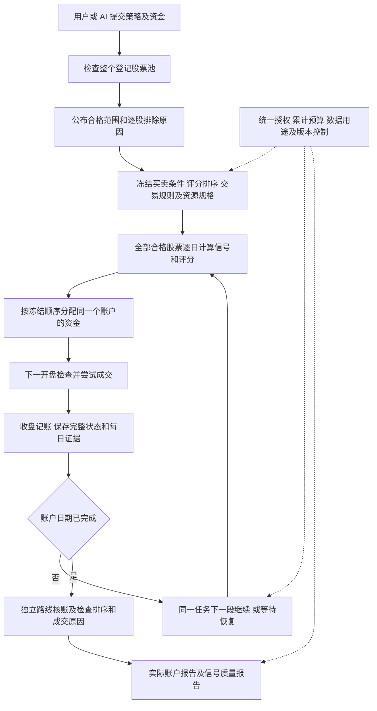

# 全池长期可信回测、策略选股与研究诊断实施计划

## Summary

交付目标是：用户或 AI 提交一份策略，系统检查整个登记股票池，在全部合格股票中寻找信号，按策略事先声明的顺序选择买入对象，用一个连续账户完成一年、两年的回测，独立核账，并分别解释信号表现、实际账户表现和每个未成交机会。

本计划解决本轮确认的四项问题：长期执行能力不足、同日选股缺少策略评分、未成交原因混淆、信号质量与账户结果混用。沿用公共入口、现有数据资格、交易与公司行动处理，不重建另一套回测系统。本次仅形成规划，没有修改业务代码、执行新策略或改变研究额度。

**实施后用户得到的流程：提交规则及资金 → 全池检查并公布排除清单 → 冻结选股及交易规则 → 长期连续回测 → 独立核账 → 查看双报告。** AI 离线不影响已批准的固定规则任务。

---

## Problem Frame

以下为源码和已落盘证据，不能与拟开发能力混写。

| 当前事实 | 依据 | 应解决的问题 |
|---|---|---|
| main 为本计划基线，公共全池与短期独立账户核验已经存在 | 公共提交、账户、核验代码及 PR #35 的发布记录 | 在已有链路上扩展，保持旧任务及结果可复查 |
| 每账户 worker 固定 900 秒、2048 MiB、单数值线程、串行；公共请求不能调高 | `scripts/run_strategy_account_v1.py:118`、`:207` | 提供正式登记的长期执行规格，而非让 AI 修改超时常量 |
| FU1 BASE 的 30 个账户交易日用时约 785.37 秒 | `reports/capital50k_full_universe_v1/public/tasks/a133c1b2e4df1f316d613c8470a42ccd2865956c617cca3d3ab4f45c80e024d9/account/FU1_BREAKOUT_VOL_TREND_BASE_RESOURCE.json` | 不能用这一结果宣布一年、两年全池回测已可用；不能机械外推耗时 |
| 现有恢复从头重放到提交日期；提交点仅绑定输入、执行身份、末日与前缀哈希 | `src/chanlun_trader/research_factory/universe_account_backend_v1.py:298`、`:343` | 完整状态恢复及可连续分段执行仍需开发 |
| 输入、特征、逐日扫描、决策和结果存在全量积累，worker 与公共核验还可能分别重构 | `src/chanlun_trader/research_factory/universe_account_inputs_v1.py`、`src/chanlun_trader/research_factory/universe_signal_scan_v1.py`、`src/chanlun_trader/research_factory/universe_account_backend_v1.py`、`src/chanlun_trader/research_factory/research_evidence_v1.py` | 先量测各阶段，再消除真实的重复读取及无界内存增长 |
| 同一策略买入按证券代码等稳定顺序进入账户分配；V3 没有评分字段 | `src/chanlun_trader/research_factory/portfolio_execution_v1.py:128`、`src/chanlun_trader/research_factory/research_rule_strategy_v3.py` | 新策略可声明买入优先级，旧策略不能静默变为评分策略 |
| 买入数量计算把多类限制压成零，随后记为 `NO_PERMITTED_QUANTITY` | `src/chanlun_trader/research_factory/portfolio_execution_v1.py:284`、`src/chanlun_trader/research_factory/forward_paper_engine_v1.py:230` | 保存具体限制和可核对的数量依据 |
| FU1 已完成结果为 1445 个 BUY 决策、14 笔买入成交；末日 235 个 BUY 没有下一开盘 | 本轮冻结结果及 `reports/capital50k_full_universe_v1/FU1_SIGNAL_FUNNEL.json` | 不能用 1445−14 推断全部是持仓名额拦截；最后一天属于观察结束 |
| 每用途 `limit=1`，已启动用途消费后不清零；BASE/STRESS 各独立用途 | `src/chanlun_trader/research_factory/etf_account_governance_v1.py`、`src/chanlun_trader/research_factory/budget.py` | 继续一次试验内的计算，保留一次用途消费与累计资源，不按分段创建新试验 |

已有账本 `checkpoint()/restore()` 可复用，完整交易引擎、订单、策略和移动止损状态的直接恢复尚未找到。当前 `batch_size` 也不能自动代表端到端流式处理。潜在成本路径只是待测对象，本规划没有测出各项耗时占比。

来源需求中的 R1、R7–R10、R13–R19、R24 和 AE1、AE3、AE5、AE8、AE9、AE14–AE15继续适用。旧全池计划 `docs/plans/2026-10-01-001-feat-full-universe-trusted-research-plan.md` 的 R8 明确选择先按代码排序，并将评分延期；本次用户要求将评分纳入开发。仅在新版本中扩展这一边界，不改写旧计划或旧验收历史，也不重开其他已开发功能。

承接原 A1 普通用户、A2 系统运行服务、A3 可替换 AI、A4 维护者的责任划分：用户/AI 提交规则，系统运行与核验，维护者登记能力。本次实现原 F1 固定策略运行和 F4 恢复接手；原 F2 的总授权/累计预算继续约束本流程，不新增模型生成循环。原 F3 晋级及 F5 Paper/组合的资格和自然日期边界保留。

---

## Requirements

| 编号 | 必须交付的行为 | 来源对应 |
|---|---|---|
| R1 | 公共入口支持真实规模的 252、504 个连续账户交易日；预热另外计算；逐日现金、持仓、订单及公司行动连续继承 | 原 R1、R9、R18；长期回测问题 |
| R2 | 每段有真实资源限制，同一账户用途累计计算、一次消费；暂停、授权到期、失败和正常换段区别明确 | 原 R15、R16、R18、R19 |
| R3 | 中断在已提交收盘边界恢复，结果与同版本连续执行一致；不能重置资金、持有期、冷却或移动止损高点 | 原 R7、R10、R18 |
| R4 | 全登记池检查，全部冻结合格范围逐日扫描；证券或日期分片只改变计算组织，不能改变股票范围与结果 | 原 R5、R6、R8；旧全池 R2、R5、R6 |
| R5 | 新策略评分及高低方向、同分顺序在结果前冻结，使用当时可用行情与现有指标；不按未来收益选股 | 原 R3、R7、R8 |
| R6 | 同日卖出优先、资金与仓位约束继续执行；开盘使用冻结收盘排序，重新检查成交条件，不能读取开盘后信息重新择优 | 原 R8、R9 |
| R7 | 用真实 signal/intent/order/fill 身份追踪每次机会及数量；区分策略守卫、评分、资金、名额、整手、资格、撮合和观察结束 | 原 R10、R13、R14 |
| R8 | 信号评价不以账户成交子集为分母；重复信号、相关性、观察截断、价格及公司行动口径全部公开 | 原 R11、R13、R14 |
| R9 | 实际账户报告独立展示净收益、回撤、费用与税、已完成持仓回合、未平仓、资金使用和精确漏斗 | 原 R9、R10、R14 |
| R10 | 新排序、资源、状态及报告语义显式版本化；旧合同、预算、源码快照及结果保持原样；核验不能以执行器自报结论为答案 | 原 R7、R10、R18；AE5、AE14 |
| R11 | 用户和 AI 共享公共提交、状态、暂停恢复及报告入口；不同受支持策略无需新增专用运行、取数或核验脚本 | 原 R1、R2、R24；AE1、AE15 |
| R12 | 工程实现、自动测试、真实规模验收、历史初筛、独立验证、方法适用和策略资格分别记录 | 原 R12、R14、R20–R23 |

账户交易日表示账户经过的交易日期，包括空仓日；持股天数由买卖规则、止损止盈、最短及最长持有期决定。开发不能为适应运行时限缩短策略持有期，也不能用短回测年化数字替代长期验收。

---

## High-Level Technical Design

完整账户只在收盘安全边界提交。执行器保存自己的状态；独立核验器从冻结原始资料和初始现金重建，或从自己此前核验通过的状态继续。两者的状态不能互相当答案。

新任务可呈现“准备资料、计算特征、账户运行、换段、暂停、待恢复、独立核验、完成、失败、预算耗尽、授权到期”。正常换段不作为失败；失败终态不能被自动重开。进度显示已完成日期、当前阶段、累计实际资源与等待原因，不估算含义不明的百分比。

---

## Key Technical Decisions

- KTD1. **新版本承接新语义。** 拟新增 `FULL_UNIVERSE_SUBMISSION_V3`，绑定登记资源规格；评分规则使用 `RESEARCH_RULE_STRATEGY_V4`，账户执行使用明确的新版本。新长期提交可运行旧 V3 规则并保持旧代码排序，也可运行 V4 评分规则。现有 V1/V2 提交、V3 规则、900 秒和旧恢复语义原样保留。新 V4 不自动获得原 V3 正式归档、资格或 Paper 准入。
- KTD2. **资源由维护者登记，用户选择，不传任意超时。** 正式分段规格单 worker 暂沿用 900 秒、2048 MiB、单线程、并发 1；新规格增加整用途累计上限，冻结到预览、批准及任务身份。252 日每成本场景累计主动耗时不超过 4 小时、504 日不超过 8 小时是本计划拟定的工程验收上限，不是现有能力承诺；包含读取、计算、账户、持久化和独立核验。若共享准备或独立报告另计，也必须一次登记、单独有界，并公布端到端总数；同一总授权内不得漏计。所有阶段的 worker 与父进程都受真实资源限制，不能将准备、核验或报告移到无界父进程。计算边界是允许消耗的上限，不保证任意指标组合按时完成，发布证据须列实际策略复杂度和实例数。
- KTD2a. **连续参考使用专用工程规格。** U8 另登记仅允许 `ENGINEERING_CONTINUOUS_REFERENCE` 用途的有界规格：252 日单 worker/整用途最多 4 小时，504 日最多 8 小时，仍为 2048 MiB、单线程和并发 1。该参考账户全程不加载恢复快照，不能用两个共同恢复过的账户互相认证 codec。普通策略请求不得选择此专用规格；用途、授权、源码和预算在运行前明确绑定，不能在执行中临时提高上限。参考与分段的运行规格及调度元信息可以不同，规则、日期、原始输入、资金、成本和规范化经济序列必须相同。
- KTD3. **计算分段不等于研究试验分段。** BASE/STRESS 各只有一个原账户用途及一次 START 消费；后续段为同一用途的 continuation，沿用 operation、trial、授权与预留。资源逐段累计，最后统一结算，不能重复计“总预留＋已用”、清零或登记新桶。新规格暂停无 worker 时不计计算耗时，但绝对授权到期持续前进；未知进程耗时缺可靠收据时保守扣除该段派发上界。旧任务不迁移到此计时口径。
- KTD4. **先量测，再做有界处理。** 先记录读取、资格与身份、指标、交易日执行、落盘、内部核验、公共核验的耗时和真实资源证据。按证券块计算完整冻结预热及历史，输出只读分片，再按日期驱动连续账户。EMA、MACD及其他递归指标不能在日期段边界重新初始化。原始数据、特征缓存及执行、核验产物分开绑定身份，缓存未就绪或篡改就拒绝。
- KTD5. **收盘状态恢复，不承诺首版半日恢复。** 复用公司行动账本 codec，增加完整引擎状态 codec、提交清单及输出链头。在提交前崩溃，丢弃或隔离未提交尾部，从上一可信收盘继续；已提交部分不重复处理。半日重算耗时照计，不免费。磁盘快照不是独立核验的真实性来源。
- KTD6. **评分最小开放范围。** V4 增加 `selection.score`、`direction`及固定 symbol 同分规则。数值节点限定现有字段、冻结指标输出、过去 `ref` 和内部求值器已实现的加减乘除；禁止任意 Python、未来引用、外部标签、随机选股及账户收益作为评分。评分依赖纳入字段资格、预热和规则身份；缺失、除零、非有限分数记为未知并公开。按卖出优先、成员 priority、strategy_id、同策略 score、symbol 排序，不混排不同策略量纲。不增加独立 Top-N、轮候追单或新指标平台。
- KTD7. **逐层计数，有数量证据。** 收盘条件机会、可行动决策、计划意图、订单和成交分别统计。每个机会保留 signal_key，订单创建前保存 requested/allocated quantity，累计 fills 计算实际实现量。一个订单 FILLED 不自动代表全部原请求已实现。多个限制同时生效时保存限制集合，按固定优先级给主要原因；不能把所有零数量归为名额不足。
- KTD8. **双报告采用不同问题和分母。** 信号报告研究账户无关的买入机会及事前冻结 5/10/20 session 观察；账户报告研究实际资金和交易。观察使用下一交易所 session 原价开盘，不跳到以后首个可买日。跨公司行动采用明确的单股权益价值口径，不能直接用原价跌幅或后复权比值冒充税后账户收益。描述性均值、胜率及评分对照不自动构成正式统计显著性。

---

## Implementation Units

### U1. 正式长期执行规格与一次试验内的资源治理

- **Goal：** 让长期回测具备可选择、可冻结、真正有界的运行规格，保持所有试验消费真实可追踪。
- **Requirements / Dependencies：** R1、R2、R10、R11；无前置单元。
- **Files：** 修改 `src/chanlun_trader/research_factory/universe_submission_v1.py`、`src/chanlun_trader/research_factory/strategy_submission_v1.py`、`src/chanlun_trader/research_factory/etf_account_governance_v1.py`、`src/chanlun_trader/research_factory/research_campaign_v1.py`、`scripts/run_strategy_account_v1.py`；新增 `src/chanlun_trader/research_factory/universe_execution_profile_v1.py`。必要时最小扩展 `src/chanlun_trader/research_factory/run_budget.py` 的 continuation 事件，保留旧事件读取语义。测试使用 `tests/research_factory/test_universe_resources_v1.py`、`tests/research_factory/test_research_campaign_v1.py`；新增 `tests/research_factory/test_universe_execution_profile_v1.py`。
- **Approach：** 资源规格随部署登记，授权明确允许该规格及累计上界，预览显示实际采用值。每账户用途只消费一次额度，后续段另有递增段号及不可重置的时间记录，保留父 campaign 的统一 resource ledger。准备、核验和报告若需多段也在各自同一已登记用途内 continuation，不能新增免费用途或移到无界进程；状态查询不读取绩效。专用连续参考规格必须校验工程用途，普通研究授权拒绝使用。
- **Patterns / Execution note：** 复用现有预算 register 的不可改额语义、campaign 资源预留和有界 worker；先保留原 900 秒、停机扣时、失败拒重放的行为测试。
- **Test scenarios：** 旧请求仍为旧限额；未知规格、超授权规格、内容哈希不符在启动前拒绝；普通研究请求使用连续参考规格被拒；BASE/STRESS 各一次消费且十段不产生十个 trial；准备/核验/报告超限也被宿主实际裁决；暂停期间无 worker、绝对到期继续生效；启动后崩溃耗时不丢失；正常换段不提前 settle；重复 START、段号回退和预算不足拒绝。
- **Verification：** profile、授权、JOB、段收据、预算与最终结算可逐项对账，所有计算用途均有真实消费记录。

### U2. 全池输入、特征、证据与独立核验的有界处理

- **Goal：** 长窗口不会靠持续积累整个池的 Python 对象运行，也不会为提速删除扫描或核账证据。
- **Requirements / Dependencies：** R1、R4、R10；U1。
- **Files：** 修改 `src/chanlun_trader/research_factory/universe_account_inputs_v1.py`、`src/chanlun_trader/research_factory/universe_signal_scan_v1.py`、`src/chanlun_trader/research_factory/universe_account_backend_v1.py`、`src/chanlun_trader/research_factory/universe_evidence_v1.py`、`src/chanlun_trader/research_factory/research_evidence_v1.py`；新增 `src/chanlun_trader/research_factory/universe_execution_artifacts_v1.py`。测试使用 `tests/research_factory/test_universe_account_inputs_v1.py`、`tests/research_factory/test_universe_signal_scan_v1.py`、`tests/research_factory/test_universe_evidence_v1.py`、`tests/research_factory/test_universe_frozen_io_v1.py`；新增 `tests/research_factory/test_universe_streaming_execution_v1.py`。
- **Approach：** 先补阶段计时和来源身份；按证券块计算完整因果特征，按日期分片持久化扫描、决策、订单、成交及账户，生成有顺序和哈希的清单。日运行只读所需片段。公司行动、状态和 coverage 不补占位值；全池登记名单与合格范围仍由原资格服务决定。旧完整 JSON 结果保持旧读取，新分片结果通过显式新 schema 被公共报告和核验读取，不能冒充旧结果结构。
- **Independent verification：** 从原始冻结行情、行动及状态独立计算条件与评分；会计重建继续使用核验器自己的字典/FIFO/税/数量路径。可流式保存其独立状态，不能从执行器 ledger、scanner 缓存或执行 snapshot 初始化答案。同一已核验分片可按已冻结核验版本和源身份复用，避免公共入口重复全窗口重构；身份改变须拒绝复用。
- **Test scenarios：** 不同证券块和日期分片大小结果一致；所有现有指标在段边界与原完整计算一致，尤其递归指标和预热；源或分片缺失/改动/断链被拒；股票扫描集合少一只、多一只均失败；已有浮点身份回归不放宽；执行器及核验器 checkpoint 各自篡改不能污染另一方；合成规模测试明确不能替代真实规模验收。
- **Verification：** 逐日证据完整，经济结果和原兼容规则一致，阶段耗时可测，真实内存限制仍由宿主执行；缓存的性能价值以实测记录证明。

### U3. 完整收盘快照、连续分段与中断接手

- **Goal：** 一年账户可以多段完成，中断不会从年初重跑，也不会产生第二份现金或重复交易。
- **Requirements / Dependencies：** R1–R4、R10；U1、U2。
- **Files：** 新增 `src/chanlun_trader/research_factory/universe_execution_state_v2.py`；修改 `src/chanlun_trader/research_factory/universe_account_backend_v1.py`、`src/chanlun_trader/research_factory/universe_execution_recovery_v1.py`、`src/chanlun_trader/research_factory/universe_status_v1.py`、`scripts/run_strategy_account_v1.py`。测试使用 `tests/research_factory/test_universe_execution_recovery_v1.py`、`tests/research_factory/test_universe_public_recovery_v1.py`、`tests/research_factory/test_universe_corporate_accounting_v2.py`、`tests/research_factory/test_individual_dividend_accounting_v1.py`；新增 `tests/research_factory/test_universe_execution_state_v2.py`、`tests/research_factory/test_universe_segmented_execution_v2.py`。
- **Approach：** 在收盘记账与证据提交完成后协作 yield。完整快照至少包含账本及公司行动权利/应收/支付/税/送转到账、持仓 lot/T+1/FIFO、预留资金、订单与开放订单/计数、引擎 ID 和事件序列、规则守卫、冷却、移动止损状态、上日决策、最近原价和估值状态、完整日历及下一 session、产物链头和累计指标。用显式类型和版本 codec，不盲拷 `__dict__`。复用 `src/chanlun_trader/engine/corporate_accounting_v1.py` 的账本恢复；不把它描述为完整引擎恢复。
- **Recovery：** 临时写入与原子提交点分离；恢复验证数据/规则/profile/source/日历和全状态闭包。只接手已退出进程，活 PID 不重复派发；发现提交后回执缺失先对账，不再交易一次。用户暂停在收盘边界生效；已有终态失败或到期不能以 continuation 名义重开。资源不足以完成下一日时保留安全提交点，并报告预算耗尽，不无限零进度换段。
- **Test scenarios：** 提交前/后、订单受理后、公司行动到账前后、退出高点更新后中断；停牌复牌、周五 T+1、冷却、部分成交、分红税和待股份到账跨段；多次恢复/暂停不重复记账及扣费；完整恢复与同版本不分段执行的经济规范化 payload、排序、成交和账户身份精确一致；任务 ID、资源时戳及段元信息单独比较，不要求整个文件哈希跨不同任务相同。
- **Verification：** 从可信末日直接进入下一全局 session；独立核验覆盖所有段，正常换段、用户暂停、预算耗尽和终态失败可区分。

### U4. 策略声明评分、确定性选股与独立排序核验

- **Goal：** 买入谁由冻结策略决定，不再隐含按代码挑选。
- **Requirements / Dependencies：** R4–R6、R10；U2。与 U3 可在接口明确后分责任开发，最终须 U7 集成。
- **Files：** 新增 `src/chanlun_trader/research_factory/research_rule_strategy_v4.py`、`src/chanlun_trader/research_factory/universe_selection_v1.py`；修改 `src/chanlun_trader/research_factory/research_rule_strategy_v3.py` 的显式工厂接线、`src/chanlun_trader/research_factory/strategy_interface_v1.py`、`src/chanlun_trader/research_factory/universe_signal_scan_v1.py`、`src/chanlun_trader/research_factory/universe_account_backend_v1.py`、`src/chanlun_trader/research_factory/portfolio_execution_v1.py`、`src/chanlun_trader/research_factory/universe_evidence_v1.py`。测试使用 `tests/research_factory/test_research_rule_strategy_v3.py`、`tests/research_factory/test_portfolio_execution_v1.py`、`tests/research_factory/test_universe_signal_scan_v1.py`、`tests/research_factory/test_universe_evidence_v1.py`；新增 `tests/research_factory/test_research_rule_strategy_v4.py`、`tests/research_factory/test_universe_selection_v1.py`。
- **Approach：** 复用 `src/chanlun_trader/engine/conditions_v2.py` 的已实现数值运算，新增公共白名单校验，不假称旧 V3 已开放评分。评分专用指标计入 references/requirements/warmup，不被误判为 unused；分别保存买卖/过滤条件的 `condition_ready` 和排序的 `score_ready`，不以评分就绪覆盖条件就绪。每个候选保存分数、ready、方向、名次和依赖身份，贯穿决策和 plan；在账户原有数量限制前按冻结顺序尝试。未知评分明确跳过，不补零、不自动回退代码排序；其已知买入条件仍进入原信号分母，在评分层记录阻断。
- **Test scenarios：** 分数更高但代码更大的股票先分配；同分稳定；低波动优先方向正确；评分专用预热生效；买卖条件已知且评分专用指标 NaN 时原信号仍计数、评分层明确阻断；除零/NaN/未来引用拒绝或未知；未来行情和未来行动不改变过去评分；未知 turn 不做代理；不同分片/输入顺序相同；卖出优先和成员优先级保留；开盘现金、停牌或整手变化按原有规则处理；篡改分数/名次/intent 顺序被独立核验拒绝；旧 V3 规则身份、排序和结果不变。
- **Verification：** 多信号日的实际买入能追溯到事前声明及收盘分数，5 万元和其他受支持现金金额均使用真实账户条件。

### U5. 信号到成交的精确漏斗与可核对阻断原因

- **Goal：** 系统直接解释每个机会为何成交、少成交或没成交，让 AI 不再自行相减猜原因。
- **Requirements / Dependencies：** R6、R7、R9、R10；U2、U4。
- **Files：** 修改 `src/chanlun_trader/research_factory/portfolio_execution_v1.py`、`src/chanlun_trader/research_factory/forward_paper_engine_v1.py`、`src/chanlun_trader/research_factory/universe_account_backend_v1.py`、`src/chanlun_trader/research_factory/universe_evidence_v1.py`；新增 `src/chanlun_trader/research_factory/universe_signal_funnel_v1.py`。测试使用 `tests/research_factory/test_portfolio_execution_v1.py`、`tests/research_factory/test_forward_paper_v1.py`、`tests/research_factory/test_universe_evidence_v1.py`；新增 `tests/research_factory/test_universe_signal_funnel_v1.py`。
- **Approach：** 结构化数量分配结果保存 primary reason、binding limits 及现金/持仓/预留/佣金/整手依据，保留旧整数 wrapper。signal_key→intent_id→order_id→fill.order_id 逐层连接，支持一个 intent 多订单/多成交及 SELL lot 子意图。创建订单前在版本化 metadata 保存原请求与分配数量，不为报告改变核心撮合 Order 协议。未知旧原因只能记 `NO_PERMITTED_QUANTITY_UNCLASSIFIED`，不能补写历史原生证据。
- **Reasons：** 分别处理条件未知/不满足、退出优先、持有/冷却、数据资格、评分未知、持仓名额、所有权、含费现金、策略额度、单股曝光、目标权重、买入换手额、整手取整、开盘停牌/资格变化、涨跌停/流动性、撮合拒绝/到期/撤销/部分实现/未成交。最后日无下一 session 单列 `END_OF_OBSERVATION_NO_NEXT_SESSION`，不记为槽位拦截或工程失败。
- **Test scenarios：** 每个数量限制单独触发及多个同时绑定；保留 pending 资金，不预支同开盘卖款；broker 改写 quantity 后 FILLED 仍正确识别部分实现；多个 fills 不多算成功信号；周末节假日用真实 next_session；尾日机会不归拦截；重复/缺失/跨日错误链接核验失败；伪造持仓满原因被独立数量重建拒绝。
- **Verification：** 每层以该层唯一 ID 作分母，数量与处置能够闭合；拒绝率、未入选率及成交率各自有明确分母，不以 scan 行数和 fills 条数混算。

### U6. 账户表现与全信号质量的两份公共报告

- **Goal：** 同时回答“信号整体有什么表现”和“按真实资金与选股规则交易赚了多少”，不让一个答案代替另一个。
- **Requirements / Dependencies：** R7–R10、R12；U2、U4、U5。
- **Files：** 新增 `src/chanlun_trader/research_factory/universe_research_report_v2.py`；接入 `src/chanlun_trader/research_factory/strategy_report_v1.py`、`src/chanlun_trader/research_factory/research_evidence_v1.py`、`scripts/run_strategy_account_v1.py` 现有报告服务。测试使用 `tests/research_factory/test_strategy_account_reports_v3.py`、`tests/research_factory/test_strategy_report_v1.py`；新增 `tests/research_factory/test_universe_research_report_v2.py`。
- **Account report：** 收益及回撤来自独立核账后的连续权益；闭合回合以同股无仓→持有→清仓定义，分批买卖合并，正确归属费用、公司行动和税；零盈亏不算赢，期末未清仓另列，不能隐藏浮亏。去最佳三回合按利润排序后计算，明确为归因诊断而非反事实账户重跑。给出空仓、名额/资金使用、成本分支路径差异和精确漏斗。
- **Signal report：** 分母为冻结合格范围内、买卖及过滤条件所需资料与 `condition_ready` 满足、buy true、market_filter true、sell false 的账户无关机会；不能先筛成交、持仓名额、现金、cooldown 或 `score_ready`。评分未知的已知条件机会仍计入原信号分母，随后单列评分阻断。分别列证券日和连续条件 episode，已知 false 结束区段；UNKNOWN/停牌造成的缺口标识边界未知，不当作确定 false 后凭空多出独立样本。同日多股、重复区段有相关性，仅提供描述性分析。
- **Observation：** 事前冻结 5/10/20 session horizon、下一交易所 session RAW open 起点及末日 close 的理论单股权益价值观察。理论允许碎股、不含费用/税，包含可证实现金权利及送转股数；到账/锁定单列，不宣称可兑现收益或真实整手账户。缺行动条款或价格、窗口不足、无下一日、开盘不可买都分别公开，不能补零、缩短 horizon、跳到后续首次可买日或静默删除。事件对照使用相同起点/horizon/权益口径的冻结范围，不能拿原期初价格篮子充当事件对照。
- **Governance：** 标签只由报告评价阶段读取冻结允许的观察窗口，不进入评分缓存或 AI 提案前的未授权材料；不得复用 `labels_m6` 绕过守卫。信号评价事前登记 DATA/VERIFY 用途及资源，真实暴露日期进入既有总任务台账；已授权且身份一致的报告再生成可复用，不以临时脚本注释授予免费实验。
- **Test scenarios：** 未成交信号仍进入信号分母；连续 BUY/UNKNOWN gap episode；同日相关样本；不同 horizon 截断与假期；跨分红/送转/税及期末待到账；全信号/排序/实成交子集分母分别展示；部分卖出不虚增胜率；去最佳排序正确；盈利事件均值不授予资格；result/settlement/观察方案/hash 不一致拒绝报告。
- **Verification：** 两份报告绑定同一规则、范围与输入，并明确不同收益口径；额外观察区间的读取有权限、用途和资源证据。

### U7. 公共入口、工作台、能力说明及版本兼容

- **Goal：** 用户和其他 AI 不写候选专用脚本，就能使用上述完整能力。
- **Requirements / Dependencies：** R1–R12；U1–U6。
- **Files：** 修改 `src/chanlun_trader/research_factory/strategy_submission_v1.py`、`src/chanlun_trader/research_factory/universe_submission_v1.py`、`src/chanlun_trader/research_factory/research_capabilities_v1.py`、`src/chanlun_trader/research_factory/universe_status_v1.py`、`scripts/run_trusted_research_v1.py`、`src/chanlun_trader/webapp.py`，以及现有提交工作台模板；修改 `docs/RESEARCH_CAPABILITIES.md`、`docs/QUALIFIED_UNIVERSE_RESEARCH.md`、`docs/AUTONOMOUS_RESEARCH_USER_GUIDE.md`；新增 `docs/LONG_HORIZON_UNIVERSE_RESEARCH.md`。测试使用 `tests/research_factory/test_universe_submission_v1.py`、`tests/research_factory/test_universe_qualified_submission_v2.py`、`tests/research_factory/test_strategy_submission_v1.py`、`tests/research_factory/test_strategy_submission_web_v1.py`、`tests/research_factory/test_research_capabilities_docs_v1.py`；新增 `tests/research_factory/test_universe_long_horizon_submission_v3.py`。
- **Approach：** preview/diagnose/freeze/approval/approve/start/status/resume 使用同一服务；新版本将评分、profile、完整状态、分片及报告纳入来源闭包。页面展示合格范围、排除清单、评分摘要、实际本金、资源和账户日期/持有期区别，运行中显示日期进度及恢复状态。状态 GET 保持只读；暂停及恢复沿用既有本机写权限，不另建特权 AI 入口。启动后固定规则任务由服务持续派发，退出 AI 会话不停止确定性执行。
- **Compatibility：** 未选择新版本的旧规则结果不变；旧失败记录仍失败，旧额度仍消费。V4 评分暂为研究能力，正式 archive/admission、统计方法及 Paper 未获相应验证时继续拒绝，不借旧 V3 资格通道放行。长期能力只有 U8 实测后才在同源能力清单标为真实验收完成。
- **Test scenarios：** 新旧版本分派和不支持组合提前拒绝；改 score/profile 后旧 preview、approve 或恢复身份拒绝；不允许请求手选子集规避全池范围；CLI/页面同状态及授权；暂停到边界后重启可接手；关闭 AI 完成固定策略；旧归档不升级；文档生成与能力注册一致。
- **Verification：** 至少三份机制不同的受支持策略通过公共入口预检；其中至少一份 V4 三类指标组合并评分的固定规则完成 U8。失败策略也能交付完整双报告。

### U8. 真实长期规模验收、发布与回滚

- **Goal：** 用实际运行证明能力完成，防止只加配置、只跑合成短窗就宣布全池长期可用。
- **Requirements / Dependencies：** R1–R12；U1–U7。
- **Files：** 扩展 `scripts/run_full_universe_acceptance_v1.py` 的版本化工程验收入口；新增 `tests/research_factory/test_universe_long_horizon_acceptance_v1.py`，必要时扩展 `tests/research_factory/test_full_universe_acceptance_v1.py`；将相关新测试接入 `.github/workflows/autonomous-completion.yml`。真实验收原件落入新的 `reports/long_horizon_universe_acceptance_v1/`，记录 `progress.md`；发布能力凭证写入 U7 文档。
- **Freeze：** 在运行前固定已获准工程历史窗口、整份登记池、按窗口资格得到的全部合格范围及排除项、3 个板块、策略、评分、5 万元、BASE/STRESS、成本/退出/公司行动规则及资源边界。范围人数由实际资格决定，不固定为 3934/4607；差异逐股公开，不能为提速手工删股或选择有利窗口。若长期窗口资料不足，沿既有资料处理服务列出缺口并等待；不能用小池通过替代全池真实验收。
- **Real scenarios：** 同机串行实际完成 252 与 504 session 的 BASE/STRESS，共四个长期账户；504 窗口另按 KTD2a 专用工程规格登记两个全程不加载快照的连续参考用途，并在原两个分段用途内进行多次真实进程中断恢复，共六个账户用途，工程对照也如实预算消费。使用同规则、同日期、同原始输入、同初始资金及同成本比较每个成本下连续与分段的经济序列，计算 profile、授权/用途及派发时戳分别核对，不要求完整任务身份相等；两者不能共享账户输出当答案。固定工程规则优先沿用已核验的趋势/动量/波动组合及原退出条件，新 V4 仅增加明确的低波动优先评分，并使用新策略身份；不根据本次收益调参。覆盖除息、送转（窗口确有且合格时）、停牌、部分实现、冷却及移动止损边界；某事件真实未出现时列出未观察，并保留其专门自动测试证据。
- **Completion：** 登记清单检查率 100%，各日应扫描集合完整；所有账户逐日独立核验 PASS；恢复对照经济规范化内容一致；漏斗 ID/数量闭合，排序核验 PASS；两类报告截断和口径明确；252/504 分别实际测出包含核验的累计耗时与宿主限制证据，达到 KTD2 拟定上限。源码哈希、profile、输入、分片、结果、预算及中文报告互相绑定。不能用 252 的实测外推 504，不能以放宽容差、跳过核验或删除失败记录通过。
- **CI / Release：** 先运行相关单位、反例与公共集成测试，保留 Linux/Windows 的既有全池回归及新增用例；长期真实运行不塞入普通 CI 或调用封存数据。实际开发获授权后在 `codex/` 分支提交，通过必须的检查再按用户发布指令推送合并；主目录同步后核对源码及能力凭证，保留其他 AI 的未提交研究材料，不清理无关目录。
- **Rollback：** 停止新 profile 派发，保留所有段、输出、额度和消费；退回基线或最后有效发布的旧能力。新版状态由相应只读工具解释，旧程序不得继续写新任务。不能通过删除 JOB、checkpoint 或预算文件回滚。
- **Verification：** 发布清单每项分别标记工程/测试/真实证据；真实长周期规模或恢复缺一项，整个计划不得标 completed。

---

## Phased Delivery

| 阶段 | 实施单元 | 普通用户能看到的结果 | 阶段完成条件 |
|---|---|---|---|
| 当前 | 已有公共全池与短期核账 | 能扫描合格范围，但长期运行与选择说明不完整 | 当前能力，不作新增完成声明 |
| 下一阶段 | U1 → U2 → U3 | 一份任务分段继续，账户不中断，资源不重置 | 资源、流式处理、状态恢复及独立审计自动测试通过 |
| 再下一阶段 | U4 → U5 → U6 | 事前说明先买谁，每个未成交原因可查，信号/账户双报告 | 排序、因果漏斗和观察口径反例通过 |
| 完整交付 | U7 → U8 | 用户或 AI 通过同一入口运行全池一年/两年任务 | Linux/Windows 相关 CI 及真实长期、恢复、核账验收完成 |

U4 可在 U2 接口明确后推进；同一 backend、scanner、evidence 文件的修改必须串行整合。不能因评分模块先完成就绕过长期执行验收。唯一优先实施单元为 U1，随后紧接 U2、U3，不先继续搜索盈利参数。

---

## Acceptance Examples

| 编号 | 场景与应有结果 | 单元 |
|---|---|---|
| AE1 | 用户关闭 AI，提交固定三类指标规则与五万元；系统自行完成批准范围内的长期回测、核账和双报告 | U1–U3、U7、U8；承接原 AE1 |
| AE2 | 同日五只股有买入条件而只够买两只，较大代码但分数较高者先买；未买者各有真实限制依据 | U4、U5 |
| AE3 | 相同信号分别因持仓已满、含费现金不足、整手不足未买，报告给三种原因而非同称槽位拦截 | U5 |
| AE4 | 最后收盘出现 235 个 BUY，无下一观察开盘；全部记观察结束，不能归入执行拒绝 | U5、U6 |
| AE5 | 部分成交或 broker 缩量后显示 FILLED，仍按原分配数量显示实际实现比例，不虚增成交率/胜率 | U5、U6 |
| AE6 | 分红到账前及移动止损高点更新后中断再接手，与同成本连续账户结果一致，无重复到账或交易 | U3、U8；承接原 AE8 |
| AE7 | 十段执行仍为一个账户用途，累计时间可核对；暂停不重置额度，到期不可继续 | U1、U3；承接原 AE9 |
| AE8 | 股票信号平均表现为正、实际账户亏损，报告同时保存两个事实，不自动评为有效或取消账户结果 | U6 |
| AE9 | 排序字段或分片被篡改，即使账户盈利也核验失败；更换目录不规避身份及总消费 | U2、U4、U7；承接原 AE5 |
| AE10 | 沿用旧 V3 规则，新长期任务仍按旧确定性代码顺序；旧 archive 可读、原失败预算不变 | U1、U4、U7；承接原 AE14 |
| AE11 | 新操作者无聊天接手可恢复；评分/源码/profile 不符时拒绝伪装为原任务 | U3、U7；承接原 AE15 |
| AE12 | 252 通过但 504 未完成或超限，发布只标实际验证范围，整份计划仍未完成 | U8 |

---

## Scope Boundaries

本计划交付沪深主板与创业板、日频、已有 51 类指标及允许参数范围内的全池长期研究能力。扫描范围与实际持仓数量继续分开；历史状态的 MODELED 可见时间和按全窗口资料得到的 DATA_QUALIFIED 名单不会因升级自动成为完整历史可投资市场证明。

本次不增加指标大全、ATR 止损、市场指数上下文、分钟交易、杠杆、券商实盘、无限模型调用或新的任意程序语言。现有 `market_filter` 仍是当前股票上下文，不写成已支持大盘过滤。用于兼容的旧源码与另一个 AI 的临时研究脚本不清理、不批量改写；旧漏斗的错误结论以新公共报告或明确只读纠正说明呈现，不伪造旧原生证据。

正式统计方法研发、确认数据补齐、真实 Paper 天数及策略组合资格属于后续独立工作。本次必须保留它们的适用性拒绝和分层报告：`docs/FORMAL_ACCOUNT_METHOD_V3.md` 对当前五万元 V3 范围仍为 UNSUPPORTED；新评分规则扩展范围更不能继承该方法。504 个账户日是工程验收长度，不是领取正式资格。不得把这四项工程问题解决说成终极研究目标全部达成。

---

## System-Wide Impact

公共请求、规则、执行状态、结果分片和报告均有新版本，来源闭包需要同时覆盖 parser、排序、数量解释、恢复 codec 和核验依赖。现有 V3 调用方、旧账户任务、旧 Paper 和归档不得被新字段或默认行为改变；共享数量分配组件保留兼容 wrapper。新模式的写权限沿用当前公共服务，读取状态不触发取数、派发或目录修复。

同一固定任务由系统宿主顺序推进准备、账户、核验及报告，AI 只负责提出规则和读取获准结论。父任务暂停/到期/停止会阻断下一段，当前段在明确安全边界处理；工程失败必须传到最终状态，不能因已有盈利片段继续生成“通过”报告。分片与快照是持续积累的审计资产，发布回滚不抹去它们或改变已消费的预算。

---

## Risks And Implementation Discovery

| 具体风险或执行期未知 | 处理及所属单元 |
|---|---|
| 尚未测出最大耗时项和合理每段日期数 | U2 先量测冻结短窗，U3 据实选择换段边界；不得为性能改信号或核验口径 |
| 一天本身超过单 worker 上限，无法到收盘提交 | U2 消除已证实瓶颈；仍不满足则按新批准规格评估，未达标明确阻断，不无限换段或半日假提交 |
| 快照漏订单、税、应收、移动止损等状态 | U3 显式状态闭包与跨界反例，U8 连续/恢复真实对照 |
| 保存特征后审计直接相信缓存，破坏独立性 | U2 独立重构与双状态隔离；可共享公式，不共享结果真值 |
| 大结果落盘及重复原件占空间 | U2 清单化引用同一不可变原件，逐日紧凑分片；真实磁盘占用纳入 U8 报告，不删除必要证据 |
| 长窗口数据资格人数与短窗不同 | U8 全登记检查、全部合格扫描，逐股公开差异；不足时等待资料，不手选小池提速 |
| 新评分改变研究范围、增加尝试与数据暴露 | U4/U6 绑定新身份和用途；U7 保留原资格拒绝，不改已有统计门槛 |
| 与另一 AI 活跃作业发生冲突 | 执行前只读核对进程、JOB 和源码身份；在隔离开发目录工作，旧任务读取冻结源码，验收单独串行，不修改其消费记录 |

精确 serializer/helper 名称、最终分片尺寸、可移除的重复读取、现场峰值与日期规模差异留到实施期测量；这些不改变已固定的预算、连续账户、独立核验和版本兼容原则。当前没有需要用户再选择的产品方向。

---

## Sources And Research

本计划基于上述需求、旧计划、现有输入/扫描/账户/核验/预算/恢复代码和 FU1 原生结果。本地已经存在多个可复用的资金、公司行动、提交、分片、预算及恢复模式，本次未选新外部框架或依赖；没有用通用最佳实践替代源码事实。源码只读核验与规划审查不构成任何新增运行验收。

实施时重点保留 `tests/research_factory/test_universe_account_identity_v1.py` 的浮点身份及“审计不把引擎或 scanner 当答案”反例，复用公司行动恢复、公共恢复、总预算和旧版本回归。原临时漏斗及回合脚本仅作为问题材料，正式能力由系统公共模块统一提供。

**整份计划完成的含义：四项系统问题获得功能、自动测试和真实规模证据。策略可以亏损，工程仍可验收；工程通过不能把亏损策略变成盈利策略或取得正式资格。**
