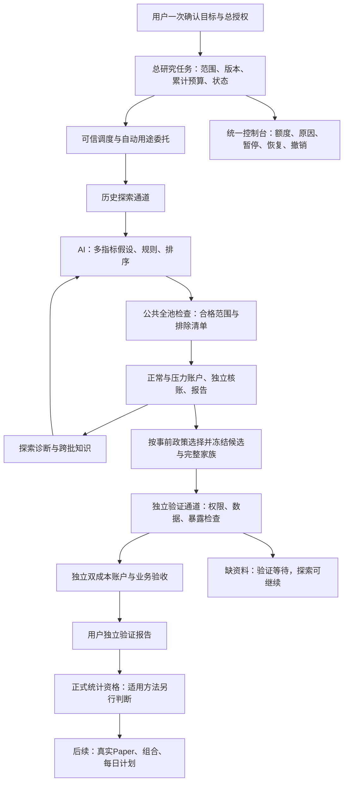
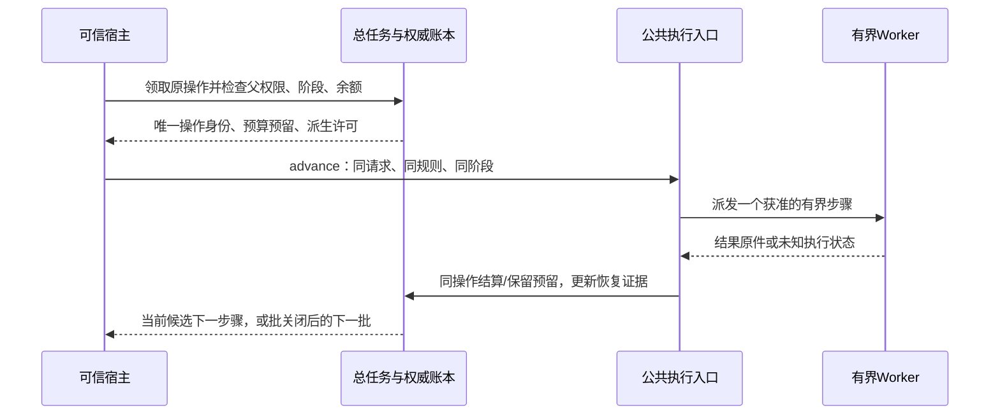
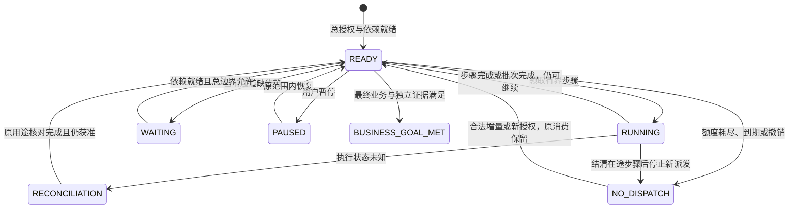

# 全池长周期回测接入可信持续研究循环

---

## Summary

把已经可用的全池长周期回测，接入系统自己的持续研究流程。用户一次确认总目标、允许使用的数据、累计资源和有效期；系统在这些边界内自动提出策略、执行账户、核账、总结失败、生成下一版，并在一批结束后自动接续下一批。用户不需要反复批准候选，也不需要 AI 为每个策略另写运行脚本。

历史探索和独立验证分别推进。缺少独立资料、尚未达到最终样本长度，或者统计方法暂不适用，都应给出具体等待项，同时允许仍有授权的历史探索继续。停止某个计算步骤与完成整个研究目标必须分开。

**交付后的业务流程：一次总授权 → 全池信号选股与多指标提案 → 多批自动回测和失败学习 → 冻结候选与选择办法 → 独立业务验证 → 单独判断正式资格。**

本计划完成持续研究及独立业务验证的工程接线；不承诺一定发现盈利策略，不凭工程验收授予正式资格，也不新增实盘下单。现有五万元、V4 规则、全池收益过程的正式统计方法适用性，以及真实 Paper 和组合，保留为后续独立工作。

---

## Problem Frame

### 当前系统真正有什么

核对基线源码、测试、登记元数据和既有原始记录，而非只依据进度总结：

| 能力 | 已有证据与实际边界 | 本计划处理 |
|---|---|---|
| 全池长周期公共入口 | `FULL_UNIVERSE_SUBMISSION_V3`、V4 规则、数据合格池、正常/压力账户、分段恢复、独立核账和报告已有真实验收 | 复用执行链，不重写交易和记账引擎 |
| 全池范围 | 基线登记 4,607 只，覆盖深圳 `00`、上海 `60`、创业板 `30`；既有两个窗口各有 3,669 只合格、938 只排除 | 每次按冻结窗口和规则重新检查全部登记分母；这些数量不是新任务的保证 |
| 持续研究原型 | `DiagnosisResearchV3` 使用旧请求字段、旧 V3 规则解析和三账户约定；旧有界循环还有限定尝试数 | 新增薄编排版本，接到新版全池入口，不扩大旧循环冒充接通 |
| 总预算和恢复 | campaign 与原事件账本已有跨批累计、预留、结算和恢复基础 | 补范围授权、阶段预算、自动委托、完整派发身份和生命周期接线 |
| 探索与验证的执行用途 | 当前全池请求只接受 `EXPLORATORY`；部分账户及准备/核验/报告镜像固定记为 `EXPLORATION` | 新版阶段合同贯穿整条链，不能只改上层标签 |
| 真实模型预算 | 默认模型适配器没有满足现有研究服务要求的 token/费用硬限制接口 | 在开放自动循环前取得可信硬上限和实际调用证据 |
| 数据长度 | 当前全池配套登记与 TRAIN 交集只有 462 个交易日，且还要核对规则预热 | 支持短探索；补齐最终 504 日的数据是单独可追踪依赖 |
| 独立资料 | 未建立可证明独立且满足 252 日的合格资料；旧验证集已暴露，封存范围不能默认读取 | 建立独立资料准入、冻结、执行和隔离；缺证据时正确等待 |

当前全池授权到期、相应用途预算耗尽，足以阻止旧任务继续，但不说明回测引擎坏了。更深的产品缺口是：**长周期执行、真实模型、总授权、数据用途和批次接续尚未形成同一条公共流程。** 仅换提示词、延长一份旧凭证，或者重建一个空目录，不能解决它。

### 用户得到什么变化

| 现在容易发生的情况 | 改完后的行为 |
|---|---|
| 五个候选跑完就回聊天询问是否继续 | 批次只是调度单位；额度足够时自动开下一批 |
| 每个新规则都要另办一次用途授权 | 可信服务按总授权派生精确用途，普通候选不再问用户 |
| 没有独立数据，于是整个研究停住 | 验证通道等待；探索通道在合法 TRAIN 和剩余额度内继续 |
| 只有 462 日，于是连机制初筛也不能做 | 允许短探索，清楚标注尚未达到最终 504 日门槛 |
| 程序中断后靠 AI 猜从哪里接着跑 | 系统重建同一任务和消费状态，复用已完成步骤 |
| 历史盈利就被称为找到了合格策略 | 历史、独立业务验收、正式统计资格和 Paper 分栏显示 |

---

## Scope Boundaries

**本次包括：** 总研究目标和范围合同；长期但有限的总授权；受约束的自动派生许可；累计预算和授权增量；真实模型 V4 提案；全池长周期公共执行；多批接续；进程恢复；探索与独立业务验证分流；共同部署和公共控制；真实验收及操作说明。

**本次不包括：** 改买卖撮合、费用和公司行动算法；另造规则语言；按收益缩小股票池；无条件解封历史；自动扩大总权限；修订既有正式统计尺子以让当前候选通过；真实 Paper、组合、实盘；保证无限运行或保证盈利。

上游需求的第二阶段与第三阶段中“独立业务验证接线”在本次落地。R22、R23 和 F5 的 Paper、组合及每日计划保留在总路线，未被取消；其正式资格前提也不在本次绕过。创业板和已登记指标沿用当前公共能力，不回退成原来的几只股票，也不假定所有指标参数都已支持。

规划本身不授予新的数据访问、模型消费或执行权限。实施时可以完成软件、隔离测试和只读预检；真实模型及账户验收须使用当时有效、范围匹配的执行授权，最终由用户确认一次具体总授权摘要，而非逐批确认。

---

## Requirements

本计划使用独立编号 CR1–CR14，避免与上游 R 编号混淆。下表给出的 U 编号是稳定实施单元，不因后续拆分或调整顺序重新编号。

| 编号 | 可验收要求 | 上游对应 | 实施单元 |
|---|---|---|---|
| CR1 | 一份不可变目标绑定资金、股票池、规则能力、数据用途、评价政策和版本；候选只改变获准的策略变量 | R1–R9、R15–R17、R24；F1/F2 | U1、U2、U4 |
| CR2 | 总授权内自动派生批次、候选、计算用途；父权限是上界，模型不能自行授权；普通批次结束不询问用户 | R15–R16、R24；AE7/AE9 | U2、U5、U7 |
| CR3 | 同一权威账本累计所有批次、失败、重复、预检、模型及各计算用途；名称、目录和入口变化不重置额度 | R15–R16；AE7–AE9 | U2、U5 |
| CR4 | 总额度/有效期支持显式版本化增量；已用、未知预留、债务和旧用途到期原样保留；暂停与撤销有不同语义 | R16、R18–R19；AE8/AE9 | U2、U5、U7 |
| CR5 | 新循环真实调用模型，输出公共 V4 规则；上下文仅含合法探索证据；没有硬费用保障不得宣称自动模型循环已可用 | R2–R4、R15–R17；F2 | U4、U8 |
| CR6 | 扫描完整支持登记池，通过数据资格后回测；多指标组合和事前固定排序参与信号选股，持仓上限不缩小扫描范围 | R5、R8–R9；AE2/AE3 | U1、U4、U5 |
| CR7 | 新循环只编排既有公共准备、双成本账户、独立核账、报告；各用途绑定原批次/候选/阶段，避免双重收费 | R7、R9–R11、R15；AE5/AE8 | U2、U5、U6 |
| CR8 | 历史探索与独立验证分别拥有数据、权限、预算和状态；验证等待不能阻断仍合法的探索 | R19–R21；F2/F3；AE10/AE11 | U1、U3、U5、U6 |
| CR9 | 短探索可执行；最终 504 日探索、252 日独立业务验证和其余冻结门槛不降低、不混算 | R12、R14、R20；AE10 | U1、U3、U6、U8 |
| CR10 | 独立验证先冻结完整家族及选择办法；结果不进入设计；使用验证反馈学习须登记暴露并换新独立证据 | R7、R20–R21；AE11 | U3、U4、U6 |
| CR11 | 重启、重复操作和多宿主竞争保持原身份；未知执行先核对，不免费重调模型或重跑账户 | R7、R18；F4；AE8/AE15 | U2、U4、U5、U8 |
| CR12 | 用户、AI、CLI、工作台和宿主使用同一服务及限制；查询没有启动副作用；宿主离线不能显示后台研究中 | R19、R24；AE9/AE15 | U7、U8 |
| CR13 | 报告分开工程、测试、真实账户、历史初筛、独立业务验证、正式资格、Paper；未达标不能写成完成目标 | R10、R12–R14、R19；AE5/AE10 | U1、U6–U8 |
| CR14 | 旧任务和凭证不静默升级；新版本迁移不修改旧结果和消费，能力与来源变更不能伪装同一任务恢复 | R7、R14、R18；AE14/AE15 | U2、U5、U7、U8 |

### 保留的最终业务标准

沿用本次用户目标的 `FROZEN_CRITERIA.json`，导入时绑定内容哈希，不覆盖原件：每份正常/压力账户各以 **50,000 元**开始；探索至少 **504 个实际账户交易日**，冻结后的独立验证至少 **252 日**。两个阶段分别要求正常成本年化净收益 ≥15%、最大回撤 ≤15%、扣费完整回合胜率 ≥55%、盈利因子 ≥1.3、完整回合 ≥100；压力成本全期净收益严格大于零。

这是最终业务验收，**不是每个早期实验的启动条件**。另行冻结探索初筛政策，允许在合法的较短 TRAIN 窗口检验机制、比较规则和积累失败证据；其结果只叫探索，不能因为初筛通过而豁免最终日数或回合数。预热不计入账户日数，空仓交易日计入；账户日数不等于持股天数。

同阶段两个成本账户、不同阶段收益不能相加或按比例换算。利润、胜率、收益集中度、资金投入、成本敏感性、分阶段表现与信号到成交漏斗均应报告；“去掉最佳交易”等诊断不冒充重新运行的真实账户。多指标要求不等于强制 51 个指标全部叠加；要求覆盖获准机制组合，并明确每个指标承担的角色及可被否定的假设。

---

## Key Technical Decisions

### K1. 新增薄编排版本，保留旧循环

新增 `DiagnosisResearchV4`，复用 `ResearchCampaignV1`、模型执行边界和公共 submission。保留旧 V3、旧有界研究及冻结任务的语义。不把旧三账户后端复制进新版，也不以提高旧“最多五次”的数字代替新接线。

新循环通过 `public_rule_factory` 使用 `RESEARCH_RULE_STRATEGY_V4`；指标、参数、评分算子、止损止盈和市场过滤的实际能力来自系统能力目录。`market_filter` 的现有含义是同股过滤，不能标成已经支持独立指数择时。

### K2. 总授权只批准边界，可信服务批准边界内用途

采用版本化总授权及范围政策；允许的规则版本、指标能力、可改参数、排序方式、资金/持仓/成本、全池身份、各阶段资料与物理日期范围、执行规格、累计资源、有效期、自动接续和验证选择办法都须冻结。

可信服务为每个确定候选派生子许可，精确绑定父授权版本、campaign、batch、candidate/attempt、规则哈希、请求哈希、数据/资格池身份、阶段、账户计划和用途 operation。派生不得扩大范围、增发预算、延长父有效期，也不得由模型传入任意模块或文件路径。派生时保留规则以外的不变条件，使策略对照有意义。

批准权限与执行权限分开：总授权、增额、续期及范围扩大须经过受保护的 owner 批准通道，运行中的设计模型、worker 和普通执行客户端不持有此能力。批准记录绑定批准者、完整摘要哈希、grant 身份和权限版本；客户端的 `confirmed=true` 或文字声称“用户同意”不能代替批准证据。用户和 AI 在相同角色/已获授权下走同一业务服务，这不意味着给研究模型 owner 权限；本次仅补总授权的批准边界，不建设通用多用户登录平台。

增额/续期是用户明确批准的授权增量事件，使用唯一 grant 身份并累积到原研究账本，不覆盖已冻结父文件；重复增量只生效一次。旧用途不会被续期悄悄延长，未知消费必须先解决；超出原范围的数据或能力须形成可审阅的新版本，不能借普通 `resume` 获准。

对于事前允许的资料补齐或未来观察，总授权可以绑定可信资料路线/发布身份及明确日期、来源、证券和质量范围，不必预知尚未生成文件的哈希；可信准备完成后，派生许可仍须绑定具体登记版本和内容哈希。任意路径、未经登记的新来源或越界日期不能借此自动加入。

### K3. 一个权威事件流，预算单位写清楚

沿用 campaign 和 `AutonomousRunBudgetV2` 的事件流作为总资源权威，原用途登记器保留为受父 operation 约束的执行记录。游标、报表及父子镜像都是可重建投影，不是第二个预算来源。准备/账户/核验/报告的实际执行边界各只有一个收费归属，不叠加旧循环的外层 DATA/VERIFY 预留。

资源分别计量：候选尝试、模型调用、输入/输出 token 与最大费用、资料评价/采集请求、账户作业、核验/报告作业、累计执行秒、存储上限。报告用途保留独立身份；若沿用父账本的 `verification_jobs` 分类，明确它与子 `report_jobs` 的映射，不能漏算或再算一次。总额和阶段子上限须同时成立；保护独立验证预留，探索不能挪用。

派发前预留合法的最坏上限，已知实际消费后结算并释放确实未用的部分。未知状态保留预留；真实超耗完整入账并保留债务，阻止后续派发，不能裁成合规。模型格式错误、重复规则和被否定假设仍保留尝试与真实消费；未派发账户不能伪计账户执行费。

旧会话人工设计的候选以原来源导入搜索史和数据暴露，不能补造系统模型调用。已有权威消费保留引用；新总任务或授权增量不能抹去相关历史，也不对同一已有消费重复收费。没有可证明的旧计量数据时标注未知，不用报告中的手写总数覆盖原账本。

### K4. 新版公共阶段合同，不能只改标签

新增 `FULL_UNIVERSE_SUBMISSION_V4` 作为阶段绑定外层，保留 V3 的严格探索语义。V4 复用长周期执行、资格池、双成本、观察计划和报告；增加可信研究绑定引用，解析出 `EXPLORATION` 或独立业务验证的 `CONFIRMATION`。请求自填阶段或 `qualified=true` 均没有权限效果。

阶段绑定贯穿数据守卫、准备、账户许可、核验、报告、分段、消费和恢复镜像。不得把确认作业默认计入探索，也不得因每个 compute 请求哈希创建一个新研究批次。独立业务验证不是旧 `VALIDATION_PROTOCOL_V2` 的正式资格确认；通过前者不推导后者适用。

### K5. 数据投影与独立性是两件事

普通探索只读物理上仅含 TRAIN 的登记资料。官方投影程序须有明确资料准备权限，记录父文件真实物理范围，产出价格、状态、参考、事件、日历和覆盖证据等一致的子资料；不能只改 manifest 日期，或让 AI 先读整张含验证期的大表再筛选。

投影保留父谱系、哈希、单位、复权证据、转换版本及完整证券分母，**不创造历史可见性或独立性**。父文件跨旧验证期时，其非分析准备访问也如实记载，结果不向设计模型暴露越界行情；跨封存界线另须具体权限，本计划不授予。

当前全局守卫对 2025-08-01 起的数据一律封存。新增用途限定的可信访问路径必须验证独立协议、来源、明确授权及读取范围，再注入独立执行；保留默认硬锁，不增加公共布尔开关绕过。真实前瞻资料须按实际日期持续采集；不能用历史补录伪造当日观察。

### K6. 两条业务通道，正式资格单列

探索使用合法 TRAIN；独立验证使用规则冻结后符合准入条件的资料。复用现有未来观察协议与快照校验，新增全池独立业务验证协议及到公共账户的适配；不宣称旧快照格式已完成全池接线。

完整相关试验家族、选择政策、验证资源及暴露次数须先冻结。允许继续探索追加新候选，但不能把它们插入已冻结家族；一个确认集不能反复测试到通过。设计端不读验证行情、收益、状态反馈或汇总指标。对用户发布的验证结果如果被 AI 用于学习，也算暴露，后续改规则须用新独立证据；换目录或重新下载不能恢复资格。

正式统计仍走原方法解析器；五万元/V4 全池范围未获适用证据时继续 `UNSUPPORTED`、`strategy_qualified=false`。业务独立验证可完成自己的观察性结论，不冒充控制过全部搜索偏差的统计显著性；真实 Paper 未开始时天数为零。

### K7. 有界推进与恢复，不让一次 tick 占住整个长期任务

当前 `start` 会连续完成账户、核验和报告，当前 tick 也不是每 900 秒让出。新增公共有界 `advance` 操作：一次只推进一个有明确预算的准备段、账户段、核验段或报告段，沿用既有分段器。完成后写稳定接续位置再让出宿主，下一 tick 重新检查范围、额度、有效期和撤销。

拆分要落到 `run_strategy_account_v1.py` 的长周期账户/compute 派发循环及 `UniverseScanServiceV1` 的准备循环：抽出共同的单段派发、核对与结算原语，旧阻塞入口循环复用，新 advance 单次复用。账户计算和记账算法保持原样，不能在外层改名后仍让内部把整份长期作业跑完。

模型调用同样有受控超时、预算与结果回执。已派发但响应未知时不盲目重调；模型支持幂等键时核对原请求，否则等待核对并保留最坏费用预留。所有有副作用的动作使用稳定意图身份；同身份同内容返回原操作，同身份不同内容拒绝。意图及预算预留须在可恢复的同一提交边界落盘，实际副作用与本地回执无法原子化时使用“已派发/待核对”状态，不声称分布式恰好一次。[AWS 幂等重试实践](https://aws.amazon.com/builders-library/making-retries-safe-with-idempotent-APIs/)支持这一处理原则，不引入 AWS 依赖。

### K8. 真正连续运行依赖宿主，而非聊天窗口承诺

复用可信研究宿主、锁、心跳和停止指令，增加共同部署 builder，让 UI、CLI 与 daemon 注入同一研究服务和模型适配器。生命周期固定 stage 清单用尽不代表研究成功；新版持续任务由总授权与持久状态控制接续。

宿主运行时才推进；进程退出后保留可接续状态，重新启动同一宿主后恢复。离线显示离线，不宣称后台仍跑；本计划不自动安装操作系统计划任务。暂停停止新派发，可恢复；撤销不可用恢复动作解除；到期/撤销不妨碍已发生消费的核对与结算。

---

## High-Level Technical Design

### 业务架构

没有从独立验证结果到 AI 设计的隐含回路；如需将结果用于下一轮学习，先登记暴露，再为下一版安排新的独立证据。

### 身份、存储与状态

| 对象 | 权威内容与关系 |
|---|---|
| 总研究目标 | 目标身份、冻结业务门槛、允许调整项、总授权及增量、数据路线、源码和能力身份 |
| 研究批次 | 原总任务下的调度单位；批大小不等于总候选上限；批结束只触发下一次合法派发判断 |
| 候选/尝试 | 父候选、机制假设、修改理由、真实模型请求/响应、规范化规则身份、所有成功失败和重复记录 |
| 公共执行任务 | 请求、规则、资料、资格池、BASE/STRESS 计划、各阶段 operation、结果与核验原件 |
| 独立协议 | 已冻结家族前缀、选择政策、候选、数据准入与暴露、独立预算、业务门槛；不能被后续探索改写 |
| 状态/游标 | 账本及不可变原件的投影；附原件身份和账本位置，损坏后可重建，不自行产生授权或消费事实 |

总状态与两条通道状态分别显示。`BATCH_CLOSED`、`CANDIDATE_REJECTED`、`HISTORICAL_PROFITABLE` 均不是总目标完成。

| 事件 | 探索通道 | 独立验证通道 | 总目标/用户动作 |
|---|---|---|---|
| 批次结束且仍有总权限和额度 | 自动下一批 | 按原队列推进 | 继续，不逐批询问 |
| 候选正常落选 | 诊断后继续 | 不入队 | 未完成 |
| 最终探索长度不足 504，但可做合法短探索 | 继续短探索，标记不足 | 候选保留在待晋级清单，不消耗最终独立验证资料；先补最终探索证据 | 等待资料补齐与探索继续并存 |
| 独立资料/方法不足 | 可继续 | `WAITING_DATA` 或正式资格 `WAITING_METHOD` | 列具体依赖，不伪称达标 |
| 模型不可用或缺硬预算保障 | 等待提案；已经冻结的确定性任务可继续 | 合法确定性任务可继续 | 显示模型原因 |
| 总预算耗尽/授权到期 | 不再派发 | 不再派发超出边界的用途 | 未完成；用户可批准一次新的授权增量 |
| 未知消费、账本冲突或结果绑定错误 | 隔离受影响任务并核对；共享账本不可信时阻断整个总任务派发 | 同样处理 | 工程阻塞，不当作策略失败 |
| 用户暂停/撤销 | 安全停止新派发，已发生工作结算 | 同样处理 | 暂停可恢复；撤销不可恢复旧授权 |
| 冻结的最终业务门槛及独立证据均满足 | 停止新候选派发，结清在途工作 | 固化证据 | `BUSINESS_GOAL_MET`；正式资格与 Paper 另列 |

调度在两通道间采用冻结的公平策略与阶段资源预留；验证等待不占用可用探索槽位，验证已就绪时也不能被源源不断的新探索饿死。初版同一总任务串行派发 worker，不新增并行交易引擎。

### 可信派发与批次接续示意

以下展示边界和顺序，不规定具体方法签名：

状态图表示总任务派发；两通道各有自己的等待状态。撤销的旧授权永不复活，图中的新授权须经新的明确批准；状态不明时也不能靠增量跳过原消费核对。

---

## Implementation Units

### U1. 定义总目标、分阶段标准与可执行性预检

**Goal / Requirements / Dependencies：** 先让系统表达“允许继续研究但目标尚未达标”。覆盖 CR1、CR6、CR8–CR9、CR13；对应 F2/F3、AE7/AE10；无前置单元。

**Files：** 新增 `src/chanlun_trader/research_factory/continuous_research_contract_v1.py`、`tests/research_factory/test_continuous_research_contract_v1.py`；复用 `research_campaign_v1.py`、`universe_execution_profile_v1.py`、`research_capabilities_v1.py` 的 `capabilities` 与长周期能力出口。

**Approach / Patterns：** 不可变合同、内容身份与结构化等待原因沿用现有模式。分开总目标、探索初筛、最终业务标准和正式资格；将当前外部 `FROZEN_CRITERIA.json` 作为有哈希的导入依据。预检不读越界行情，汇总授权、资料、真实模型预算、磁盘与执行规格的就绪情况。冻结允许研究的机制组合、指标角色和排序变量，不规定某个指标必须盈利。

**Test scenarios：** 1）合法短探索可创建但最终长度不足；503/504 和 251/252 边界准确，预热不计入；2）初筛通过不能覆盖最终标准；3）资金/日期/成本/指标能力越界拒绝；4）基线小池、持仓数、市场过滤含义不能被误写成全市场或指数择时；5）目标门槛/资料版本变化产生新版本而非改原任务。

**Verification：** 一份预检同时展示“探索能否运行、独立验证缺什么、最终业务还差什么”，不再只返回总的成功或失败。

### U2. 总授权、预算累计与可信阶段委托

**Goal / Requirements / Dependencies：** 一次批准可安全覆盖多批，不靠 AI 反复造凭证。覆盖 CR1–CR4、CR7、CR11、CR14；F2/F4、AE7–AE9/AE14；依赖 U1。

**Files：** 新增 `src/chanlun_trader/research_factory/campaign_scope_v1.py`、`tests/research_factory/test_campaign_scope_v1.py`、`tests/research_factory/test_universe_research_stage_binding_v1.py`。扩展已有 `research_campaign_v1.py`、`run_budget.py`、`etf_account_governance_v1.py`、`universe_compute_governance_v1.py`、`universe_submission_v1.py`、`strategy_submission_v1.py`，均位于 `src/chanlun_trader/research_factory/`。回归 `tests/research_factory/test_research_campaign_v1.py`、`test_universe_campaign_segment_mirror_v1.py`、`test_universe_compute_governance_v1.py`。

**Approach / Patterns：** 落地 K2–K4；保留旧账本事件语义，新范围/增量/撤销事件按版本解析。新增公共 V4 阶段绑定，旧 V3 不放宽。委托服务使用受保护的部署权威，客户端不能伪造父引用或改计费归属。旧任务只读引用，不直接接管其到期用途或清空历史。跨入口共享同一 canonical campaign；复制目录不产生第二份可执行余额。

**Test scenarios：** 1）两批/不同目录/入口累计消费一致；2）同一最后槽位并发争抢只获准一个；3）规则、资金、数据、阶段、profile、父期限任一越界，读取/派发前拒绝；4）准备、BASE、STRESS、核验、报告及恢复镜像都属原批次/阶段，且只收费一次；5）授权增量重放不增发，未知预留和超耗债务不能消失；6）探索不能消费确认专属预算；7）到期/撤销在各用途中途发生时阻止后续派发，仍允许核对结清；8）旧请求、旧固定授权和历史结果保持原语义；9）普通执行客户端直接调用批准/增量入口、伪造用户批准或重放其他摘要批准时拒绝；10）带时区的 UTC/北京时间展示一致，到期瞬间不得派发，真实时钟不可由任务 JSON 注入。

**Verification：** 对每个用途可以沿原件追溯到同一总授权与唯一消费；批后自动委托无需新的用户审批，但无法突破任一总边界。

### U3. TRAIN 正式投影、资料补齐清单与独立数据准入

**Goal / Requirements / Dependencies：** 已有长周期数据真正可供探索使用；缺失的最终长度和独立性明确列出。覆盖 CR8–CR10、CR14；F3、AE4/AE11/AE14；依赖 U1、U2。

**Files：** 新增 `src/chanlun_trader/research_factory/research_dataset_projection_v1.py`、`tests/research_factory/test_research_dataset_projection_v1.py`。扩展已有 `universe_data_provider_v1.py`、`research_data_qualification_v1.py`、`forward_snapshot_v1.py`，以及 `src/chanlun_trader/research/guard.py`、`scripts/prepare_long_horizon_data_v1.py`。回归 `tests/research_factory/test_prepare_long_horizon_data_v1.py`、`test_universe_account_inputs_v1.py`、`test_universe_qualified_scope_v1.py`。

**Approach / Patterns：** 落地 K5；准备权限绑定父资料实际范围、子窗口、转换配方与上限。对子资料做物理日期检查，保留 RAW/单位/来源及全证券分母。先核对本地较早行情和配套资料的目录元数据，再按“类别＋日期＋证券”列缺口；在已批准来源和采集额度内补齐，有缺口则保留具体阻断。不能只提前 `universe_scope.start`，也不要求本次顺手重做全市场公司行动工程。

独立路线先支持有证据的真实未来观察资料。全局封存守卫保留默认行为；只在可信独立协议及具体数据授权都成立时允许受控执行，普通探索仍被拒绝。已暴露旧验证集不重新包装成独立；无访问记录也不是未见证明。封存历史准入另列外部依赖，不默认释放。

**Test scenarios：** 1）父物理范围未获准时内容读取前拒绝；2）TRAIN 子文件不残留越界行情，父字节不变，普通探索不再隐式打开父价格表；3）父/子哈希或 manifest 日期伪造拒绝；4）停牌区间、跨界公司行动、迟到状态按语义处理，不截坏账户权利；5）只补价格而无日历/状态/公司行动等不能取得更早资格；6）局部缺口公开逐股排除，系统性缺口阻断；7）真实观察天数不足、历史补录、已暴露资料和无明确授权的封存读取不能独立准入。

**Verification：** 产出正式 TRAIN 子资料和访问回执；更早 504 日资料及独立 252 日资料各有独立的就绪/缺口清单。投影成功不等于独立性获得认证。

### U4. 真实模型 V4 提案与跨批学习记录

**Goal / Requirements / Dependencies：** 将会话 AI 的人工拼装变为可核对的系统模型调用。覆盖 CR1、CR5–CR6、CR10–CR11；F2、AE2/AE7/AE15；依赖 U1、U2；真实调用使用 U3 的合法资料视图。

**Files：** 扩展 `src/chanlun_trader/research_factory/bounded_model_v1.py`；新增 `src/chanlun_trader/research_factory/diagnosis_research_v4.py` 的提案/上下文部分、`tests/research_factory/test_bounded_model_v4.py`、`tests/research_factory/test_diagnosis_research_v4.py`。复用 `research_rule_strategy_v4.py`、`strategy_submission_v1.py` 的规则解析；回归 `test_bounded_model_v1.py`、`test_bounded_model_v3.py`、`test_diagnosis_research_v3.py`，均在 `tests/research_factory/`。

**Approach / Patterns：** 模型适配器须在派发前证明输入/输出 token、调用数及最坏费用可被实际限制；单凭字符串声明、软超时或事后计费不算。优先扩展现有运行时；具体供应商、计价版本和强制措施必须在实现初期预检获证，缺失则如实 `HARD_BUDGET_UNSUPPORTED`，不能以固定提案替代真实调用验收。

模型只获得公共能力、冻结 TRAIN 元信息、可追溯试验谱系及获准定性反馈，不获得任意文件/代码/网络执行工具。完整历史留在权威记录，输入使用受 token 上限约束的确定性摘要和引用，摘要版本及选择依据冻结，不能只保留赢家或无声删除失败次数。工具与文件访问须在调用前限制；仅隔离工作目录或事后检查工具事件不能证明未读取越界资料。每候选保存假设、父版本、改变原因、相同数据上的对照政策和可证伪预期。跨趋势/反转/量价/波动及排序机制安排授权内覆盖，不把穷举所有指标组合当进展；试验分配本身也冻结并登记。量化排名、买卖条件和止盈止损均由公共能力限制。

**Test scenarios：** 1）真实 V4 schema 与公共解析一致，非法评分/参数/任意代码拒绝；2）硬预算不可证明则不派发模型；3）模型非法或重复输出保留收费与尝试，规则去重跨批生效；4）上下文/工具不得取得独立数据及验证反馈；5）模型成功原件已存在但回执缺失可补证，响应未知不重复调用；6）模型停用时已经冻结的确定性账户能继续；7）记录区分事实、假设和未知，跨池改善不能直接归因规则修改。

**Verification：** 至少一次实际受限模型调用的请求、响应、usage/费用与规则身份可核对；缺该证据时只报告适配器工程测试完成。

### U5. 公共有界推进、自动接续与中断恢复

**Goal / Requirements / Dependencies：** 让一批结束自动继续，恢复时不重跑、不清消费。覆盖 CR2–CR4、CR7–CR8、CR11、CR14；F2/F4、AE7–AE9/AE15；依赖 U2–U4。

**Files：** 完成 `src/chanlun_trader/research_factory/diagnosis_research_v4.py` 的编排部分；扩展已有 `strategy_submission_v1.py`、`universe_execution_profile_v1.py`、`universe_compute_governance_v1.py`、`research_lifecycle_jobs_v1.py`、`universe_scan_service_v1.py`（均在 `src/chanlun_trader/research_factory/`）及 `scripts/run_strategy_account_v1.py`。新增 `tests/research_factory/test_continuous_universe_batches_v1.py`、`test_continuous_universe_recovery_v1.py`、`test_universe_submission_advance_v1.py`；回归已有 `test_universe_public_recovery_v1.py`、`test_long_horizon_segment_evidence_v1.py`。

**Approach / Patterns：** 落地 K7；新增公共 advance，而非从研究循环直调私有账户函数。阶段状态覆盖提案、规范化、预检、冻结、派生批准、准备、双账户、核验、报告、初筛、记录与批关闭。批大小仅影响调度；已有 campaign 若要求总批次上限，其值属于总授权并与累计候选政策匹配，不能沿用一个未说明的“五轮”默认停点。

恢复从原件、原账本重建状态，游标不是事实来源。冻结规则/输入/源码或能力身份变化时不假恢复；结果完成但报告缺失，只派发原合法报告用途。正常策略落选继续；可识别临时错误按事前有限重试政策及同用途上限处理；未知派发、失败终态或预算债务不得通过新 ID 绕过。单总任务 worker 串行，各段结束让出并检查两通道公平推进。生命周期增加新版持续任务合同，由同一文件或独立 V2 实现承载；不得修改旧 V1 不可变的 stages 清单，也不得把 max_calls 用尽写成策略目标完成。

**Test scenarios：** 1）至少两批自动接续，正常失败后仍进入下一候选，不询问用户；2）每次 advance 只推进声明的有界阶段，断言底层实际 worker 派发次数而非只 mock 外层；账户 900 秒 worker/累计 4或8小时规格仍生效；3）模型派发、任务冻结、分段结果、父账收费、镜像更新、核验和报告边界分别中断，重建保持同身份/同消费；4）活跃 worker 存在时拒绝第二次恢复派发；5）重复同意图返回原结果，内容冲突拒绝；6）暂停/到期/撤销发生在每一阶段，已发生消费可结算但不继续派发；7）候选落选与工程核验失败采用不同路径；8）模型或验证等待不阻塞可合法继续的确定性步骤及探索。

**Verification：** 自动多批、强制重启、连续运行三组证据的候选身份、结果和账本消费可逐项对应。不得把旧固定规则工程账户当作新版真实模型闭环的证明。

### U6. 冻结候选进入独立业务验证

**Goal / Requirements / Dependencies：** 独立验证可执行但不可反哺调参；等待不拖停探索。覆盖 CR7–CR10、CR13；F3、AE10/AE11；依赖 U2、U3、U5。

**Files：** 新增 `src/chanlun_trader/research_factory/business_validation_protocol_v1.py`、`tests/research_factory/test_business_validation_protocol_v1.py`；该文件承担协议和全池独立执行接线，不另造同义确认 runner。扩展已有 `campaign_confirmation_v1.py`、`forward_snapshot_v1.py`、`diagnosis_research_v4.py`；通过 U2 的 V4 公共阶段合同执行。回归 `tests/research_factory/test_campaign_confirmation_v1.py`、`test_validation_protocol_v2.py`、`test_formal_rule_adapter_v3.py`。

**Approach / Patterns：** 冻结完整相关家族、选择办法、规则/排序、资金成本、数据路线、预热和至少 252 日的独立账户；绑定既有暴露权威记录，不另建一份“未见”清单。适配真实快照为全池账户登记资料，保留采集时间、缺口和公司行动。取得资料、权限、资源后自动运行公共双成本账户及核账，未齐则排队等待，不能循环消耗同一验证集。

业务验证选择政策明确家族级候选数及一次性暴露额度；多候选结果只作预先定义的描述性业务核对，不以其最大收益授资格。正式反复检验控制及方法适用性不具备时，正式统计保持阻断。对模型的后续反馈仅从探索产生；用户若另行批准将确认结果用于学习，先消耗其独立身份，改版候选须使用新证据。

旧 `CampaignConfirmationV1.readiness()` 的方法适用性等待不得阻塞这个独立业务协议的合法账户执行；两者共享家族与暴露证据，资格判断仍由正式服务负责。相应验收须实际经过公共账户路径，不能仅测试页面显示了两个状态。

**Test scenarios：** 1）完整家族遗漏、冻结后变规则/排序/数据/选择政策均拒绝；2）252 日不足、已暴露或封存未获准时等待/拒绝，探索仍可推进；3）相同独立任务恢复不增加暴露/收费，已失败任务不能换 ID 重测；4）后续探索追加不改冻结家族，确认就绪不会被探索饿死；5）设计上下文、反馈接口、工具读不到确认结果，暴露后资料永久退出相应独立用途；6）业务通过、正式方法不适用、Paper=0 可以同时正确显示；7）旧正式 V2 的 504 日和适用范围不因新业务协议被削弱。

**Verification：** 完成从冻结、资料就绪到独立账户/报告的可重建链；真实资料不存在时用隔离样本验证行为，并如实保留真实独立验证“未运行”，不伪造通过。

### U7. 共同部署、公共控制与交接说明

**Goal / Requirements / Dependencies：** 用户一次启动后可查看与控制，换 AI 也能接手。覆盖 CR2、CR4、CR12–CR14；F2/F4、AE9/AE14/AE15；依赖 U5、U6。

**Files：** 扩展 `scripts/lifecycle_deployment_v2.py`、`scripts/run_trusted_research_v1.py`、`scripts/run_strategy_lifecycle_v1.py`、`scripts/run_ui.py`、`src/chanlun_trader/research_daemon.py`、`src/chanlun_trader/webapp.py`、`src/chanlun_trader/research_factory/lifecycle_service_v2.py`、`trusted_research_host_v1.py`。新增 `tests/research_factory/test_continuous_universe_lifecycle_v1.py`、`docs/CONTINUOUS_UNIVERSE_RESEARCH_GUIDE.md`；同步 `docs/RESEARCH_CAPABILITIES.md`、`docs/AUTONOMOUS_RESEARCH_USER_GUIDE.md`、`docs/LONG_HORIZON_UNIVERSE_RESEARCH_GUIDE.md`。回归 `tests/research_factory/test_lifecycle_ui_launch_v2.py`、`test_trusted_research_host_v1.py`、`tests/test_webapp.py`。

前端扩展已有 `frontend/src/console/components/LifecycleWorkbench.vue`、`frontend/src/console/lifecycle.ts`、`frontend/src/console/lifecycle.test.ts`；复用现有预览确认与状态呈现，不新增另一套工作台。

**Approach / Patterns：** 使用一套部署 builder 注入研究服务、模型边界及权威存储。公共操作涵盖目标预检、创建、总授权摘要确认、启动、状态、暂停、恢复、撤销及显式增量；控制动作同样验证权限。总授权批准及增量通过 K2 的 owner 通道，普通运行角色仅能引用已批准记录；页面/CLI 共用业务服务，查询不启动模型和 worker。

复用现有工作台容器展示总额度/阶段额度、两通道状态、当前批次、真实宿主心跳、等待原因和准确接续点；不另建平台。导出交接包包含版本、合同与原件引用、累计消费、失败谱系和未完成项，不含密钥或独立结果给设计端。用户可读独立报告，但交接给设计 AI 的包必须做数据隔离。文档解释账户日、持仓上限、扫描分母、成本、独立性及正式资格区别，并提供无需新增策略脚本的操作路径。

**Test scenarios：** 1）CLI/UI/host 创建的任务及默认模型/预算完全一致；2）状态读取零副作用，离线/心跳过期不显示研究正在推进；3）两个宿主不能同时领取同一用途；4）暂停/恢复不改变原上限，撤销不能恢复；5）授权增量摘要清楚展示原消费和新增边界，不默认为无限；6）缺依赖时界面说明可继续通道和确实需要用户一次处理的事项；7）新操作者在没有原聊天的情况下可恢复；8）旧任务只读可查，新源码不能静默重签旧任务。

**Verification：** 用户无需编程、无需逐批回复，也可启动和接手同一总任务。仅当超出总权限、资源耗尽或有无法自动解决的真实依赖时需要处理；这些状态不能写成“目标完成”。

### U8. 完整验收、发布边界与最终交付

**Goal / Requirements / Dependencies：** 证明接通的是“真实模型→公共全池账户→诊断→下一批”，而非固定样例。覆盖全部 CR；重点 AE7–AE11/AE14/AE15；依赖 U1–U7。

**Files：** 新增 `scripts/run_continuous_universe_acceptance_v1.py`、`tests/research_factory/test_continuous_universe_acceptance_v1.py`、`docs/CONTINUOUS_UNIVERSE_ACCEPTANCE.md`。此脚本仅为统一产品验收，不为每个候选新增脚本。扩展已有 `scripts/run_long_horizon_universe_acceptance_v1.py` 的兼容核查与相关公共入口测试；不覆盖旧验收原件。

**Approach / Patterns：** 分层记录下面矩阵。测试样本、真实模型回执、真实数据账户、真实独立资料分别标识，任何一层不能替代另一层。模型调用与真实账户验收必须使用专门批准的有限总授权；费用、失败、未知及超耗都进入该任务账本。规则身份在调用、冻结、执行和报告间一致，正常/压力各自独立核账。

**Test scenarios：** 1）一份总授权下至少两批真实模型提案，第二批确实使用第一批合法探索诊断；2）至少两个不同机制的多指标 V4 候选经过同一全登记分母检查、双成本账户、独立核账及报告，无新增候选适配脚本；3）跨进程在模型、账户段、核验、报告各边界恢复，最后账本不双收费，未知不盲重试；4）并发争抢、授权越界、额度耗尽、撤销、源文件改变和验证泄漏均被阻断；5）独立资料缺失时探索自动进入后续批次；6）业务条件即使测试通过，正式方法不适用仍不给资格；7）旧 V3、旧循环、固定策略离线运行和旧真实长周期证据仍可核对。

**Verification：** 形成可审阅交付包：版本与源码身份、目标/授权/所有增量、真实模型和资源回执、候选全集与失败谱系、全池分母和排除清单、双成本原件、独立核账、恢复证据、两通道状态、未完成外部依赖及操作指南。若真实模型适配器无法保障硬上限，持续研究真实交付不合格；不能用 mock 替代。

---

## Acceptance Strategy

| 验收层 | 必须证据 | 不能据此声称什么 |
|---|---|---|
| 工程实现 | U1–U7 入口及身份/阶段/恢复完整，旧合同兼容 | 不能声称真实模型已调用或发现盈利策略 |
| 隔离自动验证 | 关键正常、越界、并发、故障、泄漏和 252/504 日边界场景通过 | 合成数据不能证明真实独立性 |
| 真实持续研究 | 一个总授权内至少两批真实受限调用与反馈，至少两个候选完成公共全池双账户及核账 | 盈利或初筛不等于最终业务达标 |
| 真实长周期范围 | 优先使用当前合法 TRAIN 的可用窗口，至少覆盖 252 日；真实新增 504 日依赖 U3 补齐，不借旧 Legacy 设计 | 不能把 462 日说成 504 日，也不能拿旧固定规则验收冒充新版循环的真实 504 日验收 |
| 独立业务验证工程 | 冻结、准入、隔离、队列、账户与报告可执行；真实缺资料时正确等待 | 不得把“工程通过、真实尚未运行”写成独立有效 |
| 最终策略业务达标 | 真实满足冻结的 504/252 及全部业务门槛，有完整尝试/暴露史 | 不能自动授正式统计资格、Paper 或未来盈利保证 |

真实 504 日与真实独立 252 日若实施期间无法补齐，交付必须分别标记未完成，并说明已做的来源核对和精确缺口；不得把它们取消以宣称“所有真实验收完成”。软件功能可独立交付，策略目标仍保持未完成。既有 504 日工程基线仅作为执行兼容证据，不向设计模型提供其越界收益。

测试遵循项目既有检查；新增协议、预算、恢复和公共接线做有意义回归，模型调用及全池真实验收只按已冻结矩阵执行，不反复跑大账户凑通过。验收失败保存原件，修复后按新版本明确重验范围。

---

## Delivery Order

**当前：全池长周期执行已可用、持续研究未接通 → 阶段一：总目标/总授权/合法资料与真实模型边界 → 阶段二：多批自动研究与恢复 → 阶段三：独立业务验证和统一控制 → 阶段四：真实交付验收 → 后续：正式统计方法适用性、真实 Paper、组合。**

| 交付阶段 | 单元与进入条件 | 出口标准 |
|---|---|---|
| 第一阶段 | U1 → U2；随后 U3 与 U4 可分别推进 | 预算/用途可追溯；TRAIN 可用性、最终缺口和真实模型硬上限明确 |
| 第二阶段 | U5；依赖 U2/U3/U4 的合同与实现 | 两批自动接续、单步有界推进、重启不重跑不清消费 |
| 第三阶段 | U6 → U7 | 验证等待不阻断探索；共享部署，用户一次授权可启动与接手 |
| 第四阶段 | U8 | 分层真实证据交付，未具备的数据/方法限制如实公开 |

不先做新的候选搜索、GUI 美化或扩充指标。**唯一优先开工点：U1＋U2，把同一总研究任务的目标、范围、阶段及累计账本绑定清楚。** 同时在实施早期验证 U4 的硬预算可行性，避免最后才发现真实模型循环无法交付。

---

## System-Wide Impact

- 公共请求新增 V4，规则仍用现有 V4；旧 submission 和 Diagnosis 不静默升级。能力目录、CLI、工作台及部署必须同步声明准确版本。
- 数据访问从固定日期硬锁增加用途限定的可信执行路径；默认研究仍锁定封存资料。准备访问、设计访问和独立执行访问分别记录，不能通过宽授权混为一体。
- 授权增量、阶段额度和撤销涉及核心治理合同，按新事件版本实施与回归，不原地改历史文件。未来用户批准本计划实施时仍须在具体总授权摘要确认真实消费范围，本文件不是空白支票。
- 单宿主锁不能代替所有预算争抢保护；各副作用须在权威存储边界原子领取，同一任务跨 CLI/UI/daemon 保持一致。暂停不能删除锁/日志来伪装恢复。
- 费用与结果以原始回执为准。源代码/环境变化须新冻结版本；仅允许已有可信回执补齐缺失投影，不重新签发一份“相同”历史任务。

---

## Risks & Dependencies

| 风险或依赖 | 具体处理 |
|---|---|
| 真实模型缺少可信硬费用上限 | U4 早期验证供应商/运行时强制能力；不支持则标为真实交付阻塞，固定策略仍可使用公共入口 |
| 可用 TRAIN 少于最终 504 日 | U3 按配套类别补齐更早资料并预留预热；期间继续短探索，最终业务门槛不变 |
| 无已认证的独立 252 日资料 | 独立通道等待并积累合法真实观察；不得自动把旧验证、封存或重下载数据称为新数据 |
| 总有效期不足以等待真实未来日期 | 有限长有效期与明确阶段预算在总授权摘要中展示；到期使用显式授权增量，旧消费不清零 |
| 模型故障、未知响应、实际超耗 | 留原件和最坏预留；原身份核对；债务阻断；不以新候选 ID 免费重试 |
| 数据投影损害跨期权利或来源资格 | 全配套语义投影、父谱系、访问回执和真实输入资格检查，局部排除公开 |
| 验证报告经聊天回流设计 AI | 设计端导出隔离；真实反馈使用登记暴露，下一版换新独立证据 |
| 多批搜索碰巧获得高收益 | 保留完整试验家族和搜索史；独立业务报告不宣称统计显著，正式方法另行获证 |
| 自动循环磁盘增长 | 总授权包含存储上限，预检余量；不得自动删除仍需审计的原件，触顶显示等待 |

---

## Rollout and Rollback

新能力默认不接管旧任务。先完成隔离验证，再使用专门批准的有限总任务做真实验收；通过后公开能力和操作指南。实施交付应区分代码合并、CI、主目录版本一致、真实验收及尚未完成的资料依赖。创建开发目录时须隔离已有研究输出；交付清理只针对本次开发目录并保留必需证据，不删除行情和历史账本。

回滚先暂停/撤销新版总授权，停止新派发，核对并结清已派发用途，保留所有事件与原件；然后回到上一稳定源码版本。回滚代码不退回预算和暴露，也不删除新事件来取得余额。旧入口保持可用，但不自动获取新版任务权限。任何恢复必须核对来源、源码和冻结身份。

---

## Open Questions

**规划已确定：** 采用新薄编排、公共阶段合同、同一事件账本、有限总授权及显式增量、探索/独立业务验证分流；旧正式方法不放宽。无需为了这些决定逐批询问用户。

**实施时依据证据落实，不改变业务目标：** 模型供应商硬限制与计价版本；更早配套资料的具体可用来源；独立资料路线的准入证据；每次真实任务的总金额、调用/候选/计算上限、资料准备权限和绝对有效期。这些须形成可审阅预检与一份总授权摘要，不能由模型自行填成无限。缺失时记录外部依赖，完成不依赖它的工程工作。

---

## Sources & References

- 上游需求：[可信策略研究需求](../brainstorms/2026-09-29-trusted-strategy-research-requirements.md)，重点 R15–R21/R24、F2–F4、AE7–AE11/AE14–AE15。
- 已完成执行基线：[全池长周期实施计划](2026-10-03-001-feat-long-horizon-universe-research-plan.md)、[长周期操作说明](../LONG_HORIZON_UNIVERSE_RESEARCH_GUIDE.md)、[系统能力目录](../RESEARCH_CAPABILITIES.md)。
- 本次最终业务目标：[接续说明](../STRATEGY_RESEARCH_GOAL_20261010.md)、[冻结标准](../../reports/strategy_research_goal_20261010/FROZEN_CRITERIA.json)、[真实状态](../../reports/strategy_research_goal_20261010/RESEARCH_STATE.json)、[核查报告](../../reports/strategy_research_goal_20261010/REPORT_CN.md)。这些报告仅为本次规划证据，不是新增授权。
- 数据政策：[旧验证集复用限制](../VALIDATION_REUSE_POLICY.md)；全池元数据 `data/long_horizon_universe_v1/prepared_v4/manifest_long_horizon_v1.json`；用途守卫 `src/chanlun_trader/research/guard.py`。
- 关键源码：`diagnosis_research_v3.py`、`bounded_model_v1.py`、`research_campaign_v1.py`、`run_budget.py`、`universe_submission_v1.py`、`strategy_submission_v1.py`、`universe_compute_governance_v1.py`、`etf_account_governance_v1.py`、`campaign_confirmation_v1.py`、`formal_rule_adapter_v3.py`，位于 `src/chanlun_trader/research_factory/`。
- 恢复决策参考：[Making retries safe with idempotent APIs](https://aws.amazon.com/builders-library/making-retries-safe-with-idempotent-APIs/)，仅用于派发意图和未知结果核对原则，不作为平台或供应商选型。
